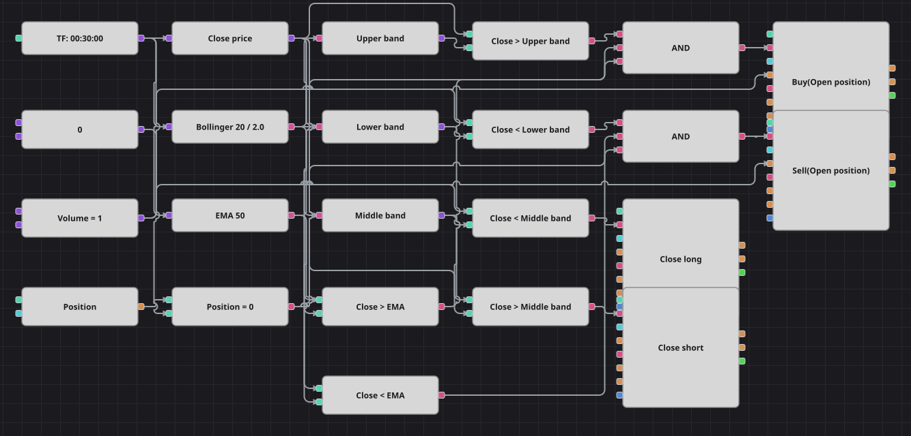

# Diagramm der Strategie Opening Range Breakout (Bollinger-Ausbruch mit EMA-Filter)
[English](README.md) | [Русский](README_ru.md) | [中文](README_zh.md) | [Español](README_es.md) | [Português](README_pt.md) | [日本語](README_ja.md)

Das Beispiel behält den Namen der Ursprungsstrategie, enthält aber keine Eröffnungsspanne einer Sitzung: Gehandelt wird tatsächlich ein Ausbruch aus den Bollinger-Bändern, bestätigt durch eine langsame EMA. Das Verlassen des Bandes ist der Auslöser, die EMA entscheidet, ob der Ausbruch mit oder gegen den Markt läuft, und das mittlere Band holt den Trade wieder ein.

## Strategieübersicht

- Bollinger-Bänder und eine EMA über 50 Perioden werden auf denselben Halbstundenkerzen gerechnet, und jede Entscheidung nutzt den Schlusskurs einer abgeschlossenen Kerze.
- Ein Ausbruch zählt nur in Trendrichtung: über dem oberen Band muss der Schlusskurs zusätzlich über der EMA liegen, unter dem unteren Band zusätzlich darunter.
- Das mittlere Band ist der Ausstieg für beide Seiten, die Position lebt also genau so lange, wie sich der Kurs von seinem eigenen Mittelwert entfernt hält. Stop-Loss und Take-Profit gibt es nicht.

## Ein- und Ausstiegsregeln

- **Long-Einstieg**: Die Kerze schließt über dem oberen Bollinger-Band, derselbe Schlusskurs liegt über der EMA und die Position ist neutral. Der Positionsbaustein kauft das gemeinsame Volumen zum Marktpreis.
- **Short-Einstieg**: Die Kerze schließt unter dem unteren Bollinger-Band, derselbe Schlusskurs liegt unter der EMA und die Position ist neutral. Der Positionsbaustein verkauft das gemeinsame Volumen zum Marktpreis.
- **Ausstieg**: Der erste Schluss unter dem mittleren Band schließt einen Long, der erste Schluss darüber einen Short; beide Bausteine laufen im Schließmodus und werden nur aktiv, wenn es etwas zu schließen gibt.

## Parameter

| Parameter | Standard | Beschreibung |
|---|---|---|
| Bollinger Length | 20 | Glättungsperiode der Bollinger-Bänder, zugleich die Periode des mittleren Bandes. |
| Bollinger Width | 2 | Bandbreite in Standardabweichungen; im Originalcode fest auf zwei gesetzt. |
| EMA Length | 50 | Periode der EMA, die bestimmt, in welche Richtung ein Ausbruch gehandelt werden darf. |
| Volume | 1 | Ordervolumen in Lots. |
| Candles | 00:30:00 | Zeiteinheit der Kerzen, mit der das gesamte Diagramm arbeitet. |

## Diagrammdetails

- Der Kerzenbaustein speist die Bollinger-Bänder, die EMA und einen Konverter für den Schlusskurs; drei weitere Konverter trennen oberes, unteres und mittleres Band.
- Sechs Vergleiche decken die gesamte Logik ab: zwei für die Bänder, zwei für den EMA-Filter und zwei für die Rückkehr zum mittleren Band.
- Beide UND-Bausteine der Einstiege verlangen eine neutrale Position, ein Einstieg vergrößert also nie einen laufenden Trade; die Schließbausteine hängen direkt an den Vergleichen mit dem mittleren Band.
- Zwei Dinge des C#-Originals fehlen: die Pause von 10 Kerzen zwischen den Aktionen, für die es im Designer keinen Baustein gibt, und die sofortige Umkehr — hier wird erst am mittleren Band geschlossen und die Gegenseite auf einer späteren Kerze eröffnet.

## Verwendung

Importieren Sie die `.json`-Datei in Designer, testen Sie sie im Backtester mit historischen Daten und passen Sie danach Parameter oder Bausteine an Ihr Instrument an, bevor Sie live handeln.
