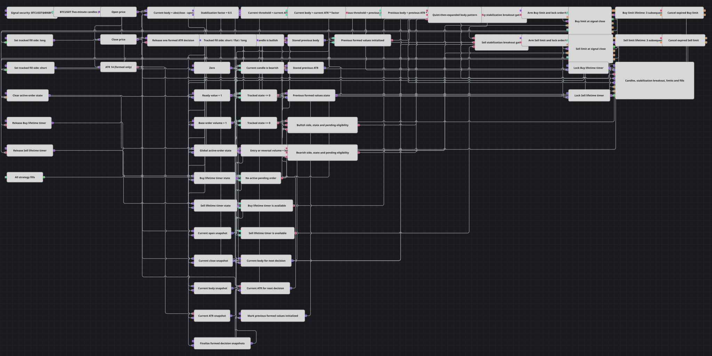

# Order Stabilization Breakout Strategy Diagram
[Русский](README_ru.md) | [中文](README_zh.md) | [Español](README_es.md) | [Deutsch](README_de.md) | [Português](README_pt.md) | [日本語](README_ja.md)

This diagram watches finished five-minute BTCUSDT@BNBFT candles for a transition from a body stabilized below half of ATR(14) to a body expanding above that level. It places one limit order at the signal close, gives the order three later candles to finish, and sizes a filled reversal at twice the base quantity.

## Strategy Overview

- Finished five-minute candles provide Open and Close prices, while formed ATR(14) values measure the current volatility scale.
- Body is calculated as `abs(Close - Open)`, and its stabilization boundary is `ATR * Stabilization Factor`. The default factor is `0.5`.
- The first formed Body/ATR pair initializes the stored previous values without creating a signal. Every later formed pair compares both the previous and current body with its matching boundary.
- A setup requires `Previous Body < Previous ATR * 0.5` and `Current Body > Current ATR * 0.5`. Equality at either boundary does not qualify.
- A shared pending-order latch allows only one active limit order. Separate buy and sell lifetime gates prevent either side from reusing its three-candle timer before that timer completes.

## Entry and Exit Rules

- **Long entry**: When a qualifying expansion candle is bullish (`Close > Open`), the signed state is flat or short, no order is pending, and the buy lifetime gate is ready, submit a buy limit at the current Close.
- **Short entry**: When a qualifying expansion candle is bearish (`Close < Open`), the signed state is flat or long, no order is pending, and the sell lifetime gate is ready, submit a sell limit at the current Close.
- **Order size**: The quantity is `Base Volume * (1 + abs(state))`. A flat entry uses one base unit; an accepted reversal from `-1` or `1` uses two base units.
- **Exit**: There is no price-based protection. Exposure changes only when an opposite limit fills; an unfilled limit receives an addressed cancellation request after three strictly subsequent finished candles.

## Parameters

| Parameter | Default | Description |
|---|---|---|
| Security | BTCUSDT@BNBFT | Security used by the finished five-minute candle subscription. Set Strategy Security to the same value because orders, cancellations, and fills use Strategy Security and Strategy Portfolio. |
| Candle Series | 00:05:00 | Finished five-minute candles used for ATR, body calculations, signals, lifetime counting, and the chart. |
| ATR Length | 14 | Averaging length of the Average True Range indicator. Decisions begin only after ATR is formed. |
| Stabilization Factor | 0.5 | Multiplier applied separately to the previous and current ATR values to form their body boundaries. |
| Lifetime N | 3 | Number of strictly subsequent finished candles allowed before cancellation is requested for an unfilled limit. |
| Base Volume | 1 | Quantity for a flat entry; the action formula doubles it for a reversal. |

## Diagram Details

- The Security [Variable](https://doc.stocksharp.com/en/topics/designer/strategies/using_visual_designer/elements/data_sources/variable.html) configures only the finished [Candles](https://doc.stocksharp.com/en/topics/designer/strategies/using_visual_designer/elements/data_sources/candles.html) subscription. Each completed candle supplies Open, Close, and the full candle passed to ATR; order and trade blocks use Strategy Security and Strategy Portfolio, so Strategy Security must match Security.
- The [Indicator](https://doc.stocksharp.com/en/topics/designer/strategies/using_visual_designer/elements/common/indicator.html) block emits only formed ATR(14) values. Formula and latch blocks keep the current Body, current boundary, previous Body, and previous boundary aligned within one candle decision.
- An initialization latch suppresses the first formed decision and stores its pair. Later decisions evaluate the two strict boundary relations before advancing the previous-value latches.
- The current candle reaches both lifetime counters before the signal branch runs. Starting a counter after that input makes its release occur on the third later finished candle, so the signal candle is never counted in its own lifetime.
- An accepted setup closes its side's timer gate and sets the shared pending latch before [Order registering](https://doc.stocksharp.com/en/topics/designer/strategies/using_visual_designer/elements/orders/register.html) is triggered. The pending latch clears only when that order reports a final state; the side timer remains unavailable until its three-candle release even if the order fills earlier.
- Each registration block saves its Order reference for addressed cancellation. A lifetime release sends the matching saved reference to cancellation and reopens only that side's timer gate.
- MyTrade events set the signed state from actual fills: a sell fill sets `-1`, a buy fill sets `1`, and the latch starts at `0` for flat. The chart receives candles, ATR, Body, the stabilization boundary, submitted orders, and strategy fills.

## Usage

Import the `.json` file into Designer, set Strategy Security to BTCUSDT@BNBFT, run it on five-minute history, and review limit fills and cancellations before adjusting the factor, lifetime, or volume for another trading environment.
