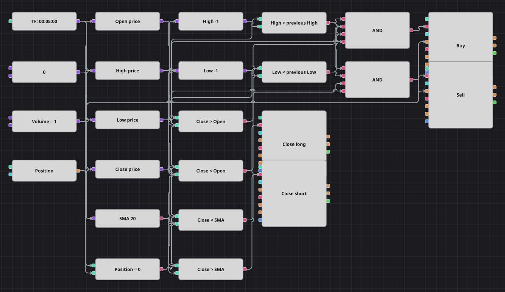

# Diagrama da estratégia de reversão do outside bar
[English](README.md) | [Русский](README_ru.md) | [中文](README_zh.md) | [Español](README_es.md) | [Deutsch](README_de.md) | [日本語](README_ja.md)

Um outside bar é um candle que engole toda a amplitude do anterior: uma máxima mais alta e uma mínima mais baixa na mesma barra. Os dois lados tiveram sua chance dentro de um único candle e um deles venceu, então o diagrama lê o vencedor no próprio corpo da barra: um outside bar de alta é comprado, um de baixa é vendido. Depois, uma média móvel simples do preço de fechamento decide quando soltar a operação.

## Visão geral da estratégia

- O outside bar é montado com blocos básicos: conversores leem a máxima, a mínima, a abertura e o fechamento do candle finalizado, e dois blocos de valor anterior guardam a máxima e a mínima do candle precedente.
- Duas comparações formam a figura — máxima acima da máxima anterior e mínima abaixo da mínima anterior — e ambas precisam valer ao mesmo tempo.
- A direção vem do próprio corpo do candle, não de um filtro de tendência: fechar acima da abertura é comprar, fechar abaixo é vender.
- A média móvel simples não participa da entrada e serve apenas como linha de saída, exatamente como na estratégia original.

## Regras de entrada e saída

- **Entrada comprada**: O candle rompeu os dois extremos do anterior, fechou acima da própria abertura e não há posição. A ordem compra um lote e abre uma compra.
- **Entrada vendida**: O candle rompeu os dois extremos do anterior, fechou abaixo da própria abertura e não há posição. A ordem vende um lote e abre uma venda.
- **Saída**: A compra é encerrada quando um candle fecha abaixo da média móvel e a venda quando fecha acima, ambas por blocos de modificação de posição em modo de fechamento, igual ao original. Não há stop nem alvo, porque o código original não tem nenhum dos dois. Ficou de fora a pausa de várias centenas de candles que o original mantém após cada entrada e cada saída: um contador de barras só se monta devolvendo um sinal ao diagrama, o que fecharia o grafo em um laço. Por isso aqui todo outside bar é operado e a frequência de negócios é bem maior.

## Parâmetros

| Parâmetro | Padrão | Descrição |
|---|---|---|
| SMA Length | 20 | Período de suavização da média móvel simples que encerra as operações. |
| Volume | 1 | Volume da ordem, em lotes. |
| Candles | 00:05:00 | Tempo gráfico dos candles com que todo o diagrama trabalha. A estratégia original usa candles de um minuto; aqui são cinco minutos, para casar com o histórico incluído. |

## Detalhes do diagrama

- O bloco de candles alimenta cinco ramos: quatro conversores para abertura, máxima, mínima e fechamento, mais a média móvel.
- A máxima e a mínima seguem por dois caminhos ao mesmo tempo — direto para uma comparação e para um bloco de valor anterior —, de modo que a comparação coloca o extremo deste candle contra o do candle anterior.
- Cada E lógico reúne quatro sinalizadores: a máxima superior, a mínima inferior, a direção do corpo e a verificação de posição feita pelo bloco de posição contra uma constante zero.
- Os dois blocos de entrada enviam ordens a mercado e tiram o volume de uma constante compartilhada; os dois blocos de saída são acionados diretamente pelas comparações com a média e só agem quando há algo a encerrar.

## Uso

Importe o arquivo `.json` no Designer, execute-o sobre dados históricos no backtester e depois ajuste os parâmetros ou os próprios blocos ao seu instrumento antes de operar ao vivo.
