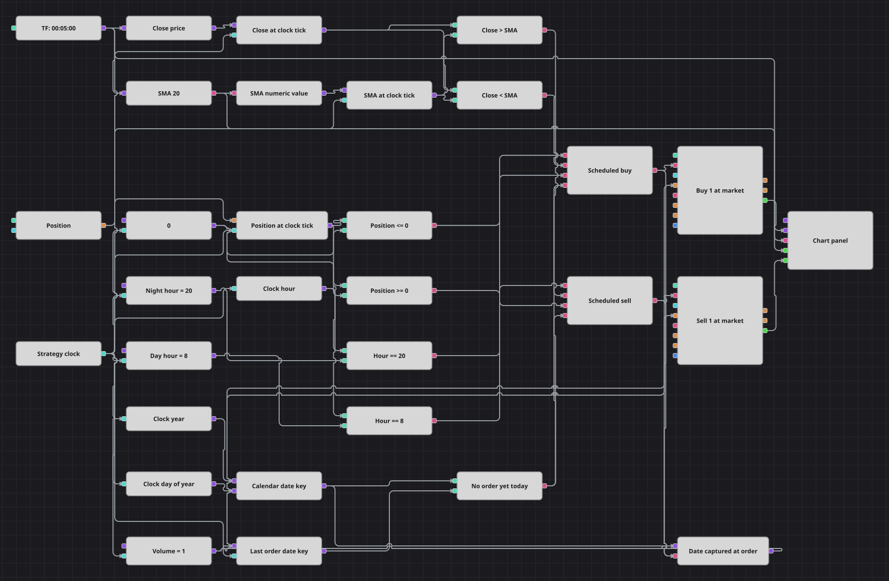

# Overnight Session Flip ストラテジーダイアグラム
[English](README.md) | [Русский](README_ru.md) | [中文](README_zh.md) | [Español](README_es.md) | [Deutsch](README_de.md) | [Português](README_pt.md)

このダイアグラムは、形成済みの期間 20 の SMA と、成行注文用の 2 つの時間帯を組み合わせます。ストラテジー時刻は、直近の確定済み 5 分足、ポジション、カレンダー日付を評価します。条件を満たす買い注文は 20 時台、売り注文は 8 時台に送信できます。日付ラッチにより、送信する注文は各カレンダー日につき 1 件に制限されます。

## 戦略の概要

- 確定済み 5 分足によって、終値と期間 20 の SimpleMovingAverage が更新されます。
- SMA ブロックは形成済みの値だけを出力するため、時間指定の判断は十分なローソク足履歴が蓄積されるまで待機します。
- Time ブロックが判断用クロックになります。各クロック刻みで最新の終値、SMA、ポジションのスナップショットを出力し、その後で条件に使う時刻とカレンダー要素を渡します。
- 2 つの成行注文ブロックは、ポジション変更条件を指定せず、固定数量 1 を使います。ポジションフィルターは、ゼロ以下の場合だけ買いを、ゼロ以上の場合だけ売りを許可します。
- 数値化したカレンダー日付キーは、注文ブロックを起動する前にラッチされます。チャートにはローソク足、SMA 値、2 つの MyTrade ストリームが表示されます。保護ブロックと個別の決済ブロックはありません。

## エントリーとエグジットの条件

- **ロングエントリー**: Night Hour 20 の時間帯に、直近の確定足の終値が形成済み SMA を上回り、現在のポジションがゼロ以下で、当日の注文がまだ送信されていない場合、ダイアグラムは Volume 1 の成行買い注文を送信します。
- **ショートエントリー**: Day Hour 8 の時間帯に、直近の確定足の終値が形成済み SMA を下回り、現在のポジションがゼロ以上で、当日の注文がまだ送信されていない場合、ダイアグラムは Volume 1 の成行売り注文を送信します。
- **エグジット**: 専用の決済注文や保護注文はありません。後日に条件を満たした反対方向の固定数量注文は、既存ポジションの縮小、同量の反対ポジションの決済、または現在量が Volume より小さい場合のゼロ越えを行うことがあります。完全な反転は保証されません。

## パラメーター

| パラメーター | 既定値 | 説明 |
|---|---|---|
| Candles | 00:05:00 | 5 分足の時間枠です。確定済みのローソク足だけが価格と SMA の保存値を更新します。 |
| SMA Period | 20 | SimpleMovingAverage に使う確定足の本数です。判断には形成済み SMA 値が必要です。 |
| Night Hour | 20 | 買い条件が注文を送信できるストラテジー時刻の時間です。 |
| Day Hour | 8 | 売り条件が注文を送信できるストラテジー時刻の時間です。 |
| Volume | 1 | 両方の成行注文ブロックに渡す固定数量です。 |

## ダイアグラムの詳細

- [ローソク足](https://doc.stocksharp.com/ja/topics/designer/strategies/using_visual_designer/elements/data_sources/candles.html)ストリームは、終値の[コンバーター](https://doc.stocksharp.com/ja/topics/designer/strategies/using_visual_designer/elements/converters/converter.html)と、形成済み SMA だけを出力する[インジケーター](https://doc.stocksharp.com/ja/topics/designer/strategies/using_visual_designer/elements/common/indicator.html)に入ります。式 `a` の[フォーミュラ](https://doc.stocksharp.com/ja/topics/designer/strategies/using_visual_designer/elements/common/formula.html)が SMA を数値として取り出します。
- [現在時刻](https://doc.stocksharp.com/ja/topics/designer/strategies/using_visual_designer/elements/time/current_time.html)は、ストラテジーまたはメッセージのタイムスタンプを提供します。各クロック刻みで最新の終値、SMA、ポジションを保持する[変数](https://doc.stocksharp.com/ja/topics/designer/strategies/using_visual_designer/elements/data_sources/variable.html)ブロックを起動するため、Time はすべての判断に直接関与します。
- 時刻コンバーターは Hour、Year、DayOfYear を取り出します。日付の[フォーミュラ](https://doc.stocksharp.com/ja/topics/designer/strategies/using_visual_designer/elements/common/formula.html)は `Year * 1000 + DayOfYear` を計算し、各カレンダー日を表す安定したキーを生成します。
- [比較](https://doc.stocksharp.com/ja/topics/designer/strategies/using_visual_designer/elements/common/comparison.html)ブロックは、2 つの指定時刻、終値と SMA、ポジションとゼロ、現在の日付キーと最後にラッチしたキーを評価します。2 つの[論理条件](https://doc.stocksharp.com/ja/topics/designer/strategies/using_visual_designer/elements/common/logical_condition.html)ブロックが買いと売りの条件をまとめます。
- 現在の[ポジション](https://doc.stocksharp.com/ja/topics/designer/strategies/using_visual_designer/elements/positions/current.html)は各クロック刻みで取得されます。買い側は `Position <= 0`、売り側は `Position >= 0` を必要とします。
- 組み合わせた条件が真になると、現在の日付キーを先にラッチし、その後で対応する[ポジション変更](https://doc.stocksharp.com/ja/topics/designer/strategies/using_visual_designer/elements/positions/modify.html)ブロックを起動します。この順序により、同じカレンダー日の後続クロック刻みでは別の注文が送信されません。
- 両方の Modify position ブロックは共有の固定 Volume 値を受け取り、成行注文を出します。Chart パネルは、確定済みローソク足、形成済み SMA ストリーム、買いと売りの各ブロックからの MyTrade 出力を受け取ります。

## 使い方

`.json` ファイルを Designer に読み込み、バックテスターで過去データを使って実行し、実運用の前にパラメーターやブロック自体を自分の銘柄に合わせて調整してください。
