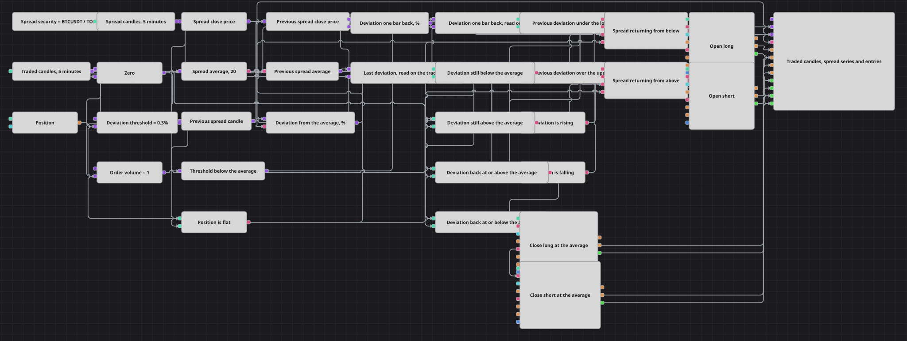

# Схема стратегии отклонения спреда двух инструментов
[English](README.md) | [中文](README_zh.md) | [Español](README_es.md) | [Deutsch](README_de.md) | [Português](README_pt.md) | [日本語](README_ja.md)

Два инструмента, которые обычно движутся вместе, время от времени расходятся, и разрыв между ними, как правило, снова закрывается. Схема делит одну цену на другую, следит за тем, насколько это отношение уходит от собственной скользящей средней, и покупает или продаёт первый инструмент в момент, когда разрыв начинает закрываться, а не в момент, когда он открывается.

## Обзор стратегии

- Индексный кубик строит из двух реальных инструментов один синтетический, деля цену первого на цену второго, и на этот синтетический инструмент подписывается серия свечей — так спред приходит готовыми свечами, а не собирается вручную.
- По свечам спреда считается скользящая средняя, а конвертер берёт их цену закрытия — так у спреда появляются и текущий уровень, и собственная опорная линия.
- Формула сводит эту пару к одному числу: расстоянию от закрытия до средней, в процентах от средней.
- То же значение на бар назад восстанавливается из предыдущей свечи спреда и предыдущего значения средней, а вторая формула превращает их в отклонение предыдущего бара.
- Вторая серия свечей идёт по торгуемому инструменту, и две переменные привязывают к ней оба отклонения: каждая хранит последнее число, выданное спредом, и отдаёт его при завершении торгуемой свечи — так любое решение принимается по часам того инструмента, на который идут заявки.
- Дальше сравнения задают четыре вопроса: где предыдущее отклонение стояло относительно порога, в какую сторону отклонение движется сейчас, по какую сторону от средней оно всё ещё находится и пуста ли позиция. Логическое условие собирает четыре ответа в один вход по каждому направлению.
- Входы — рыночные заявки фиксированного объёма, открываемые только из пустой позиции, и выставляются они по тому инструменту, который задан самой стратегии. Синтетический инструмент — источник чисел, заявок он не несёт никогда.
- Ещё два сравнения ждут, когда отклонение снова дойдёт до средней, и передают этот момент двум позиционным кубикам, по одному на каждую сторону, которые закрывают то, что открыто.

## Правила входа и выхода

- **Вход в лонг**: Отклонение предыдущего бара было ниже нижнего порога, отклонение этого бара выше предыдущего, отклонение всё ещё под средней, а позиция пуста. Кубик длинной стороны покупает по рынку объём заявки.
- **Вход в шорт**: Отклонение предыдущего бара было выше верхнего порога, отклонение этого бара ниже предыдущего, отклонение всё ещё над средней, а позиция пуста. Кубик короткой стороны продаёт по рынку объём заявки.
- **Выход**: Позиция закрывается, когда спред проходит путь, ради которого её открывали: длинная уходит, когда отклонение доходит до средней или пересекает её вверх, короткая — когда доходит до средней или пересекает её вниз. У каждого закрывающего кубика своя сторона, поэтому предназначенный для длинных не тронет короткую, а закрывающий кубик, сработавший на пустой позиции, просто ничего не сделает. Ни цели по прибыли, ни стоп-лосса, ни ограничения по времени здесь нет: весь выход — это возврат спреда.

## Параметры

| Параметр | По умолчанию | Описание |
|---|---|---|
| Index Expression | BTCUSDT@BNBFT/TONUSDT@BNBFT | Выражение, из которого строится синтетический инструмент: цена первого инструмента, делённая на цену второго. Оба инструмента должны присутствовать в подключённых данных, и торгуется только первый из них. |
| Spread Candles | 00:05:00 | Длина свечей, на которых строится серия спреда. |
| Traded Candles | 00:05:00 | Длина свечей, на которых выставляются заявки. Держите её равной серии спреда, иначе привязанные числа окажутся старше того бара, на котором их читают. |
| Average Length | 20 | Число свечей спреда в скользящей средней, от которой измеряется отклонение. |
| Deviation Threshold, % | 0.3 | Насколько далеко спред должен уйти от своей средней, в процентах, чтобы возврат к ней стоил сделки. |
| Order Volume | 1 | Объём заявки, в лотах. |

## Детали диаграммы

- Отклонение предыдущего бара восстанавливается из предыдущей свечи и предыдущего значения средней, а не хранится готовым процентом, — так обе половины отношения читаются на бар назад, и сравнение нынешнего значения с прежним не может смешать два разных момента.
- Две серии заканчиваются не в один и тот же миг: синтетический инструмент собирается из двух потоков, и его свеча закрывается чуть позже обычной. Именно привязка чисел к торгуемой свече держит стратегию на одних часах; отдача обеих серий вместе датировала бы каждую заявку более ранней из двух, а заявка с датой раньше текущего времени отклоняется.
- Константы запускаются торгуемой свечой. Сравнению для каждого вычисления нужно, чтобы оба его значения пришли заново, поэтому не отправленная повторно константа останавливает условие, которое она питает, и никак этого не показывает.
- Нижний порог — не вторая константа, а формула от того же значения, поэтому полоса остаётся симметричной при любом заданном пороге.
- Кубикам заявок велено не ждать выхода стратегии в онлайн, а входы настроены открываться только из пустой позиции, поэтому сигнал, повторившийся при уже идущей сделке, ничего к ней не добавляет.

## Использование

Импортируйте файл `.json` в Designer, прогоните схему на исторических данных в тестере, затем подстройте параметры или сами кубики под свой инструмент, прежде чем торговать вживую.
