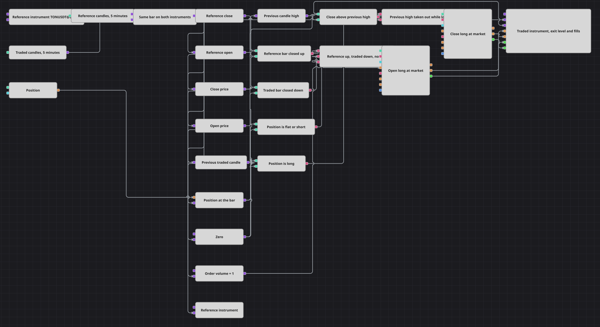

# Diagramm der Strategie Paired Bar Direction
[English](README.md) | [Русский](README_ru.md) | [中文](README_zh.md) | [Español](README_es.md) | [Português](README_pt.md) | [日本語](README_ja.md)

Zwei Instrumente, eine Kerze. Das Diagramm liest die Richtung derselben Fünf-Minuten-Kerze auf dem gehandelten Instrument und auf einem zweiten, dem Referenzinstrument, und kauft nur dort, wo beide sich widersprechen: Die Referenzkerze hat im Plus geschlossen, die gehandelte Kerze im Minus. Die Position wird zurückgegeben, sobald der Kurs über dem Hoch der vorherigen Kerze schließt.

## Strategieübersicht

- Zwei Kerzenblöcke speisen das Diagramm. Der gehandelte läuft auf dem eigenen Instrument der Strategie; der Referenzblock wird über eine Security-Variable auf ein namentlich genanntes Instrument gerichtet, sodass das Paar eine Einstellung ist und keine Frage der Verdrahtung.
- Beide Reihen sind auf ausschließlich abgeschlossene Kerzen gestellt, sodass eine unfertige Kerze die Entscheidung niemals verschieben kann.
- Sync hält je eine Leitung pro Instrument und lässt beide Kerzen gemeinsam im Fünf-Minuten-Takt heraus. Zwei Datenströme treffen unabhängig voneinander ein, und erst nach diesem Halten stammen die beiden Kerzen aus derselben Periode - und das ist das Einzige, was ihren Vergleich sinnvoll macht.
- Konverter holen Eröffnung und Schluss aus jeder freigegebenen Kerze heraus und reduzieren jedes Instrument auf die beiden Zahlen, die sagen, in welche Richtung seine Kerze gelaufen ist.
- Zwei Vergleiche lesen diese Zahlen: Referenz-Schluss über Referenz-Eröffnung bedeutet, dass die Referenzkerze im Plus geschlossen hat; gehandelter Schluss unter gehandelter Eröffnung bedeutet, dass die gehandelte Kerze im Minus geschlossen hat.
- Previous value hält die gehandelte Kerze einen Schritt zurück, und ein Konverter liest das Hoch aus ihr heraus. Der Block hält die Kerze selbst, das Feld wird erst danach gelesen - diese Reihenfolge liefert auf jeder Kerze einen Wert.
- Die Position wird über eine Variable, die auf den Kerzen-Trigger hin ausgibt, auf die Kerze aufgesetzt und dann zweimal mit null verglichen: kleiner oder gleich null lässt einen Einstieg zu, größer null lässt einen Ausstieg zu.
- Zwei logische UND-Gatter steuern zwei Position modify-Blöcke - einer eröffnet mit der Bedingung Open position, der andere schließt mit Close position - und das Chart-Panel zeigt die gehandelten Kerzen, das Ausstiegsniveau, die Orders und die Ausführungen.

## Ein- und Ausstiegsregeln

- **Long-Einstieg**: Auf einer freigegebenen Kerze hat das Referenzinstrument über seiner eigenen Eröffnung geschlossen, das gehandelte Instrument unter seiner eigenen Eröffnung, und die Position liegt bei oder unter null. Das UND-Gatter feuert, und Position modify kauft das Ordervolumen zum Markt mit der Bedingung Open position, sodass eine Kerze, die das Muster bei bereits offener Position wiederholt, nichts hinzufügt.
- **Short-Einstieg**: Es gibt keine Short-Seite. Das Diagramm ist reines Long: Eine fallende Kerze auf dem gehandelten Instrument wird als Abschlag zum Kaufen gelesen, nie als Grund zu verkaufen.
- **Ausstieg**: Solange die Position über null liegt, feuert eine freigegebene Kerze, deren Schluss über dem Hoch der vorherigen Kerze liegt, das Ausstiegsgatter, und das zweite Position modify schließt zum Markt mit der Bedingung Close position. Es gibt weder Stop-Loss noch Take-Profit: Das Hoch der vorherigen Kerze ist die gesamte Ausstiegsregel, und weil der Block schließt, was offen ist, statt eine feste Größe zu verkaufen, kann ein Ausstieg die Position nicht ins Short drehen.

## Parameter

| Parameter | Standard | Beschreibung |
|---|---|---|
| Reference Instrument | TONUSDT@BNBFT | Das Instrument, dessen Kerzenrichtung den Einstieg bestätigt; es muss über die Verbindung zusammen mit dem gehandelten Instrument verfügbar sein. |
| Reference Candles | 00:05:00 | Zeitrahmen der Referenzkerzen. |
| Traded Candles | 00:05:00 | Zeitrahmen der gehandelten Kerzen. |
| Sync Interval | 00:05:00 | Der Takt, in dem Sync beide Instrumente freigibt; halte ihn gleich dem Zeitrahmen der Kerzen, sonst ist das freigegebene Paar nicht die Kerze, von der die Vergleiche ausgehen. |
| Order Volume | 1 | Ordergröße in Lots. |

## Diagrammdetails

- Beide Position modify-Blöcke sind so eingestellt, dass sie keine Online-Verbindung verlangen, sodass sich dasselbe Diagramm auf Historie und auf einem Live-Feed identisch verhält.
- Der Einstieg trägt die Bedingung Open position mit Absicht. Ohne sie würde der Block auf jede Positionsänderung reagieren, über die er getriggert wird, und ein einzelnes Signal würde zu einem Strom von Orders.
- Jede Konstante im Diagramm - die Null und das Ordervolumen - wird von der freigegebenen Kerze getriggert. Eine Variable gibt auf ihren Trigger hin aus, nicht auf ihren eigenen Wert hin; eine ungetriggerte Konstante würde die Vergleiche neben sich den ganzen Lauf über stumm lassen.
- Beide Enden jeder Sync-Leitung sind verbunden. Ein Wert, der in den Block geschickt und nie herausgenommen wird, lässt ihn auf eine Leitung warten, die sich nie schließt, und die Strategie würde überhaupt nicht starten.
- Das Ausstiegsniveau wird als eigene Linie im Chart gezeichnet, sodass sich die Kerze, die darüber schließt, direkt im Panel neben der darauf folgenden Ausführung ablesen lässt.

## Verwendung

Importieren Sie die `.json`-Datei in Designer, testen Sie sie im Backtester mit historischen Daten und passen Sie danach Parameter oder Bausteine an Ihr Instrument an, bevor Sie live handeln.
