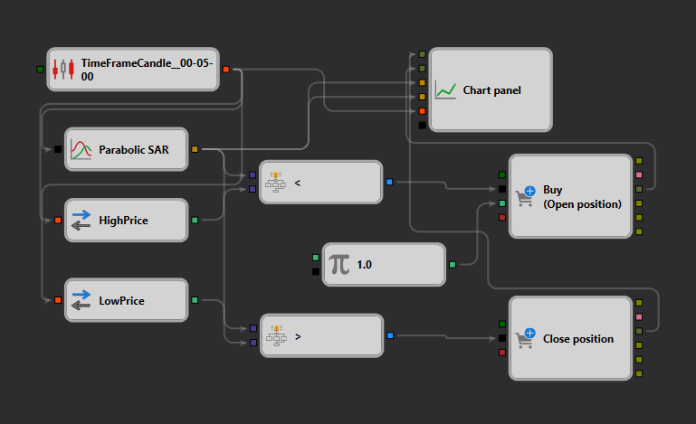

# Parabolic SAR Strategy Description

## Strategy Overview

The "Parabolic SAR" strategy is designed to capture trend reversals and continuation patterns using the Parabolic Stop and Reverse (SAR) indicator within [StockSharp Designer](https://doc.stocksharp.com/topics/designer.html). This strategy provides clear entry and exit signals based on the movement of price relative to the Parabolic SAR points.

## Strategy Details

### Components

- **Candle Formation**: Utilizes a 5-minute [timeframe](https://doc.stocksharp.com/topics/designer/strategies/using_visual_designer/elements/data_sources/candles.html) to analyze price action, ensuring that the strategy captures short-term market movements effectively.
- **Parabolic SAR Indicator**: [Configured](https://doc.stocksharp.com/topics/designer/strategies/using_visual_designer/elements/common/indicator.html) with an initial acceleration factor of 0.02, an acceleration step of 0.02, and a maximum acceleration of 0.2. These settings allow the indicator to adjust to the volatility of the market.

### Trade Execution

- **Entry Signal**: A buy signal is generated when the price crosses [above](https://doc.stocksharp.com/topics/designer/strategies/using_visual_designer/elements/common/comparison.html) the Parabolic SAR points, indicating a potential upward trend.
- **Exit Signal**: A sell signal is issued when the price falls [below](https://doc.stocksharp.com/topics/designer/strategies/using_visual_designer/elements/common/comparison.html) the Parabolic SAR points, suggesting a possible downward trend.

### Visualization

- **Chart Display**: The Parabolic SAR points are plotted on the [chart](https://doc.stocksharp.com/topics/designer/strategies/using_visual_designer/elements/common/chart.html) alongside the price candles, providing a visual representation of the trend and potential trade signals.

## Implementation Details

- **Platform**: Implemented on the StockSharp platform using its comprehensive features for real-time data fetching, indicator computation, and trade execution.
- **Indicator Application**: The Parabolic SAR is applied directly to the price chart, allowing for immediate visual assessment of trend changes and trade setup validity.

## Conclusion

The "Parabolic SAR" strategy is ideal for traders who need precise and automatic trade signals based on trend reversal patterns. It leverages the dynamic nature of the Parabolic SAR to provide timely entries and exits, enhancing the potential for profit in fast-moving markets.
