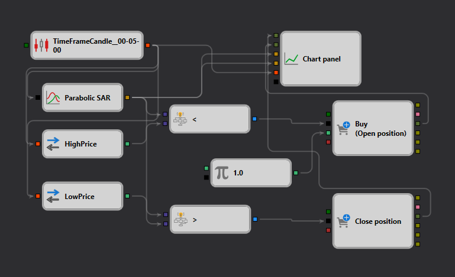

# Beschreibung der Parabolic SAR-Strategie
[English](README.md) | [Русский](README_ru.md) | [中文](README_zh.md) | [Español](README_es.md) | [Português](README_pt.md) | [日本語](README_ja.md)

## Strategieübersicht

Die Strategie „Parabolic SAR" ist darauf ausgelegt, Trendumkehrungen und Trendfortsetzungsmuster mithilfe des Parabolic Stop and Reverse (SAR)-Indikators im [StockSharp Designer](https://doc.stocksharp.com/topics/designer.html) zu erfassen. Die Strategie liefert klare Ein- und Ausstiegssignale basierend auf der Kursbewegung relativ zu den Parabolic SAR-Punkten.

## Strategiedetails

### Komponenten

- **Kerzenbildung**: Nutzt einen 5-Minuten-[Zeitrahmen](https://doc.stocksharp.com/topics/designer/strategies/using_visual_designer/elements/data_sources/candles.html) zur Analyse der Kursentwicklung und stellt so sicher, dass kurzfristige Marktbewegungen effektiv erfasst werden.
- **Parabolic SAR-Indikator**: [Konfiguriert](https://doc.stocksharp.com/topics/designer/strategies/using_visual_designer/elements/common/indicator.html) mit einem anfänglichen Beschleunigungsfaktor von 0,02, einem Beschleunigungsschritt von 0,02 und einer maximalen Beschleunigung von 0,2. Diese Einstellungen ermöglichen es dem Indikator, sich an die Marktvolatilität anzupassen.

### Trade-Ausführung

- **Einstiegssignal**: Ein Kaufsignal wird generiert, wenn der Kurs die Parabolic SAR-Punkte [von unten nach oben kreuzt](https://doc.stocksharp.com/topics/designer/strategies/using_visual_designer/elements/common/comparison.html), was auf einen möglichen Aufwärtstrend hindeutet.
- **Ausstiegssignal**: Ein Verkaufssignal wird ausgegeben, wenn der Kurs [unter](https://doc.stocksharp.com/topics/designer/strategies/using_visual_designer/elements/common/comparison.html) die Parabolic SAR-Punkte fällt, was einen möglichen Abwärtstrend signalisiert.

### Visualisierung

- **Chart-Anzeige**: Die Parabolic SAR-Punkte werden auf dem [Chart](https://doc.stocksharp.com/topics/designer/strategies/using_visual_designer/elements/common/chart.html) neben den Kurskerzen dargestellt und liefern eine visuelle Repräsentation des Trends und potenzieller Handelssignale.

## Implementierungsdetails

- **Plattform**: Implementiert auf der StockSharp-Plattform unter Nutzung ihrer umfassenden Funktionen für Echtzeit-Datenabruf, Indikatorberechnung und Trade-Ausführung.
- **Indikatoranwendung**: Der Parabolic SAR wird direkt auf den Kurschart angewendet, was eine sofortige visuelle Beurteilung von Trendwechseln und der Gültigkeit von Trading-Setups ermöglicht.

## Fazit

Die „Parabolic SAR"-Strategie ist ideal für Trader, die präzise und automatische Handelssignale auf Basis von Trendumkehrmustern benötigen. Sie nutzt die dynamische Natur des Parabolic SAR, um zeitnahe Ein- und Ausstiege zu ermöglichen, und erhöht so das Gewinnpotenzial in sich schnell bewegenden Märkten.
