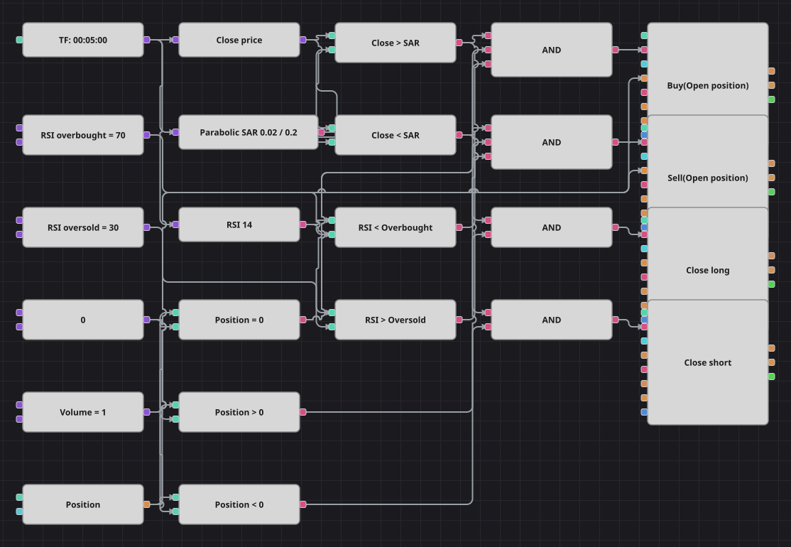

# Parabolic SAR + RSI Strategy Diagram
[Русский](README_ru.md) | [中文](README_zh.md) | [Español](README_es.md) | [Deutsch](README_de.md) | [Português](README_pt.md) | [日本語](README_ja.md)

Parabolic SAR decides which side of the market to stand on, and the Relative Strength Index is only allowed to veto an entry that would be made into an already exhausted move. The same SAR line that opens the trade also closes it, so the exit travels with the trend instead of sitting at a fixed price.

## Strategy Overview

- Parabolic SAR runs on finished candles and is compared with the closing price of every candle: a close above the line means the trend is up, a close below it means the trend is down.
- The Relative Strength Index is a soft filter, exactly as in the original code: a long needs RSI below the overbought level, a short needs RSI above the oversold level, so the filter blocks only entries made straight into an extreme.
- Positions are opened only from flat, and the SAR flip is the only way out — the diagram has no fixed stop-loss and no take-profit.

## Entry and Exit Rules

- **Long entry**: The candle closes above the Parabolic SAR, RSI is still below the overbought level and the position is flat. The modify block buys the shared volume at market.
- **Short entry**: The candle closes below the Parabolic SAR, RSI is still above the oversold level and the position is flat. The modify block sells the shared volume at market.
- **Exit**: A long is closed as soon as a candle closes below the SAR line, a short as soon as a candle closes above it; both closing blocks work on whatever size the position currently has.

## Parameters

| Parameter | Default | Description |
|---|---|---|
| RSI Length | 14 | Averaging length of the Relative Strength Index. |
| RSI Overbought | 70 | Level the index must stay below for a long entry to be allowed. |
| RSI Oversold | 30 | Level the index must stay above for a short entry to be allowed. |
| SAR Acceleration | 0.02 | Starting acceleration factor of Parabolic SAR. |
| SAR Max acceleration | 0.2 | Upper limit of the SAR acceleration factor. |
| Volume | 1 | Order volume, in lots. |
| Candles | 00:05:00 | Candle time frame the whole diagram works on. |

## Diagram Details

- The candle block feeds Parabolic SAR, the Relative Strength Index and a converter that reads the closing price of the candle.
- Two comparisons place the close against the SAR line, two more test the index against its constants, and three compare the position with zero.
- Every logical AND gathers one price condition, one filter condition and one position condition before it triggers a position modify block; the closing blocks use the close-position mode and need no volume.
- The 130-bar pause the C# strategy keeps after each trade has no counterpart block in the Designer, so this diagram re-enters sooner and trades more often than the original.

## Usage

Import the `.json` file into Designer, run it in the backtester on historical data, then adjust the parameters or the blocks themselves to fit your instrument before trading it live.
