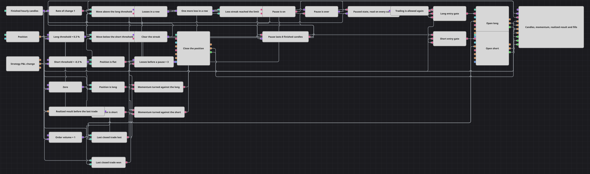

# Diagramm der Strategie „Pause nach Verlust“
[English](README.md) | [Русский](README_ru.md) | [中文](README_zh.md) | [Español](README_es.md) | [Português](README_pt.md) | [日本語](README_ja.md)

Ein schlichtes Momentum-Diagramm trägt eine Regel, die entscheidet, wann überhaupt gehandelt werden darf. Der Block P&L change meldet das realisierte Ergebnis des Kontos, sodass jeder geschlossene Trade als Gewinn oder Verlust gelesen werden kann, ohne Kurse zu messen. Aufeinanderfolgende Verluste werden gezählt, und sobald der Zähler seine Grenze erreicht, wird ein Flag-Block gesetzt, der den Handel für eine feste Anzahl von Kerzen geschlossen hält. Einstiege werden erst wieder aufgenommen, nachdem der Countdown abgelaufen ist und das Flag gelöscht wurde.

## Strategieübersicht

- Fertige Stundenkerzen speisen einen Rate of Change über eine Periode — die prozentuale Bewegung des Schlusskurses gegenüber dem vorherigen Schluss —, sodass ein einziger Indikator sowohl die Einstiegs- als auch die Ausstiegsschwelle trägt.
- Zwei Vergleiche prüfen diesen Prozentwert gegen zwei Variablen: eine obere Schwelle für eine Aufwärtsbewegung und eine untere, negative für eine Abwärtsbewegung.
- Der Position-Block wird dreimal mit null verglichen — gleich, größer und kleiner —, was einen Test auf eine flache Position für die Einstiege sowie je einen Long- und einen Short-Test für die Ausstiege ergibt.
- Ein Einstieg ist ein logisches UND aus drei Signalen: Momentum in die gewünschte Richtung, eine flache Position und keine laufende Pause. Beide Einstiegsblöcke sind auf reines Eröffnen gestellt, sodass das Diagramm jeweils nur eine Position hält und sie niemals aufstockt.
- Ein Ausstieg ist ein logisches UND aus Momentum in die Gegenrichtung und einer Position auf dieser Seite; er löst einen Position modify-Block aus, der auf Schließen gestellt ist und das Volumen aus dem Bestand ermittelt.
- Der Block P&L change meldet das realisierte Ergebnis. Ein Previous value-Block hält den Wert, der vor der letzten Änderung galt, und zwei Vergleiche sagen, ob das Ergebnis gefallen oder gestiegen ist — also ob der geschlossene Trade ein Verlust oder ein Gewinn war.
- Ein Verlust schickt die gespeicherte Serie durch eine Formel, die eins addiert und die Summe in dieselbe Variable zurückschreibt; ein Gewinn überschreibt sie mit null. Der Vergleich des neuen Zählerstands mit der Grenze ist das Signal, das eine Pause startet.
- Dieses Signal setzt ein Flag und schärft einen N values-Block, der fertige Kerzen zählt. Solange das Flag gesetzt ist, meldet eine auf jeder Kerze gelesene Zustandsvariable „pausiert“, ein logisches NICHT macht daraus „wieder erlaubt“, und das ist der dritte Eingang beider Einstiegs-Gates.

## Ein- und Ausstiegsregeln

- **Long-Einstieg**: Der Rate of Change der fertigen Kerze liegt über der Long-Schwelle, die Position ist flach, und es läuft keine Pause. Position modify kauft das Ordervolumen zum Marktpreis, nur eröffnend.
- **Short-Einstieg**: Der Rate of Change der fertigen Kerze liegt unter der Short-Schwelle, die Position ist flach, und es läuft keine Pause. Position modify verkauft das Ordervolumen zum Marktpreis, nur eröffnend.
- **Ausstieg**: Eine Position wird aufgegeben, sobald sich das Momentum gegen sie dreht: Ein Long wird geschlossen, wenn der Rate of Change unter die Short-Schwelle fällt, ein Short, wenn er über die Long-Schwelle steigt. Der Block ist auf Position schließen gestellt, sodass das Ordervolumen aus der Position selbst stammt und das Diagramm niemals mit einer einzigen Order von einer Seite auf die andere dreht — die Gegenseite kann erst durch eine spätere Kerze aus der flachen Position heraus eröffnet werden. Ausstiege werden nie durch die Pause zurückgehalten; nur Einstiege.

## Parameter

| Parameter | Standard | Beschreibung |
|---|---|---|
| Candles | 01:00:00 | Zeitrahmen der Kerzen, auf denen das gesamte Diagramm arbeitet. Auch die Pause wird in diesen Kerzen gezählt, sodass eine längere Kerze die Pause in Uhrzeit verlängert. |
| Rate Of Change Length | 1 | Wie viele Kerzen zurück der Rate of Change misst. Bei eins ist es die prozentuale Bewegung gegenüber dem vorherigen Schluss, worauf beide Schwellen ausgelegt sind; eine größere Länge macht daraus ein breiteres Momentum-Maß, und die Schwellen müssen entsprechend erweitert werden. |
| Long Threshold, % | 0.3 | Prozentuale Bewegung, die einen Long eröffnet und einen Short schließt. Ein höherer Wert macht beides seltener und das Diagramm wählerischer. |
| Short Threshold, % | -0.3 | Prozentuale Bewegung, die einen Short eröffnet und einen Long schließt, als negative Zahl geschrieben. Sie muss die Long-Schwelle nicht spiegeln; asymmetrische Werte verschieben das Diagramm zugunsten einer Seite. |
| Order Volume | 1 | Größe jeder Einstiegsorder in Instrumenteneinheiten. Ausstiege nehmen ihr Volumen aus der Position, deshalb wird dieser Wert dort nicht wiederholt. |
| Consecutive Losses | 3 | Wie viele geschlossene Trades in Folge Verlust machen müssen, bevor der Handel ausgesetzt wird. Ein Gewinntrade setzt den Zähler auf null zurück, es wird also eine Serie gezählt und keine Gesamtsumme; bei eins startet jeder Verlusttrade eine Pause. |
| Pause Candles | 8 | Wie viele fertige Kerzen eine Pause dauert. Über die gesamte Zählung hinweg werden Einstiege abgelehnt, danach wird das Flag gelöscht und der Verlustzähler auf null zurückgesetzt. |

## Diagrammdetails

- Nichts von der Handelsseite speist die Pause: Der Zähler der Verlustserie und das Flag werden allein vom Kontoergebnis getrieben, sodass das Diagramm keine Schleife enthält und die Pause die Erlaubnis immer nur entziehen, nie erteilen kann.
- Der Flag-Block gibt nur in dem Moment ein Signal aus, in dem er zum ersten Mal gesetzt wird, und der N values-Block ignoriert einen Auslöser, während er bereits zählt; ein weiteres Verlustsignal während einer laufenden Pause startet den Countdown also weder neu noch verlängert es ihn.
- Der Countdown wird in fertigen Kerzen des Handels-Zeitrahmens gemessen, nicht in Kontoereignissen, sodass eine ruhige und eine lebhafte Phase eine Pause gleicher Länge ergeben.
- Die Einstiegs-Gates lesen die Pause aus einer gespeicherten Variablen und nicht aus dem Flag selbst. Das Flag meldet einen Moment, die Variable hält einen Zustand — beim Setzen des Flags auf wahr geschrieben, beim Ende des Countdowns auf falsch und auf jeder Kerze ausgegeben, sodass beiden Gates stets ein frischer Wert zur Verfügung steht, den sie mit den beiden anderen Signalen verknüpfen können.
- Das Chartfenster zeichnet die Kerzen, den Rate of Change, das realisierte Ergebnis, die Ein- und Ausstiegsorders sowie jede Ausführung, sodass ein Abschnitt, in dem Signale erreicht wurden, aber keine Order folgte, leicht als Pause zu erkennen ist.

## Verwendung

Importieren Sie die `.json`-Datei in Designer, testen Sie sie im Backtester mit historischen Daten und passen Sie danach Parameter oder Bausteine an Ihr Instrument an, bevor Sie live handeln.
