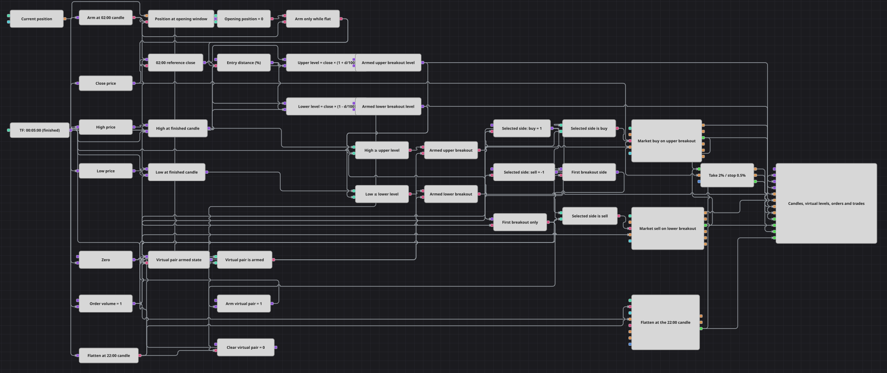

# 定时虚拟突破策略图
[English](README.md) | [Русский](README_ru.md) | [Español](README_es.md) | [Deutsch](README_de.md) | [Português](README_pt.md) | [日本語](README_ja.md)

该图表使用已完成的五分钟K线，每天激活一次两个对称的虚拟突破水平。时间戳为02:00的K线提供参考收盘价；之后任一水平被触及时，图表登记一笔市价入场，百分比保护管理成交后的持仓，时间戳为22:00的K线则停用该设置并平掉剩余持仓。虚拟水平是保存的数值，并不是交易所中的待成交订单。

## 策略概览

- 只有已完成的五分钟K线驱动时间安排、水平计算、突破检查和保护价格更新。开盘窗口`02:00:00–02:04:59`只选择时间戳为02:00的K线，该K线在约02:05完成时被处理。
- 如果开盘脉冲发生时持仓为零，图表会保存该K线的收盘价，并计算`Upper Level = Close × 1.0015`和`Lower Level = Close × 0.9985`。这两个保存的数值保持不变，并在下一个有效的开盘脉冲到来时被替换。
- 激活状态变量和按顺序执行的K线结束触发链，确保在决策前刷新High、Low及两个保存的水平。共享的一次性Flag只允许当天设置中的第一次突破通过。
- 上方比较先于下方比较执行。如果一根K线同时跨越两个水平，只接受上方突破并登记一笔市价买入；否则下方突破可以登记一笔市价卖出。在水平被触及前，不存在任何订单。
- 入场成交会初始化持仓保护。随后，已完成K线的收盘价驱动其2%止盈和0.5%止损检查。收盘窗口`22:00:00–22:04:59`解除未使用的设置，并提交最多为Order Volume 1的ReduceOnly市价操作；其成交返回保护方块，以清除所跟踪的敞口。

## 入场与出场规则

- **做多入场**: 虚拟水平对处于激活状态时，`High ≥ Upper Level`优先通过当日一次性门控，并登记Order Volume 1的市价买入。同一事件会关闭两个突破路径，直到下一个有效的开盘脉冲。
- **做空入场**: 如果上方突破未被接受，已激活的`Low ≤ Lower Level`条件会通过一次性门控，并登记Order Volume 1的市价卖出。该事件同样会在本周期剩余时间内关闭两个突破路径。
- **离场**: 当已完成K线的收盘价相对实际入场成交价向有利方向移动2%，或向不利方向移动0.5%时，持仓保护会提交市价离场。与此独立，时间戳为22:00的K线会停用虚拟水平对，并请求最多为Order Volume 1的ReduceOnly市价平仓。若盘中触及的保护阈值在K线最终收盘价上不再存在，图表不会执行该阈值；离场后，设置要到下一个开盘窗口才会再次激活。

## 参数

| 参数 | 默认值 | 说明 |
|---|---|---|
| Candles Series | 00:05:00 | 用于时间安排、虚拟水平、突破测试和保护性收盘价检查的已完成五分钟K线。 |
| Opening Window | 02:00:00–02:04:59 | 包含边界的单根K线区间，在持仓为零时捕获参考收盘价。 |
| Closing Window | 22:00:00–22:04:59 | 包含边界的单根K线区间，用于停用未使用的设置并平掉持仓。 |
| Entry Distance | 0.15% | 在捕获的收盘价上下设置的对称百分比偏移。 |
| Take Profit | 2% | 相对实际入场成交价的有利收盘价变动，达到后激活保护。 |
| Stop Loss | 0.5% | 相对实际入场成交价的不利收盘价变动，达到后激活保护。 |
| Order Volume | 1 | 任一市价入场的数量，也是计划减少持仓时的最大数量。 |

## 图表详情

- [K线](https://doc.stocksharp.com/zh/topics/designer/strategies/using_visual_designer/elements/data_sources/candles.html)方块输出已完成的五分钟K线。Close、High和Low[转换器](https://doc.stocksharp.com/zh/topics/designer/strategies/using_visual_designer/elements/common/converter.html)方块提供明确的数值流。
- 两个[工作时间](https://doc.stocksharp.com/zh/topics/designer/strategies/using_visual_designer/elements/time/working_time.html)方块检查K线的OpenTime。由于两个配置边界都包含在区间内，其上限设在下一个五分钟时间戳前一秒。
- [变量](https://doc.stocksharp.com/zh/topics/designer/strategies/using_visual_designer/elements/data_sources/variable.html)方块保存参考收盘价、计算出的水平、激活状态、选定方向和常量。两个[公式](https://doc.stocksharp.com/zh/topics/designer/strategies/using_visual_designer/elements/common/formula.html)方块只在有效的开盘脉冲中计算对称百分比偏移。
- [比较](https://doc.stocksharp.com/zh/topics/designer/strategies/using_visual_designer/elements/common/comparison.html)、[逻辑条件](https://doc.stocksharp.com/zh/topics/designer/strategies/using_visual_designer/elements/common/logical_condition.html)和[Flag](https://doc.stocksharp.com/zh/topics/designer/strategies/using_visual_designer/elements/common/flag.html)方块共同确保只在无持仓时激活、使用刷新后的数值进行评估、买入优先，并且每次设置只接受一次突破。
- 买入和卖出[订单登记](https://doc.stocksharp.com/zh/topics/designer/strategies/using_visual_designer/elements/orders/register.html)方块执行市价操作。它们的MyTrade输出初始化共享的[持仓保护](https://doc.stocksharp.com/zh/topics/designer/strategies/using_visual_designer/elements/positions/protect.html)方块，其Price输入接收已完成K线的收盘价。
- 定时[修改持仓](https://doc.stocksharp.com/zh/topics/designer/strategies/using_visual_designer/elements/positions/modify.html)方块使用ReduceOnly和Order Volume 1。它根据当前敞口确定平仓方向，绝不增加持仓，并在定时离场后把MyTrade输出返回给持仓保护。
- [图表面板](https://doc.stocksharp.com/zh/topics/designer/strategies/using_visual_designer/elements/common/chart.html)显示已完成K线、两个保存的虚拟水平、入场与保护订单，以及入场、保护和定时平仓成交。

## 使用方法

将 `.json` 文件导入 Designer，在回测器中用历史数据运行，然后根据自己的交易品种调整参数或方块，确认无误后再用于实盘。
