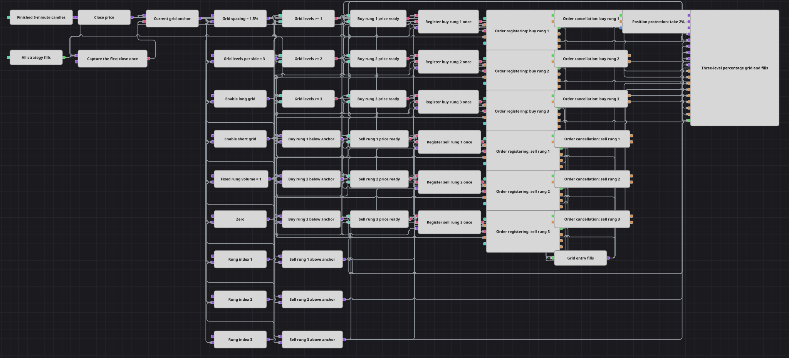

# 百分比网格阶梯策略图
[English](README.md) | [Русский](README_ru.md) | [Español](README_es.md) | [Deutsch](README_de.md) | [Português](README_pt.md) | [日本語](README_ja.md)

该图以第一根已完成五分钟K线的收盘价为锚点建立对称百分比网格。锚点下方放置三张买入限价单，上方放置三张卖出限价单；第一张成交后撤销其余阶梯，并用百分比保护管理持仓。

## 策略概览

- 第一根已完成五分钟K线的收盘价被锁定为锚点，不使用Level1报价或买卖价中点。
- 1.5%的间距在锚点下方生成最多三个买入层级，在上方生成最多三个卖出层级。
- 每侧网格层数启用第一至第三层，做多和做空开关可分别控制两侧。
- 第一张入场单成交后撤销所有仍在工作的网格单，并启动2%止盈和3%止损保护。
- 保护退出会撤销残余订单，以最新收盘价重新设锚并登记新阶梯。

## 入场与出场规则

- **做多入场**: 启用做多时，在anchor × (1 − spacing × 层号)放置一单位买入限价单；每侧网格层数决定启用一至三层。
- **做空入场**: 启用做空时，在anchor × (1 + spacing × 层号)放置一单位卖出限价单；每侧网格层数决定启用一至三层。
- **离场**: 第一张成交单形成唯一的持仓周期。持仓保护在+2%或−3%平仓，随后按最新已完成收盘价重建下一组六张网格单。

## 参数

| 参数 | 默认值 | 说明 |
|---|---|---|
| Grid Spacing, % | 1.5 | 相邻网格层级之间的百分比距离；1.5表示1.5%。 |
| Grid Levels per Side | 3 | 每侧启用的层数，范围一至图中的最大值三。 |
| Enable Long | true | 允许在锚点下方登记买入限价单。 |
| Enable Short | true | 允许在锚点上方登记卖出限价单。 |
| Take Profit, % | 2 | 持仓保护相对成交价的止盈距离。 |
| Stop Loss, % | 3 | 持仓保护相对成交价的止损距离。 |

## 图表详情

- C#策略保存虚拟层级，并在K线收盘价触及层级时发送市价单。本图有意改用真实挂单限价，以展示订单方块及撤单生命周期。
- 源代码可以陆续触发多个层级。本图采用单持仓周期简化：一次成交即撤销其他层级，固定交易一单位，并等待保护退出后再重建。
- 每侧网格层数支持一到三。图中最多只有三个实体层级，因此大于三的值不会生成更多方块。
- 重新设锚采用先撤单再登记新单，不使用订单替换方块；对未声明价格步长的回放证券关闭价格收缩。
- 初始及后续锚点均为精确的K线收盘价，与源代码的重置价格一致，也避免了不必要的Level1依赖。

## 使用方法

将 `.json` 文件导入 Designer，在回测器中用历史数据运行，然后根据自己的交易品种调整参数或方块，确认无误后再用于实盘。
