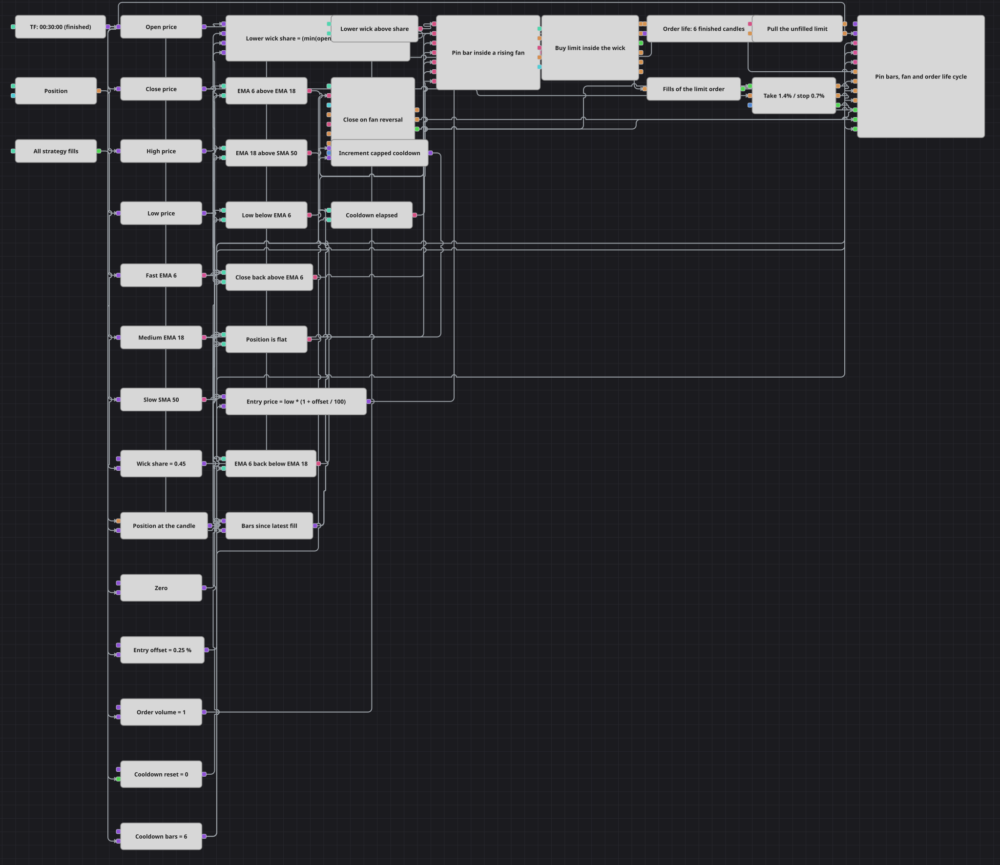

# Pin Bar Pending Order Strategy Diagram
[Русский](README_ru.md) | [中文](README_zh.md) | [Español](README_es.md) | [Deutsch](README_de.md) | [Português](README_pt.md) | [日本語](README_ja.md)

This long-only diagram looks for a deep lower wick inside a rising moving-average fan. Instead of buying the signal close, it places a limit order inside the wick, cancels an unfilled order after a fixed number of finished candles, protects a fill with percentage exits, and also closes when the fast EMA falls below the medium EMA.

## Strategy Overview

- Finished thirty-minute candles feed open, high, low, and close converters plus formed-only EMA 6, EMA 18, and SMA 50 indicators.
- A Formula calculates (min(open, close) - low) / (high - low). The lower wick must cover more than 0.45 of the full candle range.
- The trend filter requires EMA 6 > EMA 18 > SMA 50. The signal candle must also dip below EMA 6 and close back above it.
- The entry gate requires all pattern conditions, a flat Position, and a six-candle cooldown since the latest strategy fill.
- Order registering places a buy limit of Order Volume at low * (1 + 0.25 / 100), slightly above the signal low, with price shrinking disabled.
- N values counts six subsequent finished candles from the registered order. Its output triggers Order cancellation if the limit is still active, while Trades for order forwards any fill to protection.
- Position protection places a 1.4% take profit and a 0.7% stop loss. Separately, EMA 6 below EMA 18 triggers a market ClosePosition exit.

## Entry and Exit Rules

- **Long entry**: A finished candle qualifies when its lower wick share exceeds 0.45, EMA 6 is above EMA 18, EMA 18 is above SMA 50, the low is below EMA 6, the close is back above EMA 6, Position is flat, and at least six candles have passed since the latest strategy fill. The diagram then registers a buy limit at the candle low plus 0.25%. Entry occurs only if a later price move fills that order.
- **Short entry**: The diagram has no short entry. A weakening fan is treated as an exit condition rather than a signal to open a short position.
- **Exit**: An unfilled limit is cancelled after six finished candles. A filled long is closed by Position protection at +1.4% or -0.7% from its fill price, or by a market ClosePosition order when EMA 6 falls below EMA 18. The market exit fill is returned to the protection block so its protective state is cleared.

## Parameters

| Parameter | Default | Description |
|---|---|---|
| Candles | 00:30:00 | Time frame of the finished candles used by the pattern, indicators, order life, cooldown, and exits. |
| Fast EMA Length | 6 | Length of the fast ExponentialMovingAverage that the wick must pierce and the close must recover. |
| Medium EMA Length | 18 | Length of the middle ExponentialMovingAverage in the rising fan. |
| Slow SMA Length | 50 | Length of the slow SimpleMovingAverage at the base of the fan. |
| Wick Share | 0.45 | Minimum lower-wick share of the complete candle range. |
| Entry Offset, % | 0.25 | Percentage above the signal low used as the buy-limit price. |
| Order Volume | 1 | Quantity of each pending buy order. |
| Order Life, candles | 6 | Number of finished candles before an unfilled limit is cancelled. |
| Take Profit, % | 1.4 | Favorable distance from the entry fill, in percent. |
| Stop Loss, % | 0.7 | Adverse distance from the entry fill, in percent. |
| Cooldown, candles | 6 | Minimum number of finished candles after the latest strategy fill before another entry is allowed. |

## Diagram Details

- All price fields, indicators, state checks, and counters use one finished thirty-minute candle stream, so order timestamps remain on the trading clock.
- The AND gate combines wick size, both fan comparisons, the fast-EMA pierce and recovery, flat Position, and cooldown readiness into one entry trigger.
- Order registration feeds the same order to N values, Order cancellation, Trades for order, and the chart. The order-life counter starts from the registration event and advances with finished candles.
- Strategy trades resets the cooldown counter to zero on every own fill. Each candle increments it up to the configured limit; a large initial value makes the first setup immediately eligible.
- The flat-position filter blocks new entries after a fill. While an earlier limit remains unfilled, a later qualifying candle is an independent pending-order attempt; every such order follows the same six-candle cancellation rule.

## Usage

Import the `.json` file into Designer, run it in the backtester on historical data, then adjust the parameters or the blocks themselves to fit your instrument before trading it live.
