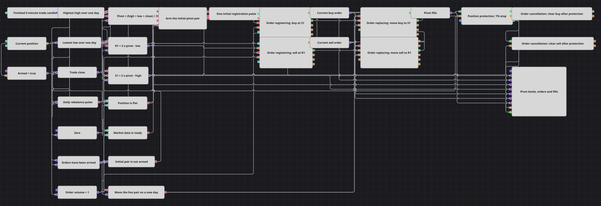

# Diagrama de estrategia de órdenes limitadas por pivotes
[English](README.md) | [Русский](README_ru.md) | [中文](README_zh.md) | [Deutsch](README_de.md) | [Português](README_pt.md) | [日本語](README_ja.md)

El diagrama convierte los soportes y resistencias clásicos de pivote en una pareja persistente de órdenes limitadas. Un día móvil de velas cerradas aporta el rango, una breve ventana de medianoche programa el ciclo de vida y la referencia vigente de cada orden pasa por registro, reemplazo, cancelación y gráfico.

## Resumen de la estrategia

- Las velas cerradas de cinco minutos alimentan Highest y Lowest con una ventana de 288 barras, equivalente a un día móvil; el último cierre completa el cálculo.
- Las fórmulas calculan P = (H + L + C) / 3, R1 = 2P − L y S1 = 2P − H sin encadenar una fórmula con otra.
- Working time emite el pulso diario cerca de medianoche. Un estado retenido permite que el primer pulso con niveles listos y posición plana registre una sola pareja.
- Order registering publica una compra limitada en S1 y una venta limitada en R1, conservando exactamente el precio calculado.
- Combination guarda la referencia más reciente. Los pulsos posteriores activan Order replacing y cada resultado vuelve al mismo bus.
- Position protection coloca un stop del 1% tras una ejecución. Su ejecución activa Order cancellation, mientras que la orden del pivote opuesto compensa naturalmente la posición.

## Reglas de entrada y salida

- **Entrada en largo**: Cuando se forma el rango de 288 barras, el primer pulso válido publica una compra limitada en S1 con el volumen configurado. El toque del soporte ejecuta la entrada y la venta en R1 puede actuar como salida opuesta.
- **Entrada en corto**: El mismo pulso publica una venta limitada en R1. El toque de la resistencia abre el corto y la compra en S1 ofrece la salida limitada opuesta.
- **Salida**: La orden del pivote opuesto puede aplanar la posición al otro extremo del rango. En paralelo, Position protection cierra un movimiento adverso del 1% y cancela las órdenes aún activas después de ejecutarse.

## Parámetros

| Parámetro | Por defecto | Descripción |
|---|---|---|
| Candle Time Frame | 00:05:00 | Marco temporal de las velas cerradas usadas por el rango diario móvil, los pivotes, las órdenes y la protección. |
| Order Volume | 1 | Cantidad de cada orden limitada de compra y venta. |
| Stop Loss, % | 1 | Distancia adversa desde la ejecución a la que sale Position protection, en porcentaje. |

## Detalles del diagrama

- La ventana Highest/Lowest de 288 barras aproxima un día móvil y evita depender de una suscripción diaria separada.
- R1 y S1 se expanden directamente con H, L y C, manteniendo las ecuaciones y produciendo ambos niveles en una sola capa.
- Una variable flag recuerda que la pareja inicial ya fue armada y evita registros repetidos en cada vela.
- Las órdenes registradas y reemplazadas entran en buses Combination<Order>; la salida de cada reemplazo vuelve al bus para mantener la referencia actual.
- OnlineOnly = false y ShrinkPrice = false permiten la reproducción histórica y preservan los precios calculados.

## Uso

Importe el archivo `.json` en Designer, ejecútelo sobre datos históricos en el probador y después ajuste los parámetros o los propios bloques a su instrumento antes de operar en real.
