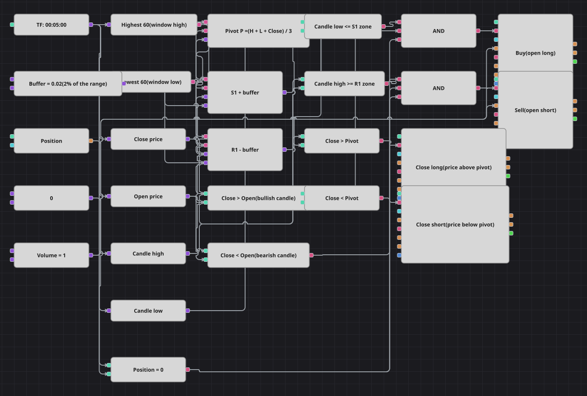

# Diagrama de la estrategia de reversión en el punto pivote
[English](README.md) | [Русский](README_ru.md) | [中文](README_zh.md) | [Deutsch](README_de.md) | [Português](README_pt.md) | [日本語](README_ja.md)

El pivote clásico del parqué se recalcula en cada vela sobre una ventana móvil: el máximo y el mínimo de las últimas sesenta velas, junto con el cierre actual, dan el pivote P, el soporte S1 y la resistencia R1. El diagrama opera contra el movimiento en los bordes de esa banda y recoge el beneficio en el propio pivote.

## Resumen de la estrategia

- Highest y Lowest sobre la misma ventana sustituyen al rango de la sesión anterior, así que los niveles se mueven con el mercado en lugar de fijarse una vez al día.
- P = (High + Low + Close) / 3, S1 = 2P - High, R1 = 2P - Low, y un margen del dos por ciento del rango de la ventana ensancha ambas zonas.
- La entrada exige además que la vela acompañe: alcista en el soporte, bajista en la resistencia.
- El objetivo es el propio pivote: la posición se cierra en cuanto el cierre pasa al otro lado de P.

## Reglas de entrada y salida

- **Entrada en largo**: El mínimo de la vela entra en la zona de S1 (mínimo <= S1 + margen), la vela cierra por encima de su apertura y la posición está plana. La orden de compra abre un largo de un lote.
- **Entrada en corto**: El máximo de la vela alcanza la zona de R1 (máximo >= R1 - margen), la vela cierra por debajo de su apertura y la posición está plana. La orden de venta abre un corto de un lote.
- **Salida**: El largo se cierra cuando el cierre queda por encima del pivote y el corto cuando queda por debajo. Ambos bloques de salida trabajan en modo cierre de posición, de modo que no hacen nada si no hay nada que cerrar. El código original no lleva ni stop de pérdidas ni toma de beneficios, y el diagrama lo respeta.

## Parámetros

| Parámetro | Por defecto | Descripción |
|---|---|---|
| Highest Length | 60 | Longitud de la ventana del indicador Highest, es decir, cuántas velas entran en el máximo. |
| Lowest Length | 60 | Longitud de la ventana del indicador Lowest; conviene mantenerla igual que la de Highest. |
| Zone Buffer | 0.02 | Anchura de las zonas de entrada como fracción del rango de la ventana: 0,02 es el dos por ciento. |
| Volume | 1 | Volumen de la orden, en lotes. |
| Candles | 00:05:00 | Marco temporal de las velas con el que trabaja todo el diagrama. |

## Detalles del diagrama

- El bloque de velas alimenta los indicadores Highest y Lowest y también cuatro conversores: apertura, máximo, mínimo y cierre.
- Tres bloques de fórmula convierten esos cinco números en el pivote, el soporte con margen y la resistencia con margen; el margen es una constante propia y por eso se puede optimizar.
- Cada entrada es una Y lógica de tres comparaciones: toque del nivel, dirección de la vela y posición plana.
- Los dos bloques de salida se disparan con una simple comparación del cierre contra el pivote y usan el modo cierre de posición en lugar de un volumen fijo.
- La estrategia original usa velas de un minuto y calla durante quinientas barras tras cada operación; el diagrama trabaja en cinco minutos, que es lo que admite el histórico incluido, y no tiene esa pausa.

## Uso

Importe el archivo `.json` en Designer, ejecútelo sobre datos históricos en el probador y después ajuste los parámetros o los propios bloques a su instrumento antes de operar en real.
