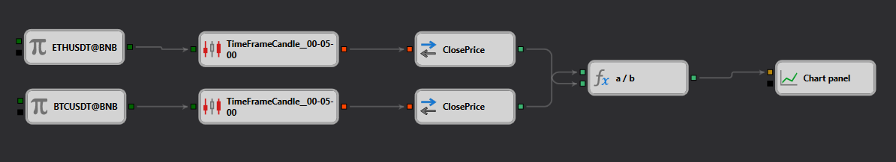

# PseudoIndex Strategy Description

## Strategy Overview

The "PseudoIndex" strategy is designed to create a synthetic index from the price ratios of two major cryptocurrencies, specifically Ethereum and Bitcoin, as traded on the Binance exchange. This strategy monitors the relative performance of these cryptocurrencies by calculating a real-time index based on their price movements.

## Strategy Details

### Components

- **Data Sources**: Utilizes [real-time price](https://doc.stocksharp.com/topics/designer/strategies/using_visual_designer/elements/data_sources/candles.html) data of ETHUSDT and BTCUSDT from Binance.
- **Price Calculation**: 
  - Tracks the [closing prices](https://doc.stocksharp.com/topics/designer/strategies/using_visual_designer/elements/converters/converter.html) of both ETHUSDT and BTCUSDT.
  - Computes the ratio of these prices to form a synthetic index, representing the relative performance of Ethereum against Bitcoin.

### Index Computation

- **Candle Formation**: Uses a [5-minute timeframe](https://doc.stocksharp.com/topics/designer/strategies/using_visual_designer/elements/data_sources/candles.html) for both ETH and BTC to capture short-term price movements.
- **Ratio Calculation**: The index is calculated as the price of ETH [divided](https://doc.stocksharp.com/topics/designer/strategies/using_visual_designer/elements/common/formula.html) by the price of BTC, providing a measure of how Ethereum's value trends relative to Bitcoin.

### Visualization

- **Chart Display**: The resulting index is plotted on a [chart](https://doc.stocksharp.com/topics/designer/strategies/using_visual_designer/elements/common/chart.html) for visual analysis, helping to identify trends and potential trading signals based on the index's movement.

## Implementation Details

- **Platform**: Implemented within the StockSharp platform using its advanced features for real-time data fetching and processing.
- **Technical Indicators**: The strategy relies on basic price information without the use of additional technical indicators, focusing on the price ratio for decision-making.

## Conclusion

The "PseudoIndex" strategy offers a novel approach to trading by comparing the performance of two major cryptocurrencies, allowing traders to gauge market sentiment and make informed decisions based on the relative strength of Ethereum and Bitcoin. This can be particularly useful for traders looking to hedge or diversify their cryptocurrency holdings based on these insights.
