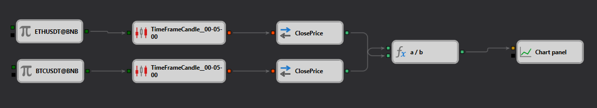

# Beschreibung der PseudoIndex-Strategie
[English](README.md) | [Русский](README_ru.md) | [中文](README_zh.md) | [Español](README_es.md) | [Português](README_pt.md) | [日本語](README_ja.md)

## Strategieübersicht

Die „PseudoIndex"-Strategie ist darauf ausgelegt, einen synthetischen Index aus den Kursrelationen zweier bedeutender Kryptowährungen — Ethereum und Bitcoin — zu erstellen, wie sie an der Binance-Börse gehandelt werden. Die Strategie überwacht die relative Entwicklung dieser Kryptowährungen, indem sie einen Echtzeit-Index auf Basis ihrer Kursbewegungen berechnet.

## Strategiedetails

### Komponenten

- **Datenquellen**: Nutzt [Echtzeit-Kursdaten](https://doc.stocksharp.com/topics/designer/strategies/using_visual_designer/elements/data_sources/candles.html) von ETHUSDT und BTCUSDT von Binance.
- **Kursberechnung**:
  - Verfolgt die [Schlusskurse](https://doc.stocksharp.com/topics/designer/strategies/using_visual_designer/elements/converters/converter.html) von ETHUSDT und BTCUSDT.
  - Berechnet das Verhältnis dieser Kurse, um einen synthetischen Index zu bilden, der die relative Entwicklung von Ethereum gegenüber Bitcoin darstellt.

### Indexberechnung

- **Kerzenbildung**: Verwendet einen [5-Minuten-Zeitrahmen](https://doc.stocksharp.com/topics/designer/strategies/using_visual_designer/elements/data_sources/candles.html) für ETH und BTC, um kurzfristige Kursbewegungen zu erfassen.
- **Verhältnisberechnung**: Der Index wird als Kurs von ETH [geteilt](https://doc.stocksharp.com/topics/designer/strategies/using_visual_designer/elements/common/formula.html) durch den Kurs von BTC berechnet und liefert ein Maß dafür, wie sich der Wert von Ethereum relativ zu Bitcoin entwickelt.

### Visualisierung

- **Chart-Anzeige**: Der resultierende Index wird auf einem [Chart](https://doc.stocksharp.com/topics/designer/strategies/using_visual_designer/elements/common/chart.html) zur visuellen Analyse dargestellt, um Trends zu identifizieren und potenzielle Handelssignale auf Basis der Indexbewegung zu erkennen.

## Implementierungsdetails

- **Plattform**: Implementiert auf der StockSharp-Plattform unter Nutzung ihrer fortgeschrittenen Funktionen für Echtzeit-Datenabruf und -Verarbeitung.
- **Technische Indikatoren**: Die Strategie stützt sich auf grundlegende Kursinformationen ohne den Einsatz zusätzlicher technischer Indikatoren und konzentriert sich auf das Kursverhältnis für die Entscheidungsfindung.

## Fazit

Die „PseudoIndex"-Strategie bietet einen neuartigen Handelsansatz durch den Vergleich der Wertentwicklung zweier bedeutender Kryptowährungen. Trader können damit die Marktstimmung einschätzen und fundierte Entscheidungen auf Basis der relativen Stärke von Ethereum und Bitcoin treffen. Dies kann besonders nützlich für Trader sein, die ihre Kryptowährungsbestände auf Basis dieser Erkenntnisse absichern oder diversifizieren möchten.
