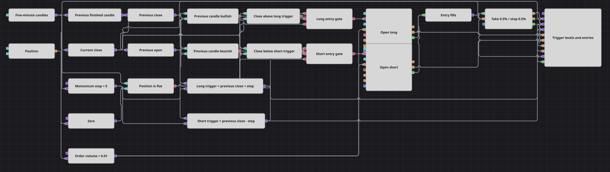

# Diagrama da estratégia Quote Momentum Sync
[English](README.md) | [Русский](README_ru.md) | [中文](README_zh.md) | [Español](README_es.md) | [Deutsch](README_de.md) | [日本語](README_ja.md)

Momentum medido de um fechamento para o seguinte. O diagrama compara o fechamento do candle recém-concluído com o fechamento anterior e exige um movimento de pelo menos um número fixo de unidades de preço, na direção que o candle anterior já vinha seguindo. Cada leitura é feita no mesmo compasso de cinco minutos, de modo que o preço de referência, o filtro de direção e a verificação da posição estão sempre sincronizados e um sinal nunca é montado a partir de valores pertencentes a momentos diferentes.

## Visão geral da estratégia

- Candles concluídos de cinco minutos do instrumento negociado são os únicos dados de mercado que o diagrama assina, e tudo o que vem depois funciona nesse compasso.
- O Previous value guarda o candle anterior inteiro, e não um único número, e dois conversores extraem dele o fechamento e a abertura.
- Esse fechamento anterior é o preço de referência: uma fórmula soma a ele o passo de momentum e outra subtrai o passo, o que dá um nível de disparo de compra e um nível de disparo de venda para o candle atual.
- Um terceiro conversor lê o fechamento do candle recém-concluído, e duas comparações o posicionam em relação aos dois níveis.
- O filtro de direção é o formato do candle anterior: seu fechamento contra a sua própria abertura, de modo que um candle de alta permite apenas posições compradas e um candle de baixa apenas posições vendidas.
- Um bloco Position comparado com zero indica se a conta está zerada, o que mantém o diagrama fora de uma operação já aberta em vez de aumentá-la.
- Duas condições lógicas reúnem direção, momentum e ausência de posição, e cada uma aciona um Position modify que abre a mercado um volume fixo e somente a partir de posição zerada.
- O Position protection recebe as execuções de entrada e o fechamento atual e encerra a operação em um take-profit ou stop-loss percentual fixo; o diagrama não tem nenhuma outra saída.

## Regras de entrada e saída

- **Entrada comprada**: O candle anterior fechou acima da sua própria abertura, o candle recém-concluído fechou acima do fechamento anterior mais o passo de momentum, e a posição está zerada. O Position modify compra a mercado o volume da ordem.
- **Entrada vendida**: O candle anterior fechou abaixo da sua própria abertura, o candle recém-concluído fechou abaixo do fechamento anterior menos o mesmo passo, e a posição está zerada. O Position modify vende a mercado o volume da ordem.
- **Saída**: Não há sinal de saída no diagrama. A partir do momento em que uma entrada é executada, a operação pertence ao Position protection, que a encerra com 0.5% de lucro ou 0.5% de prejuízo em relação ao preço de entrada. A proteção é calculada a partir do fechamento do candle, portanto os níveis são verificados uma vez por candle, e uma leitura contrária é ignorada enquanto a posição estiver aberta: a próxima entrada espera até que a posição volte a ficar zerada.

## Parâmetros

| Parâmetro | Padrão | Descrição |
|---|---|---|
| Candles | 00:05:00 | Time frame da série de candles em que todo o diagrama funciona. |
| Momentum Step | 5 | Distância em relação ao fechamento anterior, em unidades de preço, que o candle concluído precisa superar para que uma entrada seja permitida. |
| Order Volume | 0.01 | Tamanho da ordem, em lotes. |
| Take Profit, % | 0.5 | Distância do take-profit, em percentual do preço de entrada. |
| Stop Loss, % | 0.5 | Distância do stop-loss, em percentual do preço de entrada. |

## Detalhes do diagrama

- O Previous value está configurado para guardar um candle, e não um número, e os campos são lidos depois pelos conversores; é isso que faz o preço de referência e o filtro de direção virem de um único e mesmo candle.
- A condição de entrada é escrita como dois níveis de preço, e não como uma diferença em relação a um limiar, o que é a mesma aritmética vista pelo outro lado e permite que o gráfico mostre o nível que gerou cada entrada.
- Os dois blocos de entrada abrem somente a partir de posição zerada, de modo que sinais repetidos durante uma operação aberta não custam nada e nenhuma ordem é enviada para inverter ou para piramidar.
- Cada constante é acionada pela série de candles, portanto publica o seu valor a cada candle; uma constante que nunca dispara deixaria a sua comparação sem o segundo operando e a condição jamais se formaria.
- O passo de momentum é uma distância absoluta nas próprias unidades de preço, e não um percentual, portanto precisa ser reescalonado para um instrumento cotado em outra ordem de grandeza, enquanto o take-profit e o stop-loss são percentuais e se mantêm inalterados.

## Uso

Importe o arquivo `.json` no Designer, execute-o sobre dados históricos no backtester e depois ajuste os parâmetros ou os próprios blocos ao seu instrumento antes de operar ao vivo.
