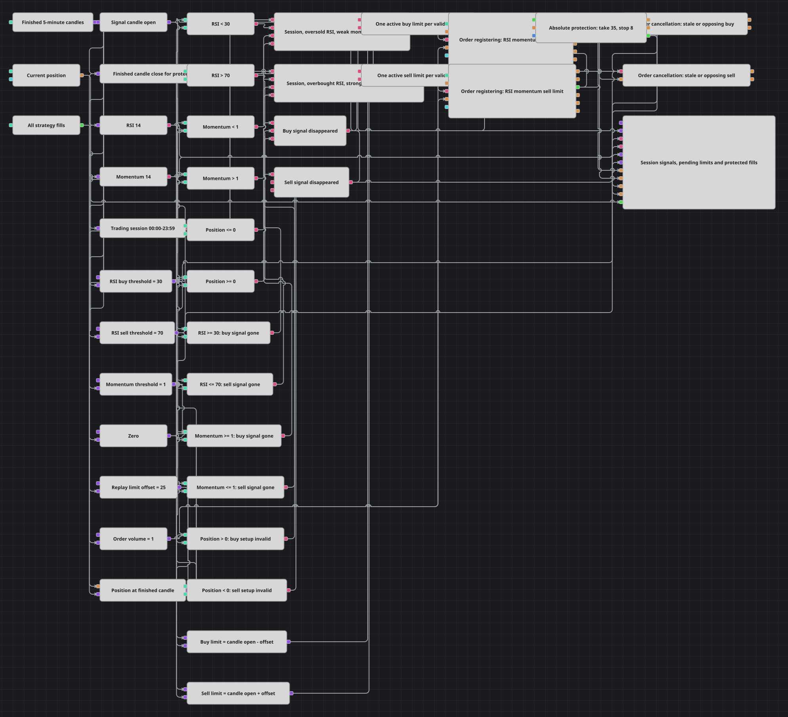

# RSI与Momentum限价时段策略图
[English](README.md) | [Русский](README_ru.md) | [Español](README_es.md) | [Deutsch](README_de.md) | [Português](README_pt.md) | [日本語](README_ja.md)

该图结合RSI(14)、Momentum(14)、全天Working time过滤器和可管理的挂单限价。超卖且动量较弱时在K线开盘价下方挂买单，超买且动量较强时在上方挂卖单，信号失效时明确撤销本侧订单。

## 策略概览

- 已完成的五分钟K线同时输入RSI、Momentum、用于入场的开盘价以及用于保护判断的收盘价。
- Working time允许00:00至23:59的K线，与源代码实际全天交易一致，同时保留可配置的时间方块。
- RSI低于30、Momentum低于1且Position <= 0时允许买入；RSI高于70、Momentum高于1且Position >= 0时允许卖出。
- 一次性标志保证每轮信号最多一张订单，并明确撤销失效的本侧订单或对侧订单。
- 限价成交后使用绝对止盈35和止损8，已完成收盘价连接到持仓保护的价格输入。

## 入场与出场规则

- **做多入场**: 时段内满足RSI < 30、Momentum < 1和Position <= 0时，在OpenPrice − 25登记一单位买入限价，并先撤销工作中的卖单。
- **做空入场**: 时段内满足RSI > 70、Momentum > 1和Position >= 0时，在OpenPrice + 25登记一单位卖出限价，并先撤销工作中的买单。
- **离场**: 持仓保护在绝对盈利35或亏损8个价格单位时平仓。RSI、Momentum或持仓条件失效会撤销买单，卖单逻辑对称。

## 参数

| 参数 | 默认值 | 说明 |
|---|---|---|
| Candle Time Frame | 00:05:00 | 已完成K线周期；五分钟是回放适配，C#默认十五分钟。 |
| RSI Period | 14 | RelativeStrengthIndex使用的数值数量。 |
| Momentum Period | 14 | Momentum使用的数值数量。 |
| Session Start | 00:00:00 | Working time窗口开始时间。 |
| Session End | 23:59:00 | Working time窗口结束时间；23:59保持源代码全天行为。 |
| RSI Buy Threshold | 30 | 买入信号要求RSI低于此值。 |
| RSI Sell Threshold | 70 | 卖出信号要求RSI高于此值。 |
| Momentum Threshold | 1 | 买入要求Momentum低于此值，卖出要求高于此值。 |
| Limit Offset, price units | 25 | 回放图中从OpenPrice减去或加上的绝对距离。 |
| Order Volume | 1 | 每张挂单限价的数量。 |
| Take Profit, price units | 35 | 相对入场成交价的绝对有利距离。 |
| Stop Loss, price units | 8 | 相对入场成交价的绝对不利距离。 |

## 图表详情

- C#默认使用15分钟K线。本图改用五分钟回放K线以展示足够的信号和订单周期，两个指标周期仍为14，因此这是明确的采样适配。
- 源代码按5 × PriceStep偏移。图中没有单独读取回放证券步长，故采用25个绝对价格单位；这是画廊执行设置，不是C#默认值。
- 入场限价严格按ProcessCandle从OpenPrice计算。ClosePrice独立存在，仅向Position protection提供实时价格。
- 源代码保护距离为35 × PriceStep和8 × PriceStep。本图将数字35和8保留为绝对价格单位，而不是错误地写成百分比。
- 一次性标志模拟源代码的活动订单检查；当RSI、Momentum或对应持仓条件失效时重置，使后续有效信号可再次挂单。

## 使用方法

将 `.json` 文件导入 Designer，在回测器中用历史数据运行，然后根据自己的交易品种调整参数或方块，确认无误后再用于实盘。
