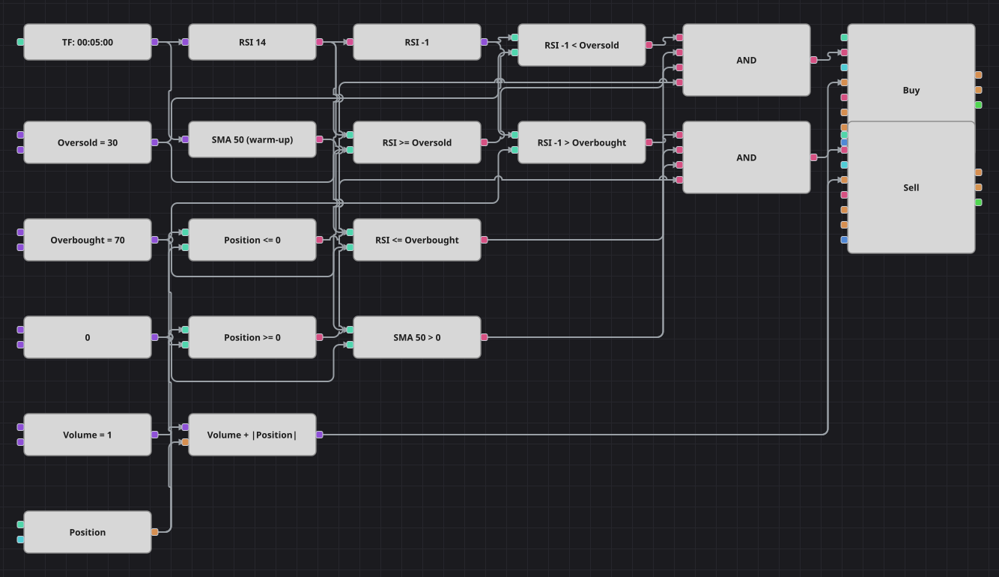

# RSI リバージョン戦略のダイアグラム
[English](README.md) | [Русский](README_ru.md) | [中文](README_zh.md) | [Español](README_es.md) | [Deutsch](README_de.md) | [Português](README_pt.md)

このダイアグラムは RSI の行き過ぎを狙いますが、仕掛けるのは指数が反転した瞬間です。売られすぎ水準を下回っていた RSI がその水準まで戻れば買い、買われすぎ水準を上回っていた RSI がその水準まで下がれば売ります。1 回の注文がドテンに必要な数量を運ぶため、ノーポジションか片側のみの保有になります。

## 戦略の概要

- 相対力指数は確定足で計算され、前値ブロックが1本前の足の値を保持するので、指数が通常のレンジへ戻った足をそのまま捉えられます。
- 50 本の SimpleMovingAverage は元の戦略から引き継いだもので、方向を決めることはなく、形成されるまで売買を遅らせるだけです。
- 現在のポジションが両方の判断に加わり、注文数量は基準数量に保有ポジションを足した値なので、1 回の成行注文で手仕舞いとドテンが同時に行われます。

## エントリーとエグジットの条件

- **ロングエントリー**: 1本前の RSI が売られすぎ水準を下回り、現在の RSI がその水準以上で、SMA 50 が形成済み、かつポジションが買いではないとき。注文は基準数量に保有中の売り数量を足して買い、売り持ちならドテン、ノーポジションなら新規の買いになります。
- **ショートエントリー**: 1本前の RSI が買われすぎ水準を上回り、現在の RSI がその水準以下で、SMA 50 が形成済み、かつポジションが売りではないとき。注文は基準数量に保有中の買い数量を足して売り、買い持ちならドテン、ノーポジションなら新規の売りになります。
- **エグジット**: 専用のエグジットブロックはありません。反対側のリバージョン信号が同じ注文で手仕舞いと新規建てを行います。元の戦略にも損切りと利食いはなく、売買後に 10 本の足を休む処理は、ブロックが足をまたいで状態を保持できないため移植していません。

## パラメーター

| パラメーター | 既定値 | 説明 |
|---|---|---|
| RSI Length | 14 | 相対力指数の平滑化期間。 |
| SMA Length | 50 | ウォームアップを担う単純移動平均の期間。 |
| Oversold | 30 | 買いのために指数が戻るべき水準。 |
| Overbought | 70 | 売りのために指数が戻るべき水準。 |
| Volume | 1 | 基準となる注文数量（ロット）。 |
| Candles | 00:05:00 | ダイアグラム全体が用いるローソク足の時間軸。 |

## ダイアグラムの詳細

- ローソク足ブロックが2つの指標を動かし、RSI 出力に付けた前値ブロックが1本前の値を供給します。
- 各方向で2つの比較ブロックが前値と現在値をしきい値の定数と比べ、元コードの条件をそのまま再現します。
- SMA とゼロの比較は元コードのガードに対応し、指標ブロックが形成済みの値だけを出すため、売買は 50 本目以降に始まります。
- 数式ブロックがポジションの絶対値を数量定数に加え、2つのポジション変更ブロックがその数量で成行注文を出します。

## 使い方

`.json` ファイルを Designer に読み込み、バックテスターで過去データを使って実行し、実運用の前にパラメーターやブロック自体を自分の銘柄に合わせて調整してください。
