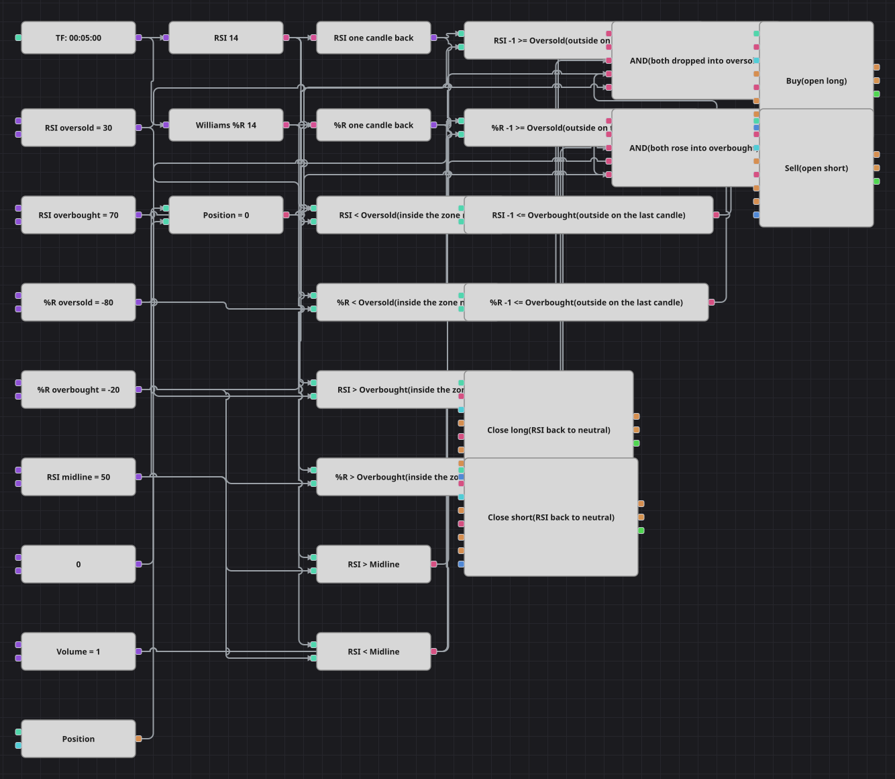

# Диаграмма стратегии двойного пробоя RSI и Williams %R
[English](README.md) | [中文](README_zh.md) | [Español](README_es.md) | [Deutsch](README_de.md) | [Português](README_pt.md) | [日本語](README_ja.md)

Два осциллятора должны согласиться на одной и той же свече. Схема покупает только тогда, когда RSI проваливается ниже 30, а Williams %R одновременно уходит ниже -80, и продаёт только тогда, когда RSI поднимается выше 70, а Williams %R — выше -20. Просто нахождение в зоне не годится: на прошлой свече оба индикатора обязаны быть вне её, поэтому каждый из них хранится ещё и со сдвигом на одну свечу. Пауза в 180 баров из исходного кода не воспроизведена: на пятиминутках она заглушила бы стратегию на пятнадцать часов после каждой сделки.

## Обзор стратегии

- RSI 14 и Williams %R 14 считаются по одним и тем же пятиминутным свечам одного инструмента.
- Кубики предыдущего значения держат оба осциллятора на одну свечу назад, поэтому свежий вход в зону отличается от значения, которое лежит там уже несколько часов.
- Вход выполняется только из нулевой позиции, а возвращает в неё средняя линия RSI на уровне 50.

## Правила входа и выхода

- **Вход в лонг**: RSI ниже уровня перепроданности, а на прошлой свече был на нём или выше, и Williams %R ниже своего уровня перепроданности, а на прошлой свече был на нём или выше; позиция нулевая. Покупается один лот по рынку.
- **Вход в шорт**: RSI выше уровня перекупленности, а на прошлой свече был на нём или ниже, и Williams %R выше своего уровня перекупленности, а на прошлой свече был на нём или ниже; позиция нулевая. Продаётся один лот по рынку.
- **Выход**: Лонг закрывается, как только RSI возвращается выше средней линии 50, шорт — как только RSI опускается ниже неё; оба выхода сделаны кубиками закрытия позиции, поэтому каждый трогает только свою сторону.

## Параметры

| Параметр | По умолчанию | Описание |
|---|---|---|
| RSI Length | 14 | Период усреднения индекса относительной силы. |
| RSI Oversold | 30 | Уровень, вниз через который RSI должен пробиться для сигнала на покупку. |
| RSI Overbought | 70 | Уровень, вверх через который RSI должен пробиться для сигнала на продажу. |
| Williams %R Length | 14 | Период просмотра Williams %R. |
| Williams %R Oversold | -80 | Уровень, вниз через который должен пробиться Williams %R для покупки; индикатор изменяется от -100 до 0. |
| Williams %R Overbought | -20 | Уровень, вверх через который должен пробиться Williams %R для продажи. |
| RSI Midline | 50 | Нейтральный уровень RSI, на котором открытая позиция отдаётся. |
| Volume | 1 | Объём заявки в лотах. |
| Candles | 00:05:00 | Таймфрейм свечей, на котором работает вся диаграмма. |

## Детали диаграммы

- Каждый осциллятор питает пару сравнений — текущее значение и предыдущее, — так пробой уровня описывается без кубика пересечения, который позволил бы двум пробоям прийти с разных свечей.
- Каждое логическое И собирает пять флагов: два сравнения по RSI, два по Williams %R и нулевую позицию из сравнения кубика позиции с нулём.
- Оба входных кубика открывают позицию только при её отсутствии и берут объём из одной общей константы.
- Ещё два сравнения следят за RSI относительно средней линии и запускают кубики закрытия позиции — это единственный выход в схеме.

## Использование

Импортируйте файл `.json` в Designer, прогоните схему на исторических данных в тестере, затем подстройте параметры или сами кубики под свой инструмент, прежде чем торговать вживую.
