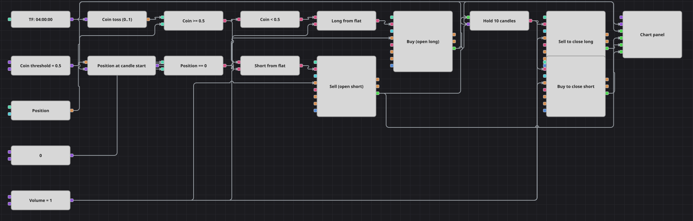

# Random Coin Toss Baseline Strategy Diagram
[Русский](README_ru.md) | [中文](README_zh.md) | [Español](README_es.md) | [Deutsch](README_de.md) | [Português](README_pt.md) | [日本語](README_ja.md)

This diagram deliberately trades without a market signal. Whenever a finished four-hour candle arrives while the position is flat, a random value chooses between a long and a short entry. The position is held for ten more finished candles, closed at market, and the cycle can begin again on the following candle. It is an educational baseline for comparing rule-based systems, not a live trading strategy.

## Strategy Overview

- One finished-only four-hour candle stream clocks both the random decisions and the holding-period counter.
- The Random block produces a value between zero and one. A threshold of 0.5 divides the range into two mutually exclusive directions.
- The current position is sampled when each finished candle arrives and compared with zero. Both entry blocks also use the Open position condition, so a trade can only begin when the candle started with the diagram flat.
- The entry trade activates an N values block, which counts ten subsequent finished candles before allowing the position to close.
- The diagram uses no indicators, stop loss, or take profit. Its random sequence is not seeded inside the diagram and may vary between runs.

## Entry and Exit Rules

- **Long entry**: The random value is below the coin threshold and the position is flat. The diagram buys the configured volume at market.
- **Short entry**: The random value is at or above the coin threshold and the position is flat. The diagram sells the configured volume at market.
- **Exit**: Once an entry is filled, the diagram counts ten subsequent finished four-hour candles. The N values block then triggers a market close of the entire position. The exit candle does not open another trade; the next finished candle is the first opportunity to enter again.

## Parameters

| Parameter | Default | Description |
|---|---|---|
| Hold Bars | 10 | Number of finished candles counted after an entry fill before the position is closed; the value must be greater than zero. |
| Volume | 1 | Entry and exit order volume, in lots. The same configured volume is used to open and reduce the position. |
| Coin Threshold | 0.5 | Random values below this level select a long entry; values at or above it select a short entry. |
| Candles | 04:00:00 | Four-hour candle time frame used for entry decisions and the holding-period count; only finished candles are processed. |

## Diagram Details

- The [Candles](https://doc.stocksharp.com/en/topics/designer/strategies/using_visual_designer/elements/data_sources/candles.html) output feeds the [Random](https://doc.stocksharp.com/en/topics/designer/strategies/using_visual_designer/elements/common/random.html) block, triggers the position snapshot, enters the Input socket of the [N values](https://doc.stocksharp.com/en/topics/designer/strategies/using_visual_designer/elements/common/delay_value.html) block, and reaches the chart panel.
- A [Comparison](https://doc.stocksharp.com/en/topics/designer/strategies/using_visual_designer/elements/common/comparison.html) checks whether the random value is at least the coin threshold. That signal selects the short branch, while a [Logical condition](https://doc.stocksharp.com/en/topics/designer/strategies/using_visual_designer/elements/common/logical_condition.html) in NOT mode produces the long branch.
- The [Position](https://doc.stocksharp.com/en/topics/designer/strategies/using_visual_designer/elements/positions/current.html) output feeds a triggered Variable that snapshots the position at the start of the candle. The snapshot is compared with a shared zero constant, and its flat-position signal joins the direction signal in each entry AND block. This snapshot prevents the closing candle from opening a new position immediately after the exit fill.
- Both entry [Modify position](https://doc.stocksharp.com/en/topics/designer/strategies/using_visual_designer/elements/positions/modify.html) blocks use market orders with the Open position condition and receive their volume from one shared constant.
- The MyTrade outputs of the long and short entry blocks feed the Trigger socket of the N values block. Further triggers are ignored while its ten-candle count is active.
- The N values output triggers two Modify position blocks in Reduce only mode. The sell block can reduce only a long position and the buy block can reduce only a short position; both receive the shared volume, so only the applicable branch registers an exit.
- The [Chart panel](https://doc.stocksharp.com/en/topics/designer/strategies/using_visual_designer/elements/common/chart.html) receives the candle stream and the trades produced by both entry and both exit blocks.

## Usage

Import the `.json` file into Designer and run it in the backtester on historical data, then compare its results with rule-based diagrams on the same instrument and period. Use this example as an educational benchmark, not as a live trading system.
