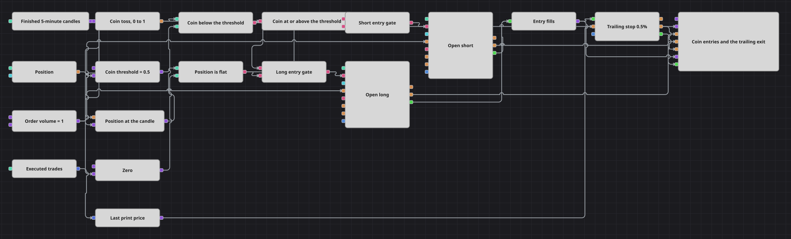

# Diagrama de la estrategia de entrada aleatoria con trailing stop sobre la cinta
[English](README.md) | [Русский](README_ru.md) | [中文](README_zh.md) | [Deutsch](README_de.md) | [Português](README_pt.md) | [日本語](README_ja.md)

La mayoría de los diagramas gastan sus bloques en decidir cuándo entrar. Este casi no gasta ninguno en eso y lo dedica todo a la salida. La entrada es un lanzamiento de moneda: un bloque Random extrae un número en cada vela cerrada, y el lado del umbral en el que cae decide si es largo o corto. Lo que ocurre después es el objetivo del ejemplo: un trailing stop que se reprecia con cada operación ejecutada de la cinta en lugar de una vez por barra.

## Resumen de la estrategia

- Una serie de velas de cinco minutos es el reloj del diagrama. Cada vela cerrada es una extracción y un intento de entrada; nada más hace avanzar la lógica de entrada.
- El bloque Random se dispara con esa vela y extrae un número entre cero y uno. Una comparación con el umbral da el lado largo, y un NOT lógico de esa misma respuesta da el lado corto, de modo que una sola comparación sirve para ambas direcciones.
- La posición actual se sincroniza con el ritmo de la vela mediante una variable que la retiene en su entrada y la libera con el disparo de la vela; comparar ese valor retenido con cero es la comprobación de posición plana.
- Dos puertas lógicas AND combinan la moneda con la comprobación de posición plana. Ambas entradas de cada puerta llegan al ritmo de la vela, por lo que cada puerta se decide exactamente una vez por vela cerrada.
- Ambos bloques de entrada llevan la condición de posición abierta, de modo que una puerta que siga diciendo que sí no puede añadir a una posición que ya existe: el diagrama mantiene una sola posición a la vez y nunca la invierte.
- El flujo de ticks se suscribe junto con las velas, y un conversor lee el precio de cada operación ejecutada.
- Position protection recibe las ejecuciones de entrada a través de un Combination y ese precio de la operación en su entrada Price. El trailing está activado, así que cada operación que lleva la posición más hacia el beneficio arrastra el stop tras ella y la salida se decide entre velas, no en ellas.
- El panel del gráfico dibuja las velas, ambas órdenes de entrada, la orden stop de protección y todas las ejecuciones, de modo que toda la vida de una posición se lee en un único panel.

## Reglas de entrada y salida

- **Entrada en largo**: En una vela cerrada el número extraído está por debajo del umbral y la posición retenida es cero. La puerta larga pasa y Position modify compra el volumen de la orden a mercado.
- **Entrada en corto**: En esa misma vela cerrada el número extraído es igual o superior al umbral —la comparación larga invertida por el NOT lógico— y la posición retenida es cero. Position modify vende el volumen de la orden a mercado.
- **Salida**: No hay señal de salida ni take-profit. Position protection se hace cargo de la operación desde su primera ejecución: coloca el stop a un 0.5% del precio de entrada y, con el trailing activado, lo sube detrás de un largo y lo baja detrás de un corto a medida que se imprimen precios mejores. La posición se cierra con una orden a mercado en el momento en que una operación toca ese nivel, lo que deja libre la siguiente vela cerrada para volver a lanzar la moneda.

## Parámetros

| Parámetro | Por defecto | Descripción |
|---|---|---|
| Candles | 00:05:00 | Marco temporal de la serie de velas. Una vela cerrada es un lanzamiento de moneda y un intento de entrada. |
| Coin Threshold | 0.5 | El valor con el que se compara el número extraído. En 0.5 las dos direcciones son igual de probables; un valor menor hace que los largos sean más raros, y uno mayor, más frecuentes. |
| Order Volume | 1 | Tamaño de la orden, en lotes. |
| Trailing Stop, % | 0.5 | Distancia del trailing stop, en porcentaje del precio de entrada. |

## Detalles del diagrama

- El bloque Random extrae de la fuente aleatoria propia de la estrategia y no de una global, de modo que reproducir el mismo histórico dos veces da la misma secuencia de lanzamientos y el mismo conjunto de operaciones.
- El stop se expresa como un porcentaje del precio de entrada y no como un número fijo de pasos de precio. La misma distancia en unidades de precio significa una cosa en un instrumento cotizado cerca de 65 000 y algo completamente distinto en otro cotizado cerca de 5; el porcentaje es la única forma que sobrevive a ambos casos.
- Alimentar la entrada Price desde la cinta es lo que hace que la salida sea de grano fino. Calculado en cambio sobre el cierre de la vela, ese mismo stop solo se comprobaría doce veces por hora.
- El stop sigue el precio de forma continua: cada mejora del precio lo mueve, sin ninguna distancia adicional que el precio deba recorrer antes de que el stop pueda avanzar de nuevo.
- Se intenta una entrada en cada vela cerrada mientras la posición está plana, por lo que el diagrama normalmente mantiene algo abierto y el stop de protección siempre tiene una posición que gestionar.

## Uso

Importe el archivo `.json` en Designer, ejecútelo sobre datos históricos en el probador y después ajuste los parámetros o los propios bloques a su instrumento antes de operar en real.
