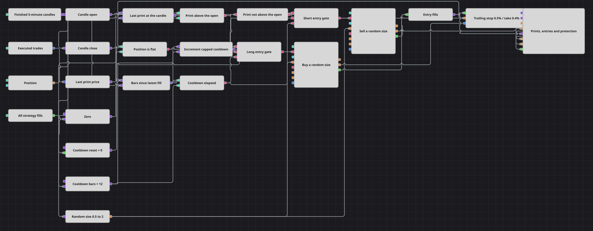

# 随机手数交替入场策略图
[English](README.md) | [Русский](README_ru.md) | [Español](README_es.md) | [Deutsch](README_de.md) | [Português](README_pt.md) | [日本語](README_ja.md)

画廊里的每一张图都要决定下多少手，而这一张干脆不决定。随机数（Random）方块在每根 K 线上重新抽取一个介于半手到两手之间的数值，直接送入两个入场方块的手数接口，因此没有两笔仓位的规模是一样的。方向却完全不随机：它取决于最后一笔成交价相对当前这根 K 线开盘价的位置。

## 策略概览

- 信号来自逐笔成交流。转换器读取最后一笔成交的价格，变量把它保存到 K 线收盘，正是这一步让成交价和 K 线开盘价处在同一个时间刻度上。
- 比较方块判断这笔成交价是否高于 K 线开盘价。同一个结果经逻辑非取反后就是空头一侧，因此一次比较同时服务于两个方向。
- 随机数方块由 K 线触发，把抽到的数值交给买入方块和卖出方块的手数接口。图中再没有别的地方读取它。
- 只有在空仓时才开仓，两个入场方块都带有持仓条件，因此信号无法给已有仓位加仓。
- 自上一笔成交以来的 K 线计数器，让两次入场之间保持十二根 K 线的间隔。没有它，保护性平仓和下一次入场就会在相邻的 K 线上互相追逐。
- 仓位保护（Position protection）是唯一的离场方式。它通过组合（Combination）方块接收开仓成交，以 K 线收盘价为基准计价，并在 0.4% 的止盈目标或 0.5% 的移动止损处平仓。
- 止损会跟随行情移动，因此方向做对的仓位只会回吐这段走势的最后一小段。
- 图表面板绘制 K 线、两路委托流以及每一笔成交，包括保护性平仓的成交。

## 入场与出场规则

- **做多入场**: 最后一笔成交价高于当前这根 K 线的开盘价，仓位为空仓，且距上一笔成交已过去十二根 K 线。仓位修改（Position modify）方块以市价买入，手数取自随机数方块为这根 K 线抽出的数值。
- **做空入场**: 最后一笔成交价等于或低于当前这根 K 线的开盘价，空仓与冷却条件与上面相同。仓位修改方块以同一次随机抽取的手数市价卖出。
- **离场**: 没有离场信号。仓位保护方块从第一笔成交起接管仓位，并在相对开仓价 0.4% 的止盈或 0.5% 的移动止损处平仓。任何一笔成交，包括保护性平仓的成交，都会重新开始下一次入场前的十二根 K 线等待。

## 参数

| 参数 | 默认值 | 说明 |
|---|---|---|
| Candles | 00:05:00 | 整张图所使用的 K 线周期。 |
| Cooldown Bars | 12 | 一笔成交之后，须经过多少根已完成的 K 线才允许下一次入场。 |
| Min Volume | 0.5 | 随机数方块可抽取的最小手数。 |
| Max Volume | 2 | 随机数方块可抽取的最大手数。 |
| Take Profit, % | 0.4 | 止盈距离，按开仓价的百分比计算。 |
| Stop Loss, % | 0.5 | 移动止损距离，按开仓价的百分比计算。 |

## 图表详情

- K 线方块向八个下游供数：两个转换器、保存成交价的变量、随机数方块、冷却计数器及其两个变量，以及图表面板。
- 每天触发数千次的逐笔成交流，和每根 K 线只需回答一次的条件之间，唯一的缓冲就是保存成交价的那个变量。
- 两个入场方块共用随机数方块的同一个输出，因此多头和空头的手数来自同一次抽取；数值在下一根 K 线才变化，而不是在两个方块之间变化。
- 冷却计数器由策略成交方块复位，所以启动等待的不只是开仓，保护性平仓同样会启动它。
- 手数按两位小数抽取，适合以不足一个单位的份额报价的品种；若是只能整手交易的品种，则应把区间改成整数。

## 使用方法

将 `.json` 文件导入 Designer，在回测器中用历史数据运行，然后根据自己的交易品种调整参数或方块，确认无误后再用于实盘。
