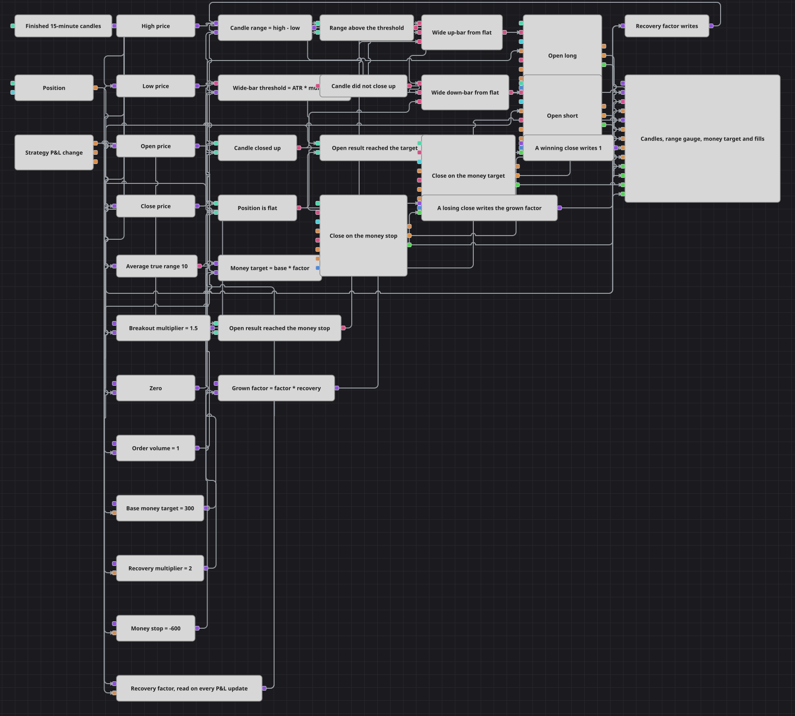

# Diagrama da estratégia Recovery Target Breakout
[English](README.md) | [Русский](README_ru.md) | [中文](README_zh.md) | [Español](README_es.md) | [Deutsch](README_de.md) | [日本語](README_ja.md)

As entradas aqui dependem de uma coisa só: uma vela muito mais ampla do que o mercado vem apresentando ultimamente. A saída é uma questão de dinheiro, e não de preço — o resultado aberto da posição é medido contra um alvo que o diagrama mantém em uma variável, e esse alvo não é constante. Uma saída perdedora o multiplica, uma saída vencedora o devolve ao valor base, de modo que cada operação sabe quanto custou a anterior.

## Visão geral da estratégia

- Velas de quinze minutos finalizadas alimentam quatro conversores que extraem a máxima, a mínima, a abertura e o fechamento de cada barra.
- Uma fórmula subtrai a mínima da máxima para obter a amplitude da barra, enquanto um indicador Average true range mede qual foi essa amplitude ao longo das últimas dez barras.
- Uma segunda fórmula multiplica o average true range pelo multiplicador de rompimento, e uma comparação pergunta se a amplitude desta barra está acima desse limiar — essa é toda a definição de uma barra anormalmente ampla.
- A direção é uma única comparação: fechamento acima da abertura. Um Not lógico transforma o mesmo sinal no caso da barra de baixa, de modo que ambas as entradas leem o mesmo corpo de vela por lados opostos.
- Ambas as portas de entrada são um And lógico de três termos: a barra é ampla, ela aponta na direção certa e a posição está zerada. O Position modify então compra ou vende a mercado com o volume da ordem.
- O P&L change fornece o resultado aberto da posição a cada atualização, e duas comparações o medem contra o alvo em dinheiro e contra o stop em dinheiro.
- O alvo em dinheiro não é um número fixo: uma fórmula multiplica o alvo base por um fator de recuperação guardado em uma variável, de modo que a meta acompanha o estado de recuperação em vez de ser digitada duas vezes no diagrama.
- O fator de recuperação é reescrito por exatamente dois eventos, cada um através de sua própria porta, e um Combination une as duas escritas na entrada única da variável que o armazena.

## Regras de entrada e saída

- **Entrada comprada**: Uma vela finalizada cuja amplitude entre máxima e mínima excede o average true range vezes o multiplicador de rompimento, fechando acima da própria abertura, tomada a partir de posição zerada. O Position modify compra a mercado com o volume da ordem.
- **Entrada vendida**: Uma vela finalizada cuja amplitude excede o mesmo limiar, mas que não fecha acima da própria abertura, tomada a partir de posição zerada. O Position modify vende a mercado com o mesmo volume da ordem.
- **Saída**: Não há stop de preço nem alvo de preço no diagrama — a posição é fechada apenas por dinheiro. Quando o resultado aberto atinge o alvo em dinheiro corrente, dispara um Position modify configurado para fechar a posição; quando ele cai até o stop em dinheiro, dispara um segundo. Cada bloco de fechamento é dono de um ramo da trava de recuperação: a execução do fechamento perdedor libera o fator ampliado, a execução do fechamento vencedor libera o valor um, e ambas as escritas se encontram em um Combination que alimenta a variável que guarda o fator.

## Parâmetros

| Parâmetro | Padrão | Descrição |
|---|---|---|
| Candles | 00:15:00 | Time frame das velas com que todo o diagrama trabalha. |
| ATR Length | 10 | Número de barras sobre as quais o average true range é medido; é a régua contra a qual uma barra ampla é julgada. |
| Breakout Multiplier | 1.5 | Quantas vezes mais ampla que a média uma barra precisa ser para contar como rompimento. Aumente-o para entradas mais raras e mais extremas, reduza-o para obter mais delas. |
| Volume | 1 | Tamanho de cada ordem de entrada. Todos os valores em dinheiro abaixo são resultado desse tamanho, portanto mudar um significa reajustar os demais. |
| Target Base | 300 | Alvo em dinheiro de uma operação tomada depois de uma vencedora, na moeda em que o resultado é contabilizado. |
| Recovery Multiplier | 2 | Por quanto o alvo é multiplicado depois de uma operação perdedora. Dois significa que a próxima operação precisa recuperar o dobro do alvo base; um desliga a recuperação e deixa um alvo em dinheiro simples. |
| Stop Money | -600 | Resultado aberto no qual uma posição é abandonada, escrito como número negativo. É um valor fixo e não é escalado pelo fator de recuperação. |

## Detalhes do diagrama

- A trava é o único laço do diagrama: a variável do fator alimenta uma fórmula que a multiplica pelo multiplicador de recuperação, o resultado aguarda em uma variável de porta, e a porta o escreve de volta na variável do fator quando um fechamento perdedor é de fato executado.
- Ambas as portas são disparadas pela execução de um bloco de fechamento, e não pela comparação que pediu o fechamento. Uma comparação pode repetir seu veredito várias vezes enquanto a ordem de fechamento ainda está em trânsito; uma execução acontece uma única vez, portanto o fator é multiplicado uma vez por operação perdedora.
- A variável do fator recebe sua entrada sem tratá-la como gatilho, de modo que uma escrita apenas altera o que ela armazena. Ela emite no gatilho que lhe é dado, que é a atualização de P&L, e isso mantém os dois lados da comparação do alvo no mesmo relógio.
- O ramo do dinheiro permanece em silêncio até que a primeira posição seja aberta, porque o resultado aberto só é informado quando há algo a avaliar. A partir daí, o fator, o alvo base e o multiplicador de recuperação são liberados juntos a cada atualização.
- As velas são assinadas apenas como finalizadas, portanto todo sinal pertence a uma barra já fechada e as ordens carregam o horário desse fechamento em vez do horário em que a barra abriu.

## Uso

Importe o arquivo `.json` no Designer, execute-o sobre dados históricos no backtester e depois ajuste os parâmetros ou os próprios blocos ao seu instrumento antes de operar ao vivo.
