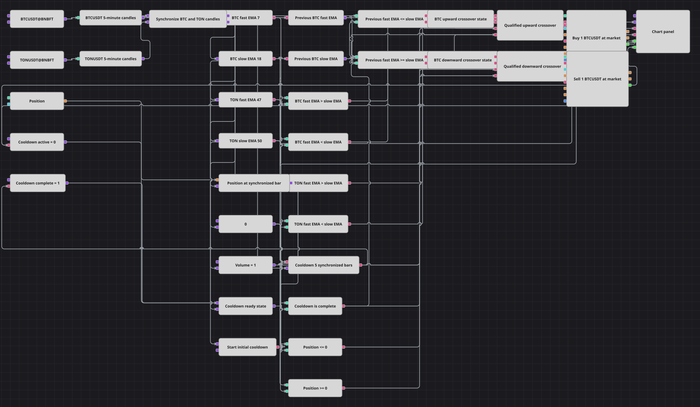

# 参照銘柄トレンド確認戦略ダイアグラム
[English](README.md) | [Русский](README_ru.md) | [中文](README_zh.md) | [Español](README_es.md) | [Deutsch](README_de.md) | [Português](README_pt.md)

このダイアグラムは、BTCUSDT@BNBFTとTONUSDT@BNBFTの確定済み5分足を先に同期し、その後、TONのEMAトレンドが同じ方向を確認した場合にBTCの厳密なEMAクロスを取引します。ポジションとクールダウンの条件で各判定を絞り込み、固定数量の2つの成行注文経路でエクスポージャーを管理します。

## 戦略の概要

- Syncブロックは、Interval `00:05:00`かつClearSockets有効で、確定済み5分足の2つのストリームを受け取ります。両方の足が揃った場合だけBTC–TONの整合したペアを出力し、どちらか一方が欠けた不完全な時間区間は破棄します。
- 整合した各ペアは、その後でBTCの短期EMA 7と長期EMA 18、TONの短期EMA 47と長期EMA 50へ入力されます。4つのインジケーターはいずれも形成済み値だけに限定するフィルターが無効です。
- BTCの上向きクロスには`PrevFast <= PrevSlow`かつ`Fast > Slow`、下向きクロスには`PrevFast >= PrevSlow`かつ`Fast < Slow`が必要です。TONの現在の関係は`Fast > Slow`で買い、`Fast < Slow`で売りを確認します。
- 買い経路ではさらに`Position <= 0`、売り経路では`Position >= 0`が必要です。両経路とも固定Volume 1の`NoCondition`成行注文を送信します。
- 最初の同期済みBTC–TONペア5組はブロックされ、各注文シグナル後も次の同期済み5組がブロックされます。整合した6組目から再び判定できます。ストップロス、テイクプロフィット、個別の決済ブロックはなく、チャートにはBTC足、2本のBTC EMA、2つの約定ストリームが表示されます。

## エントリーとエグジットの条件

- **ロングエントリー**: BTCで`PrevFast <= PrevSlow`かつ`Fast > Slow`、TONで現在`Fast > Slow`、同期されたポジション判定が`Position <= 0`でクールダウンが完了しているとき、ダイアグラムはVolume 1の成行買い注文を送信します。
- **ショートエントリー**: BTCで`PrevFast >= PrevSlow`かつ`Fast < Slow`、TONで現在`Fast < Slow`、同期されたポジション判定が`Position >= 0`でクールダウンが完了しているとき、ダイアグラムはVolume 1の成行売り注文を送信します。
- **エグジット**: 専用の決済ブロックや保護ブロックはありません。後で条件を満たす反対方向の注文がエクスポージャーを減らします。ポジションが`+1`または`-1`なら、固定Volume 1で反対側を建てずにゼロへ戻します。

## パラメーター

| パラメーター | 既定値 | 説明 |
|---|---|---|
| Main Fast EMA | 7 | 確定済み5分足のBTCUSDT@BNBFTから計算する短期ExponentialMovingAverageの期間です。形成済み値だけに限定するフィルターは無効です。 |
| Main Slow EMA | 18 | 確定済み5分足のBTCUSDT@BNBFTから計算する長期ExponentialMovingAverageの期間です。形成済み値だけに限定するフィルターは無効です。 |
| Reference Fast EMA | 47 | 整合した確定済み5分足のTONUSDT@BNBFTから計算する短期ExponentialMovingAverageの期間です。形成済み値だけに限定するフィルターは無効です。 |
| Reference Slow EMA | 50 | 整合した確定済み5分足のTONUSDT@BNBFTから計算する長期ExponentialMovingAverageの期間です。形成済み値だけに限定するフィルターは無効です。 |
| Cooldown Bars | 5 | 開始時およびシグナル後にブロックする同期済み足ペアの数です。その次の整合したペアから判定できます。 |
| Volume | 1 | 2つのNoCondition成行注文ブロックに渡す固定数量です。 |

## ダイアグラムの詳細

- 2つの[ローソク足](https://doc.stocksharp.com/ja/topics/designer/strategies/using_visual_designer/elements/data_sources/candles.html)ブロックが、BTCUSDT@BNBFTとTONUSDT@BNBFTの確定済み5分足を同期処理へ直接送ります。
- [Sync](https://doc.stocksharp.com/ja/topics/designer/strategies/using_visual_designer/elements/common/sync.html)ブロックが、Interval `00:05:00`とClearSockets `true`で2つの足入力を整合させます。両方の足を1組として出力し、片側がなければ不完全な時間区間を消去してインジケーターチェーンへ渡しません。
- 同期されたペアだけが4つの[インジケーター](https://doc.stocksharp.com/ja/topics/designer/strategies/using_visual_designer/elements/common/indicator.html)ブロックへ入り、BTCのExponentialMovingAverage 7と18、TONの47と50を計算します。形成済み値のオプションはいずれも`false`で、BTCの2本のEMA出力だけがチャートにも送られます。
- [前の値](https://doc.stocksharp.com/ja/topics/designer/strategies/using_visual_designer/elements/common/prev_value.html)ブロックが、同期済みBTCの短期EMAと長期EMAの直前値を保持します。[比較](https://doc.stocksharp.com/ja/topics/designer/strategies/using_visual_designer/elements/common/comparison.html)ブロックが、各厳密クロスの両側の条件と現在のTONトレンド関係2つを表し、別々の[論理条件](https://doc.stocksharp.com/ja/topics/designer/strategies/using_visual_designer/elements/common/logical_condition.html)経路が買いと売りの条件を組み合わせます。
- 現在の[ポジション](https://doc.stocksharp.com/ja/topics/designer/strategies/using_visual_designer/elements/positions/current.html)が`Position <= 0`と`Position >= 0`の判定値を提供します。[N values](https://doc.stocksharp.com/ja/topics/designer/strategies/using_visual_designer/elements/common/delay_value.html)ゲートはSyncから同期済みBTC足の出力を受け取り、N=5で最初の整合した5組と各注文シグナル後の5組を抑止し、6組目で判定を再び有効にします。
- 買いと売りの[ポジション変更](https://doc.stocksharp.com/ja/topics/designer/strategies/using_visual_designer/elements/positions/modify.html)ブロックは、`NoCondition`と共通Volume 1で成行注文を出します。ストップロス、テイクプロフィット、ポジション保護、個別の決済要素はありません。
- [チャートパネル](https://doc.stocksharp.com/ja/topics/designer/strategies/using_visual_designer/elements/common/chart.html)は、確定済みBTC足、BTC EMA 7、BTC EMA 18、買い注文と売り注文ブロックのMyTrade出力を受け取ります。

## 使い方

`.json` ファイルを Designer に読み込み、バックテスターで過去データを使って実行し、実運用の前にパラメーターやブロック自体を自分の銘柄に合わせて調整してください。
