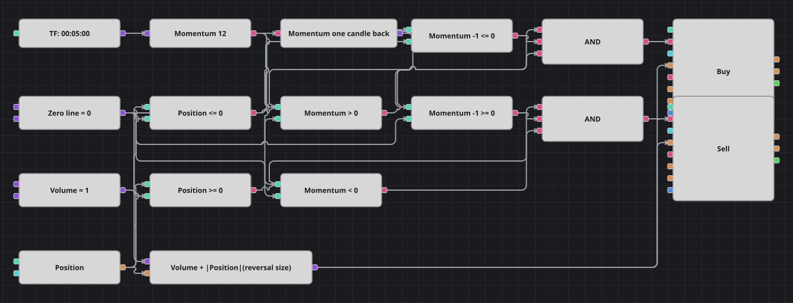

# Диаграмма стратегии импульса Momentum через нулевую линию
[English](README.md) | [中文](README_zh.md) | [Español](README_es.md) | [Deutsch](README_de.md) | [Português](README_pt.md) | [日本語](README_ja.md)

Вся диаграмма держится на одном числе: разнице между текущим закрытием и закрытием двенадцать свечей назад. Пока разница положительна, рынок за это окно поднял цену; пока отрицательна — опустил; в момент смены знака диаграмма переворачивает позицию. Несмотря на имя папки, оригинал использует Momentum — абсолютную разницу цен, а не процентную скорость изменения.

## Обзор стратегии

- Momentum по 12 свечам сравнивается с нулевой линией, а предыдущее значение того же индикатора говорит, с какой стороны он пришёл, — два сравнения дают полноценное пересечение.
- Каждый сигнал разворотный: объём заявки — это общий объём плюс модуль текущей позиции, поэтому одна заявка закрывает старую сторону и открывает новую.
- Позиция участвует в обеих ветвях: пересечение вверх покупается, только если позиция ещё не длинная, а вниз продаётся, только если она ещё не короткая.
- В оригинале после каждой сделки торговля замирает на 55 свечей; кубика-счётчика баров нет, поэтому пауза не переносится и диаграмма отрабатывает каждое пересечение.

## Правила входа и выхода

- **Вход в лонг**: На предыдущей свече Momentum был на нуле или ниже, сейчас он выше нуля, а позиция не длинная. Заявка покупает разворотный объём по рынку: шорт закрывается и лонг открывается одним действием.
- **Вход в шорт**: На предыдущей свече Momentum был на нуле или выше, сейчас он ниже нуля, а позиция не короткая. Заявка продаёт разворотный объём по рынку: лонг закрывается и шорт открывается одним действием.
- **Выход**: Отдельного кубика выхода нет. Позиция держится до противоположного пересечения нуля, которое её и переворачивает; в оригинале нет ни стоп-лосса, ни ATR-стопа, о котором говорит README.

## Параметры

| Параметр | По умолчанию | Описание |
|---|---|---|
| Momentum Length | 12 | Глубина Momentum в свечах: значение равно текущему закрытию минус закрытие столько свечей назад. |
| Volume | 1 | Базовый объём заявки в лотах; разворотная заявка добавляет к нему модуль открытой позиции. |
| Candles | 00:05:00 | Таймфрейм свечей, на котором работает вся диаграмма. |

## Детали диаграммы

- Кубик свечей питает индикатор Momentum, выход которого идёт и на кубики сравнения, и на кубик предыдущего значения, хранящий отсчёт прошлой свечи.
- Четыре кубика сравнения используют одну нулевую константу, она же служит опорой для двух проверок позиции.
- Каждое логическое И объединяет текущую сторону нуля, прошлую сторону нуля и условие по позиции и запускает кубик изменения позиции.
- Кубик формулы считает разворотный размер как общий объём плюс модуль позиции и задаёт объём обеим заявкам.

## Использование

Импортируйте файл `.json` в Designer, прогоните схему на исторических данных в тестере, затем подстройте параметры или сами кубики под свой инструмент, прежде чем торговать вживую.
