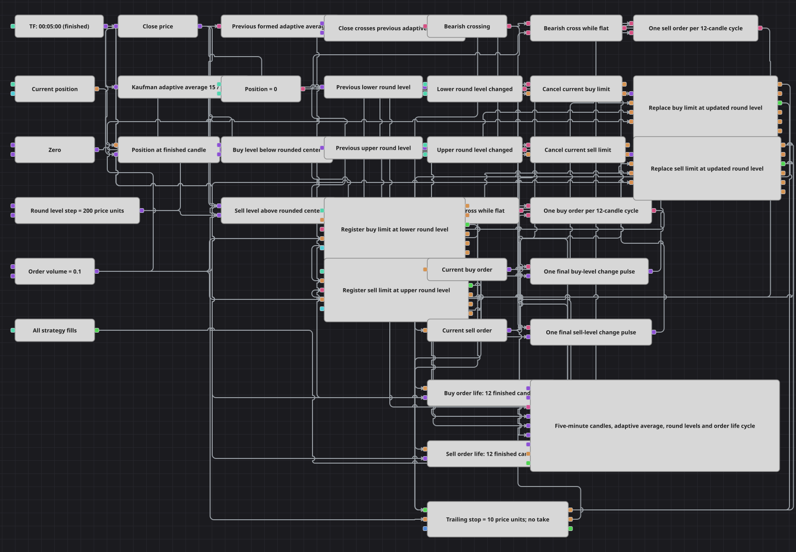

# Diagrama da estratégia de escada de ordens em níveis redondos
[English](README.md) | [Русский](README_ru.md) | [中文](README_zh.md) | [Español](README_es.md) | [Deutsch](README_de.md) | [日本語](README_ja.md)

O diagrama gerencia todo o ciclo de vida de entradas passivas em níveis redondos. Velas concluídas de cinco minutos controlam uma média adaptativa de Kaufman, cruzamentos de direção, níveis calculados de compra e venda, substituição de ordens, cancelamento temporizado e um stop móvel de distância absoluta.

## Visão geral da estratégia

- Velas concluídas de cinco minutos alimentam a KAMA(15), com período rápido 2 e período lento 30; somente valores formados do indicador seguem pelo fluxo de sinais.
- Um bloco Previous value desloca a KAMA formada em uma atualização, e Crossing compara cada fechamento com esse valor anterior da média adaptativa.
- O centro arredondado mais próximo usa floor(close / step + 0.5). O limite de compra fica um passo de 200 unidades de preço abaixo do centro e o limite de venda um passo acima.
- Barramentos separados de compra e venda guardam a ordem ativa. Quando o nível calculado muda, Order replacing desloca o limite ativo para o novo nível.
- Cada lado tem seu próprio marcador de ciclo e temporizador de doze velas. Um cruzamento contrário ou o temporizador cancela um limite ainda ativo, enquanto uma execução ativa a proteção móvel.

## Regras de entrada e saída

- **Entrada comprada**: Quando o fechamento cruza acima da KAMA formada anterior, a posição capturada é zero e o marcador do ciclo de compra está livre, registrar uma compra limitada de 0.1 unidade em (floor(close / step + 0.5) - 1) × step.
- **Entrada vendida**: Quando o fechamento cruza abaixo da KAMA formada anterior, a posição capturada é zero e o marcador do ciclo de venda está livre, registrar uma venda limitada de 0.1 unidade em (floor(close / step + 0.5) + 1) × step.
- **Saída**: Uma entrada executada ativa um stop móvel de distância absoluta 10, avaliado pelos fechamentos de velas concluídas e executado por ordem a mercado. O take-profit está desativado. Entradas pendentes são canceladas no cruzamento contrário ou após doze velas concluídas.

## Parâmetros

| Parâmetro | Padrão | Descrição |
|---|---|---|
| Candles Series | 00:05:00 | Período das velas concluídas usadas para sinais, preços, temporizadores, atualização da proteção e gráfico. |
| KAMA Fast SC Period | 2 | Período de suavização rápida da média móvel adaptativa de Kaufman. |
| KAMA Slow SC Period | 30 | Período de suavização lenta da média móvel adaptativa de Kaufman. |
| KAMA Length | 15 | Comprimento de cálculo da média móvel adaptativa de Kaufman. |
| KAMA Source | Not set | Nenhum campo alternativo de entrada do indicador está selecionado; as velas estão ligadas diretamente. |
| Round Level Step | 200 | Distância entre níveis redondos adjacentes, em unidades de preço. |
| Order Volume | 0.1 | Volume fixo de cada limite de entrada registrado e substituído. |
| Buy Order Life (N) | 12 | Número de velas concluídas no ciclo da ordem de compra antes do cancelamento temporizado e da liberação do marcador. |
| Sell Order Life (N) | 12 | Número de velas concluídas no ciclo da ordem de venda antes do cancelamento temporizado e da liberação do marcador. |
| Take Profit | 0 | O valor absoluto zero desativa a proteção de lucro. |
| Stop Loss | 10 | Distância absoluta do stop móvel em relação ao melhor preço protegido observado. |
| Trailing Stop Loss | true | Desloca o limite do stop quando o preço avança a favor da posição. |
| Use Market Orders | true | Envia a saída acionada pelo stop móvel como ordem a mercado. |

## Detalhes do diagrama

- O fechamento da vela chega a Crossing antes do deslocamento do novo valor formado da KAMA. Assim, Crossing recebe o fechamento atual e o valor da média adaptativa da atualização formada anterior.
- As duas fórmulas de nível usam o mesmo fechamento e passo. Os blocos Previous value guardam os níveis anteriores de compra e venda, e as comparações NotEqual emitem um pulso de substituição apenas quando o nível muda.
- Cada bloco Combination recebe a ordem emitida pelo registro e todas as ordens emitidas pelas substituições. Sua saída entrega a ordem mais recente a Order replacing e Order cancellation.
- Os blocos N values são ativados por um registro bem-sucedido e contam doze velas concluídas. Suas saídas solicitam o cancelamento e liberam o marcador de ciclo correspondente para uma configuração posterior.
- O gráfico mostra velas de cinco minutos, KAMA, os dois níveis redondos, os limites atuais de compra e venda, ordens do stop móvel e todas as execuções.

## Uso

Importe o arquivo `.json` no Designer, execute-o sobre dados históricos no backtester e depois ajuste os parâmetros ou os próprios blocos ao seu instrumento antes de operar ao vivo.
