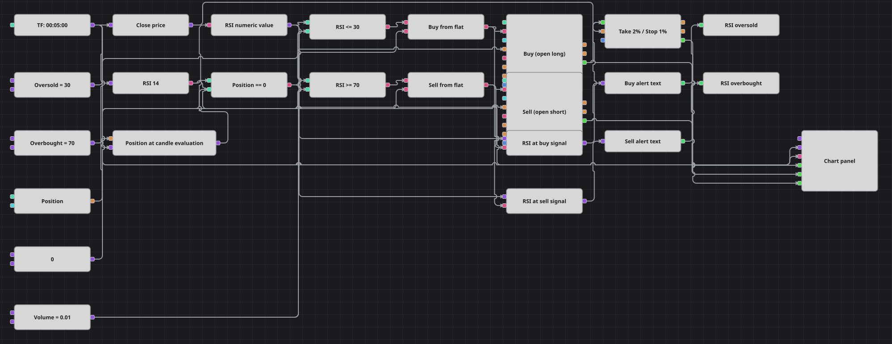

# RSI Alert Strategy Diagram
[Русский](README_ru.md) | [中文](README_zh.md) | [Español](README_es.md) | [Deutsch](README_de.md) | [Português](README_pt.md) | [日本語](README_ja.md)

This diagram turns RSI extremes into trades and readable alerts. It processes finished five-minute candles, buys at or below 30 and sells at or above 70 only while flat, and applies percentage-based protection to every filled entry. Each accepted signal also captures the numeric RSI value, formats it, and writes a notification.

## Strategy Overview

- One finished-only five-minute candle stream drives the indicator, position snapshot, entry decisions, protective-price checks, and chart.
- RelativeStrengthIndex uses a period of 14. Its formed-only filter is disabled (`IsFormed = false`), so warm-up values are not suppressed solely because the indicator is not yet formed.
- A Formula block with the expression `a` converts the RSI IndicatorValue into a decimal value used by comparisons and messages.
- The decimal RSI is compared with the oversold and overbought levels. Each direction signal is joined with a position snapshot taken during the current candle evaluation, and both entry blocks use the Open position condition.
- Filled entries activate position protection with a 2% take profit and a 1% stop loss. Accepted entry signals also pass the captured RSI value through a formatter to a Log notification.

## Entry and Exit Rules

- **Long entry**: The decimal RSI is at or below the Oversold Level and the position snapshot is flat. The diagram buys the configured volume at market and writes a buy alert containing the signal value.
- **Short entry**: The decimal RSI is at or above the Overbought Level and the position snapshot is flat. The diagram sells the configured volume at market and writes a sell alert containing the signal value.
- **Exit**: Position protection closes the trade when a finished candle close reaches the 2% take-profit level or the 1% stop-loss level relative to entry. An opposite RSI signal does not reverse an open position, and a protective fill cannot cause another entry on the same candle.

## Parameters

| Parameter | Default | Description |
|---|---|---|
| RSI Period | 14 | Number of candles used to calculate RelativeStrengthIndex. |
| Oversold Level | 30 | RSI values at or below this level allow a long entry while the diagram is flat. |
| Overbought Level | 70 | RSI values at or above this level allow a short entry while the diagram is flat. |
| Take Profit | 2% | Protective take-profit distance from the entry price. |
| Stop Loss | 1% | Protective stop-loss distance from the entry price. |
| Volume | 0.01 | Entry order volume, in lots. |
| Candles | 00:05:00 | Five-minute candle time frame; only finished candles are processed. |

## Diagram Details

- The [Candles](https://doc.stocksharp.com/en/topics/designer/strategies/using_visual_designer/elements/data_sources/candles.html) output first triggers the current-position snapshot, then updates the [Indicator](https://doc.stocksharp.com/en/topics/designer/strategies/using_visual_designer/elements/common/indicator.html), and finally updates a close-price [Converter](https://doc.stocksharp.com/en/topics/designer/strategies/using_visual_designer/elements/converters/converter.html).
- The RSI output enters a [Formula](https://doc.stocksharp.com/en/topics/designer/strategies/using_visual_designer/elements/common/formula.html) block whose expression is `a`. Its decimal output reaches both message-value latches before either threshold comparison is evaluated.
- Two [Comparison](https://doc.stocksharp.com/en/topics/designer/strategies/using_visual_designer/elements/common/comparison.html) blocks test the decimal RSI against the shared Oversold Level and Overbought Level values using `<=` and `>=`.
- The [Position](https://doc.stocksharp.com/en/topics/designer/strategies/using_visual_designer/elements/positions/current.html) value is held by a [Variable](https://doc.stocksharp.com/en/topics/designer/strategies/using_visual_designer/elements/data_sources/variable.html) for the current candle evaluation and compared with zero. Two [Logical condition](https://doc.stocksharp.com/en/topics/designer/strategies/using_visual_designer/elements/common/logical_condition.html) blocks join that flat-position result with the long and short RSI signals.
- Both entry [Modify position](https://doc.stocksharp.com/en/topics/designer/strategies/using_visual_designer/elements/positions/modify.html) blocks use market orders with the Open position condition and receive `0.01` from one shared volume value.
- The MyTrade outputs of both entry blocks feed [Position protection](https://doc.stocksharp.com/en/topics/designer/strategies/using_visual_designer/elements/positions/protect.html). The candle-close converter supplies its Price input, and the block uses a 2% take profit and a 1% stop loss.
- Each combined entry signal triggers its own RSI-value latch. [String format](https://doc.stocksharp.com/en/topics/designer/strategies/using_visual_designer/elements/notifying/string_format.html) renders `RSI {0:0.0} <= 30 — buy` or `RSI {0:0.0} >= 70 — sell`, and [Notification](https://doc.stocksharp.com/en/topics/designer/strategies/using_visual_designer/elements/notifying/notification.html) blocks of Type Log publish the messages.
- The Chart panel receives finished candles, RSI values, both entry-trade streams, and protective exit trades.

## Usage

Import the `.json` file into Designer and run it in the backtester on historical data. Watch the log for the formatted RSI notifications and verify the protective exits against candle closes. If you change either RSI threshold, update its formatter template as well so the alert text remains accurate.
