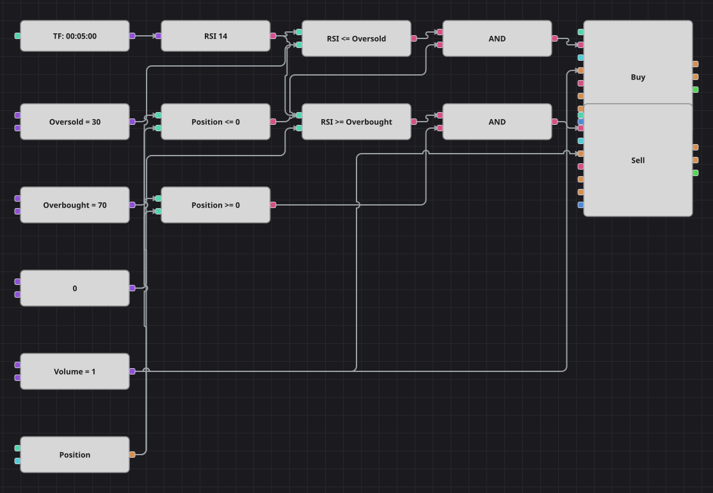

# RSI Overbought/Oversold Strategy Diagram
[Русский](README_ru.md) | [中文](README_zh.md) | [Español](README_es.md) | [Deutsch](README_de.md) | [Português](README_pt.md) | [日本語](README_ja.md)

A textbook mean-reversion diagram: the Relative Strength Index measures how stretched the last moves are, and the strategy takes the opposite side when the index reaches an extreme. The position guard keeps it from stacking up trades in the same direction.

## Strategy Overview

- The Relative Strength Index is calculated on finished candles of a single instrument.
- Two thresholds mark the zones: below the oversold level the market is considered sold off, above the overbought level it is considered overbought.
- The current position takes part in every decision, so an entry is only made when it does not add to an existing one.

## Entry and Exit Rules

- **Long entry**: RSI is at or below the oversold level and the position is not long. The order buys one lot, which opens a long from flat or closes an existing short.
- **Short entry**: RSI is at or above the overbought level and the position is not short. The order sells one lot, which opens a short from flat or closes an existing long.
- **Exit**: There is no separate exit block: the opposite signal closes the position, because every order uses the same volume.

## Parameters

| Parameter | Default | Description |
|---|---|---|
| RSI Length | 14 | Averaging length of the Relative Strength Index. |
| Oversold | 30 | Level at or below which the index is treated as oversold. |
| Overbought | 70 | Level at or above which the index is treated as overbought. |
| Volume | 1 | Order volume, in lots. |
| Candles | 00:05:00 | Candle time frame the whole diagram works on. |

## Diagram Details

- The candle block feeds the indicator block, which holds the Relative Strength Index.
- Two comparison blocks test the index against the threshold constants; two more compare the position against zero.
- Each logical AND joins one index condition with one position condition and triggers a position modify block.
- Both position modify blocks send market orders and take their volume from a shared constant.

## Usage

Import the `.json` file into Designer, run it in the backtester on historical data, then adjust the parameters or the blocks themselves to fit your instrument before trading it live.
