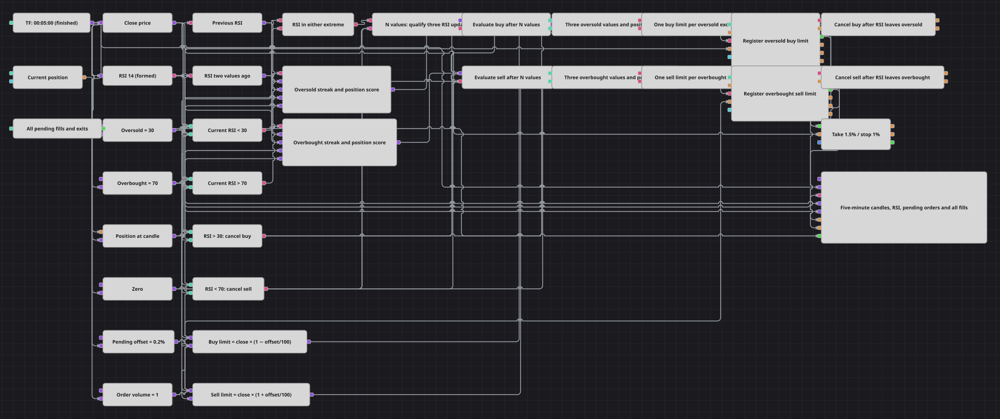

# RSI 连续极值挂单策略图
[English](README.md) | [Русский](README_ru.md) | [Español](README_es.md) | [Deutsch](README_de.md) | [Português](README_pt.md) | [日本語](README_ja.md)

该图表先等待 RSI 持续处于极端区域，再提交回调限价单。它同时检查当前值和前两个已完成的 RSI 值，每次连续进入极端区域只允许一张挂单；RSI 离开区域时撤单，并为每次成交配置百分比退出保护。

## 策略概览

- 已完成的五分钟 K 线输入周期为 14 的 RSI，并提供挂单定价所需的收盘价。
- 下方区域低于 30，上方区域高于 70。N values 方块在三个已完成 RSI 更新后安排一次评估。
- 评估时，Formula 方块同时检查当前 RSI、前两个值以及持仓限制。中断的序列不会产生入场。
- 买入限价设在信号收盘价下方 0.2%，卖出限价设在其上方 0.2%。
- 两个独立的 Flag 方块使每次连续停留在极端区域时最多只提交一张对应订单。
- 入场成交后配置 1.5% 止盈和 1% 止损，触发时均以市价单退出。

## 入场与出场规则

- **做多入场**：三次更新评估后，三个 RSI 值都必须低于 30，且 Position 小于或等于零。按 `Close × (1 − Pending Offset / 100)` 提交一张买入限价单。
- **做空入场**：三次更新评估后，三个 RSI 值都必须高于 70，且 Position 大于或等于零。按 `Close × (1 + Pending Offset / 100)` 提交一张卖出限价单。
- **挂单**：RSI 升至 30 以上时撤销未成交买单；RSI 降至 70 以下时撤销未成交卖单。同一事件会重置该方向的 Flag，以便以后再次进入该区域。
- **出场**：挂单成交后，Position protection 在价格有利变动 1.5% 或不利变动 1% 时，以市价单平掉其敞口。

## 参数

| 参数 | 默认值 | 说明 |
|---|---|---|
| K 线 | 00:05:00 | 用于信号和定价的已完成 K 线周期。 |
| RSI 周期 | 14 | 相对强弱指数的平均周期。 |
| RSI 输入字段 | 未设置 | 未选择其他指标输入字段。 |
| 超卖 | 30 | 做多三值序列的严格上界。 |
| 超买 | 70 | 做空三值序列的严格下界。 |
| 匹配次数 (N) | 3 | 确认区间内已完成 RSI 更新的数量。 |
| 挂单偏移，% | 0.2 | 限价与信号 K 线收盘价之间的距离。 |
| 数量 | 1 | 每张入场挂单的数量。 |
| 止盈，% | 1.5 | 从入场成交价开始、触发保护的有利变动。 |
| 止损，% | 1 | 从入场成交价开始、触发保护的不利变动。 |
| 移动止损 | false | 保持止损边界固定。 |
| 使用市价单 | true | 将触发的保护退出作为市价单发送。 |

## 图表详情

- 当前 RSI 输入两个 Previous value 方块，位移分别为 1 和 2；三个值均只取自已完成 K 线。
- 共用的 N values 方块由任一极端区域启动，并计数三个 RSI 更新；其输出在同一评估点读取两条入场评分公式。
- 只有三个 RSI 都低于 30 且 Position 不为正时，做多评分才为负；只有三个 RSI 都高于 70 且 Position 不为负时，做空评分才为负。
- 如果 RSI 在确认区间内离开相应区域，评分不会为负，也就不会产生注册触发；之后再次进入极端区域可以开始新的区间。
- Formula 方块根据收盘价计算两种限价，Order registering 方块提交不做价格取整、数量为一的限价单。
- Order cancellation 保存每个方向的最新订单，并在 RSI 反向越过该区域边界后立即执行。
- 当已有一单位反向持仓时，一单位订单成交会先把敞口归零；要建立新方向的敞口，还需要下一次通过确认的区域进入。
- 图表显示五分钟 K 线、RSI 及两个阈值、两路挂单和策略的全部成交与退出。

## 使用方法

将 `.json` 文件导入 Designer，在回测器中用历史数据运行，并根据交易品种调整 RSI 阈值、挂单偏移、保护距离和数量，然后再用于实盘。
