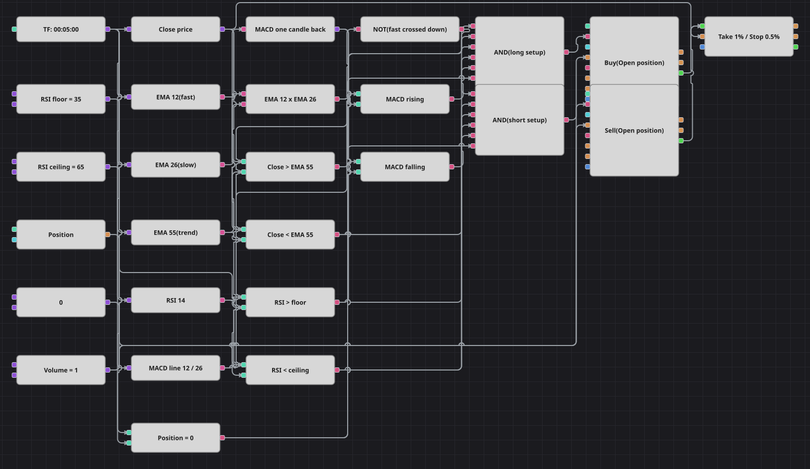

# Diagramm der Scalping-Strategie mit EMA-Kreuzung, RSI und MACD
[English](README.md) | [Русский](README_ru.md) | [中文](README_zh.md) | [Español](README_es.md) | [Português](README_pt.md) | [日本語](README_ja.md)

Ein kurzfristiger Trendfolger, der einer Kreuzung nicht ungeprüft traut. Dass die schnelle EMA die langsame kreuzt, ist nur der Auslöser; bevor eine Order hinausgeht, muss der Kurs zusätzlich auf der richtigen Seite einer weit langsameren Trend-EMA stehen, der RSI in seinem Arbeitsband und nicht am Extrem liegen und die MACD-Linie sich weiterhin in Richtung des Trades bewegen. Jede Position übernimmt eine Schutzeinheit aus Stop und Ziel, sodass ein Scalp nie unbegrenzt offen bleibt.

## Strategieübersicht

- Drei exponentielle gleitende Durchschnitte haben verschiedene Aufgaben: Das schnelle und das langsame Paar liefert das Signal, der lange sagt, welche Marktseite überhaupt erlaubt ist.
- Der Kreuzungsbaustein feuert nur in dem Moment, in dem der schnelle Durchschnitt die Seite wechselt, sodass ein einzelner Trend keine Kette von Einstiegen erzeugt.
- Der RSI dient als Extremfilter und nicht als Signal: Eine Kreuzung wird nur angenommen, solange der Index zwischen Unter- und Obergrenze bleibt, was das Diagramm aus ausgelaufenen Bewegungen heraushält.
- Die MACD-Linie wird mit ihrem eigenen Wert eine Kerze zuvor verglichen, das Momentum muss also zur Kreuzung passen und nicht bloß vorhanden sein.
- Die Positionsprüfung bewirkt, dass ein Einstieg nur eröffnen und nie vergrößern kann.

## Ein- und Ausstiegsregeln

- **Long-Einstieg**: Die schnelle EMA kreuzt die langsame nach oben, die Kerze schließt über der Trend-EMA, der RSI liegt zwischen Unter- und Obergrenze, die MACD-Linie steht höher als eine Kerze zuvor und die Position ist neutral. Die Order kauft das gemeinsame Volumen zum Marktpreis.
- **Short-Einstieg**: Die schnelle EMA kreuzt die langsame nach unten, die Kerze schließt unter der Trend-EMA, der RSI liegt zwischen Unter- und Obergrenze, die MACD-Linie steht tiefer als eine Kerze zuvor und die Position ist neutral. Die Order verkauft das gemeinsame Volumen zum Marktpreis.
- **Ausstieg**: Der Baustein zum Positionsschutz beendet jeden Trade über einen prozentualen Stop oder ein prozentuales Ziel, gemessen ab dem Ausführungskurs. Das Original bemisst beide Marken an der durchschnittlichen wahren Handelsspanne, Stop bei zwei ATR und Ziel beim Doppelten dieses Risikos, doch der Schutzbaustein nimmt nur einen festen Wert an. Deshalb wurde der ATR-Abstand durch einen Prozentsatz derselben Größenordnung auf diesem Instrument ersetzt; die dynamische Fassung erforderte, die Marken im Diagramm neu zu rechnen und die Orders von Hand zu senden. Zwei weitere Dinge entfielen: die Pause von zehn Balken nach jedem Trade, die kein Baustein über Kerzen hinweg zählen kann, und die Umkehr beim Gegensignal, denn hier beenden Stop und Ziel den Trade. Das Original arbeitet auf Dreißig-Minuten-Kerzen, dieses Diagramm läuft auf den Fünf-Minuten-Kerzen der mitgelieferten Historie.

## Parameter

| Parameter | Standard | Beschreibung |
|---|---|---|
| Fast EMA Length | 12 | Länge des schnellen exponentiellen gleitenden Durchschnitts, der die Kreuzung erzeugt. |
| Slow EMA Length | 26 | Länge des langsamen exponentiellen gleitenden Durchschnitts, gegen den gekreuzt wird. |
| Trend EMA Length | 55 | Länge des exponentiellen Trenddurchschnitts, der über die erlaubte Seite entscheidet. |
| RSI Length | 14 | Glättungsperiode des Relative-Stärke-Index. |
| RSI floor | 35 | Untere Kante des RSI-Bandes; darunter gilt die Kreuzung als bereits gelaufene Bewegung. |
| RSI ceiling | 65 | Obere Kante des RSI-Bandes; darüber gilt die Kreuzung als überhitzt. |
| Take profit, % | 1 | Abstand des Take-Profit vom Ausführungskurs, in Prozent. |
| Stop loss, % | 0.5 | Abstand des Stop-Loss vom Ausführungskurs, in Prozent. |
| Volume | 1 | Ordervolumen in Lots. |
| Candles | 00:05:00 | Zeiteinheit der Kerzen, mit der das gesamte Diagramm arbeitet. |

## Diagrammdetails

- Der Kerzenbaustein speist alle fünf Indikatoren und einen Konverter für den Schlusskurs; der MACD nutzt dieselben Längen zwölf und sechsundzwanzig wie das EMA-Paar.
- Der Kreuzungsbaustein bekommt den schnellen Durchschnitt auf den oberen und den langsamen auf den unteren Eingang, und ein logisches NICHT macht aus derselben Ausgabe die Abwärtskreuzung für die Short-Seite.
- Das RSI-Band besteht aus zwei Vergleichen gegen zwei Konstanten, die sich beide Einstiege teilen; der MACD-Momentumtest vergleicht die Linie mit einem Baustein für den vorigen Wert eine Kerze zurück.
- Jedes logische UND sammelt Kreuzung, Trendseite, beide RSI-Kanten, den Momentumtest und die Neutralprüfung und löst dann einen Einstiegsbaustein aus, der sein Volumen aus der gemeinsamen Konstante bezieht.
- Beide Einstiegsbausteine geben ihre eigenen Trades an den Baustein zum Positionsschutz weiter, der die Position schließt.

## Verwendung

Importieren Sie die `.json`-Datei in Designer, testen Sie sie im Backtester mit historischen Daten und passen Sie danach Parameter oder Bausteine an Ihr Instrument an, bevor Sie live handeln.
