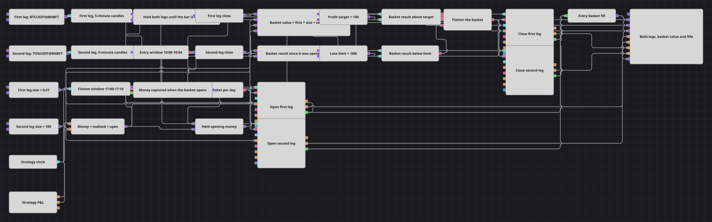

# Scheduled Two-Leg Basket with a Money Guard
[Русский](README_ru.md) | [中文](README_zh.md) | [Español](README_es.md) | [Deutsch](README_de.md) | [Português](README_pt.md) | [日本語](README_ja.md)

This diagram trades a clock, not a signal. It holds no indicator at all: once a day a short entry window opens and the diagram buys two instruments at the same moment, a later window flattens both, and between the two windows a money guard watches what the basket has made and closes it early on a profit target or a loss limit.

## Strategy Overview

- Two Variable blocks of type Security name the two instruments the diagram trades. Each one feeds its own candle series, its own opening action and its own closing action, so the two legs are sized and managed separately while being opened and closed together.
- Sync holds the two 5-minute candle series until both legs have delivered the same bar and releases them as one set, so the value drawn for the basket never mixes a fresh price of one leg with a stale price of the other.
- A Formula multiplies each released close by that leg's traded size and adds the two products. The result is what the basket is actually worth at the sizes the diagram trades, and it is the line drawn on the chart panel.
- Working time reads the time stamp of the first leg's finished candles and is open only inside the entry window, so exactly one bar per day passes it. Flag turns that opening into a single pulse and stays latched until the basket is flattened.
- The latched pulse triggers two Position modify blocks set to Open position. Each one carries its own Security and its own Volume, and the Open position condition makes the pair silent whenever that instrument is already held, so one pulse can never stack a second basket on top of the first.
- Strategy P&L feeds a Formula that adds realized and open money. A second Formula subtracts the amount captured at the moment the basket was opened, which turns the account's running total into the result of the current basket alone.
- A logical OR joins three reasons to flatten: the closing window, a basket result above the profit target and a basket result below the loss limit. Its signal drives two Position modify blocks set to Close position and also releases the daily Flag, so the next entry window finds the latch free.

## Entry and Exit Rules

- **Long entry**: Inside the entry window the first leg's finished candle opens Working time, the daily Flag has not been used yet, and both Open position blocks fire on the same pulse: one buys the first leg for its own size, the other buys the second leg for its own size. Each order is a market order, and each is suppressed on its own instrument if a position in it is already open.
- **Short entry**: The diagram has no short side: both entry blocks carry a fixed Buy direction. A short basket is one setting away - switch the Direction of the two Open position blocks to Sell and the same schedule, the same latch and the same money guard run the basket the other way round.
- **Exit**: Three reasons flatten the basket, and any one of them is enough. The closing window, driven by the strategy clock rather than by candle arrivals, flattens on schedule; the basket result rising above the profit target flattens early in profit; the basket result falling below the loss limit flattens early in loss. All three go through one logical OR into two Close position blocks, which need neither a volume nor a direction because they compute both from the position they find - and do nothing at all when there is none, so a repeated signal inside the window is harmless.

## Parameters

| Parameter | Default | Description |
|---|---|---|
| First Leg Security | BTCUSDT@BNBFT | Instrument traded by the first leg; it drives the candle series that times the entry window. |
| Second Leg Security | TONUSDT@BNBFT | Instrument traded by the second leg; it is opened and closed on the same signals as the first. |
| First Leg Candles | 00:05:00 | Time frame of the first leg. Only finished candles are used, so the entry window has to be at least one candle wide. |
| Second Leg Candles | 00:05:00 | Time frame of the second leg. Keep it equal to the first leg, since the two are held together before the basket value is computed. |
| Alignment Interval | 00:05:00 | Grouping interval used to align the two legs. It should match the candle time frame; a larger value would release the pair later than the bar it belongs to. |
| Entry Window From | 10:00:00 | Beginning of the daily entry window, read from the time stamp of the first leg's finished candles. |
| Entry Window Until | 10:04:00 | End of the daily entry window. The span between the two values must contain exactly one candle opening, otherwise the daily latch would be armed more than once. |
| Flatten Window From | 17:00:00 | Beginning of the daily flatten window, read from the strategy clock rather than from candle arrivals. |
| Flatten Window Until | 17:10:00 | End of the daily flatten window. Keep it a few candles wide so the clock is sampled inside it at least once. |
| First Leg Size | 0.01 | Quantity used to open the first leg, and the weight the first leg carries in the drawn basket value. |
| Second Leg Size | 100 | Quantity used to open the second leg, and the weight the second leg carries in the drawn basket value. Choose it so the two legs contribute comparable amounts of money. |
| Profit Target | 100 | Money made by the current basket above which it is closed early. It is measured from the moment the basket was opened, not from the start of the run. |
| Loss Limit | -500 | Money lost by the current basket below which it is closed early; a negative value, measured the same way as the profit target. |

## Diagram Details

- Two [Variable](https://doc.stocksharp.com/en/topics/designer/strategies/using_visual_designer/elements/data_sources/variable.html) blocks of type Security are the only place an instrument is named. Each feeds a [Candles](https://doc.stocksharp.com/en/topics/designer/strategies/using_visual_designer/elements/data_sources/candles.html) block and the Security input of the two Position modify blocks that manage that leg, so a leg is repointed at another instrument by editing one value.
- [Sync](https://doc.stocksharp.com/en/topics/designer/strategies/using_visual_designer/elements/common/sync.html) takes one line per leg and lets both out together once the bar is complete on both. The released candles are drawn on the chart panel and converted to close prices, which a [Formula](https://doc.stocksharp.com/en/topics/designer/strategies/using_visual_designer/elements/common/formula.html) weights by the traded sizes into the basket value line.
- The two clocks are deliberately different. The entry [Working time](https://doc.stocksharp.com/en/topics/designer/strategies/using_visual_designer/elements/time/working_time.html) is fed by the first leg's candles, so the entry decision cannot drift away from the price it is taken at; the closing Working time is fed by [Time](https://doc.stocksharp.com/en/topics/designer/strategies/using_visual_designer/elements/time/current_time.html), so the flatten still happens when the data goes quiet. [Flag](https://doc.stocksharp.com/en/topics/designer/strategies/using_visual_designer/elements/common/flag.html) sits between the entry window and the orders and is reset only by the flatten signal, which is what limits the diagram to one basket per day.
- [P&L change](https://doc.stocksharp.com/en/topics/designer/strategies/using_visual_designer/elements/common/pnl_strategy.html) reports realized and open money on every update. Adding them gives the account's running total; a Variable captures that total on the first entry fill, a second Variable holds it and re-emits it on every later update, and subtracting it leaves the result of the basket that is open now. The guard therefore measures the current basket rather than the lifetime of the account, and it goes back to zero as soon as the basket is closed.
- Every action is a [Position modify](https://doc.stocksharp.com/en/topics/designer/strategies/using_visual_designer/elements/positions/modify.html) block. The two entry blocks use the Open position condition with an explicit direction and volume; the two exit blocks use Close position, which takes neither and derives both from the current position of its own instrument. [Combination](https://doc.stocksharp.com/en/topics/designer/strategies/using_visual_designer/elements/common/combination.html) merges the four fill streams into the single trade series drawn on the chart panel, while the four order streams are drawn separately.

## Usage

Import the `.json` file into Designer, run it in the backtester on historical data, then adjust the parameters or the blocks themselves to fit your instrument before trading it live.
