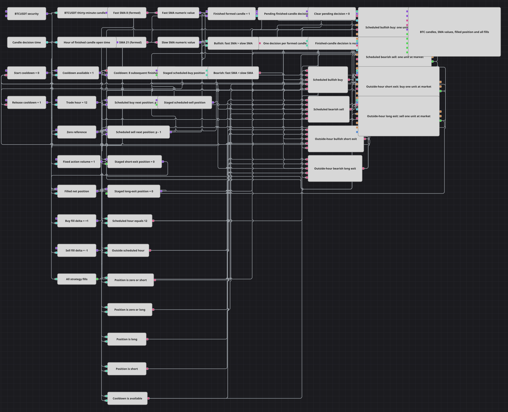

# 指定小时 SMA 交叉
[English](README.md) | [Русский](README_ru.md) | [Español](README_es.md) | [Deutsch](README_de.md) | [Português](README_pt.md) | [日本語](README_ja.md)

该图表在已完成的三十分钟 BTCUSDT K 线上计算快慢移动平均线，在 K 线开盘小时为 12 时允许计划入场，在其他小时平掉与趋势相反的持仓，并用八根 K 线的冷却期隔开市场操作。

## 策略概览

- 已完成的三十分钟 K 线进入仅输出已形成值的 SMA(8) 和 SMA(21)。只有同一根 K 线的两个均线值都可用时，才会发出决策。
- 多头趋势定义为 `SMA(8) > SMA(21)`，空头趋势定义为 `SMA(8) < SMA(21)`。两者相等时不执行操作。
- 每根已完成且指标已形成的 K 线准备好趋势值后，Time 模块提供决策时间戳，Converter 再提取其中的 Hour。在已完成 K 线批次中，该时间戳与规则使用的 K 线 `OpenTime` 对齐。一次性 Flag 保证该 K 线只决策一次，即使期间同步处理订单事件也是如此。
- 由成交驱动的状态把净持仓记录为 `-1`、`0` 或 `1`。四条操作路径各自在提交订单前准备自己的下一状态，并且只在该路径报告成交后提交该状态。
- 每次操作都会启动八根 K 线的冷却期。随后第 1 至第 7 根 K 线被阻止；第 8 根已完成 K 线会在决策前把计数减到零，因此可以再次执行操作。

## 入场与退出规则

- **计划多头操作**：当 K 线的 `OpenTime.Hour` 为 12、趋势为多头且持仓为空或为空头时，以市价买入 Volume 1。空头持仓只减至零，不会直接反转。
- **计划空头操作**：在同一小时内，当趋势为空头且持仓为空或为多头时，以市价卖出 Volume 1。多头持仓只减至零，不会直接反转。
- **其他小时退出**：在其他开盘小时，空头趋势用一次市价卖出平掉多头持仓，多头趋势用一次市价买入平掉空头持仓。小时 12 之外不会建立新持仓。
- 不设单独的平仓小时。四条分支都要求冷却期可用，并且只有结果为真的分支才能触发自己独立的 Modify position 模块。

## 参数

| 参数 | 默认值 | 说明 |
|---|---|---|
| BTC Data Security | BTCUSDT@BNBFT | Candles 和 Strategy trades 模块使用的交易品种。交易时请把 Strategy Security 设为同一品种。 |
| Candle Series | 00:30:00 | 已完成 K 线的周期，也是指标更新和冷却步进的时钟。 |
| Fast SMA Length | 8 | 快速简单移动平均线包含的已完成 K 线数量。 |
| Slow SMA Length | 21 | 慢速简单移动平均线包含的已完成 K 线数量。 |
| Trade Hour | 12 | 计划入场操作所接受的已完成 K 线 `OpenTime.Hour` 字段值。 |
| Cooldown N | 8 | 可以再次考虑操作的最早后续已完成 K 线序号。 |
| Volume | 1 | 每次市价买入或卖出的固定数量。 |

## 图表细节

- BTC [Variable](https://doc.stocksharp.com/zh/topics/designer/strategies/using_visual_designer/elements/data_sources/variable.html) 把交易品种送入构建并完成的 [Candles](https://doc.stocksharp.com/zh/topics/designer/strategies/using_visual_designer/elements/data_sources/candles.html) 和 [Strategy trades](https://doc.stocksharp.com/zh/topics/designer/strategies/using_visual_designer/elements/common/trades_by_strategy.html)。
- 两个仅输出已形成值的 [Indicator](https://doc.stocksharp.com/zh/topics/designer/strategies/using_visual_designer/elements/common/indicator.html) 模块计算 SMA(8) 与 SMA(21)。Formula 模块把数值交给多头和空头 [Comparison](https://doc.stocksharp.com/zh/topics/designer/strategies/using_visual_designer/elements/common/comparison.html) 模块。
- Time 依次释放已保存持仓、计划小时、零基准、冷却状态、送往 Hour Converter 的时间戳和固定数量，最后才触发待决策锁存器，因此每个五输入逻辑门都会取得同一根 K 线的一致快照。
- 一次性 Flag 会在同步交易事件处理期间阻止逻辑重入。四个独立的 [Modify position](https://doc.stocksharp.com/zh/topics/designer/strategies/using_visual_designer/elements/positions/modify.html) 模块可避免结果为假的分支消耗为真分支准备的数量。
- 计划买入和卖出的候选状态分别是 `持仓 + 1` 与 `持仓 - 1`，两个退出候选状态均为零。候选状态只能通过相应 Modify position 的 `MyTrade` 输出进入持仓状态。
- [Delay](https://doc.stocksharp.com/zh/topics/designer/strategies/using_visual_designer/elements/common/delay_value.html) 模块在同一根 K 线的决策之前先接收该 K 线。结果为真的操作门先把冷却标为不可用并启动 N = 8，然后提交订单。图表显示 K 线、两条均线、已成交持仓、四个操作成交流以及全部策略成交。

## 使用方法

把 `.json` 文件导入 Designer，将 Strategy Security 设为 BTCUSDT@BNBFT，选择投资组合，然后在三十分钟历史数据上运行图表。使用内置三月数据和上述默认值时，验证得到 59 个已完成的市价订单和 59 笔成交，且没有交易错误。实盘前请核对 K 线时区、小时字段、数量和冷却行为。
