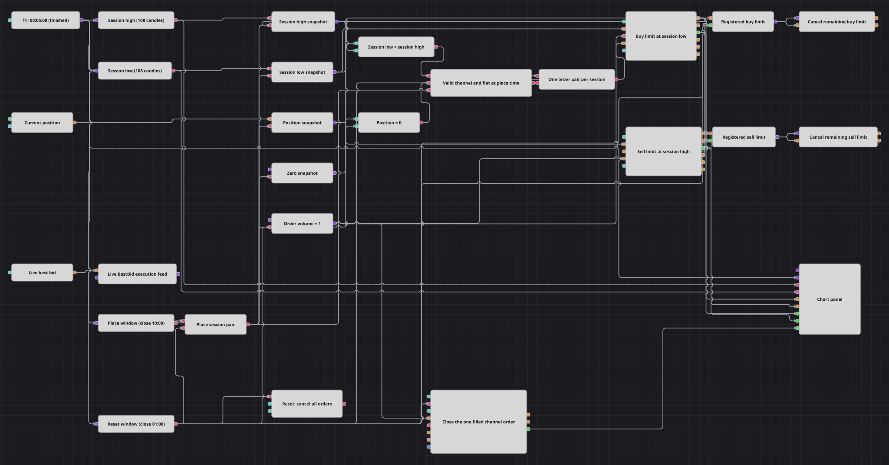

# Diagrama da estratégia de ordens limite no canal de sessão
[English](README.md) | [Русский](README_ru.md) | [中文](README_zh.md) | [Español](README_es.md) | [Deutsch](README_de.md) | [日本語](README_ja.md)

Este diagrama captura diariamente um retrato fixo de um canal de preços de nove horas e coloca em suas bordas um par OCO de ordens limite gerenciado no cliente. Após uma execução, a lógica do diagrama solicita o cancelamento da ordem oposta; não se trata de uma instrução OCO atômica da bolsa. Candles finalizados de cinco minutos definem o canal, uma assinatura contínua de BestBid fornece eventos de cotação para a execução e o próximo reinício diário cancela as ordens restantes antes de ajustar a posição por Order Volume com uma ação de mercado ReduceOnly.

## Visão geral da estratégia

- Candles finalizados de cinco minutos alimentam Highest 108 e Lowest 108, configurados para emitir somente valores formados. No retrato diário, sua janela móvel contém os candles com OpenTime das 01:00 às 09:55 UTC inclusive, ou seja, a sessão completa de 01:00–10:00.
- O bloco de horário de colocação seleciona o candle finalizado marcado entre 09:55:00 e 09:59:59. A marca do candle contém OpenTime, portanto ele chega quando termina às 10:00 UTC; um Flag transforma o resultado da janela em exatamente um pulso de colocação por sessão.
- O pulso captura as duas bordas do canal e a posição atual. Quando Session Low < Session High e Position = 0, o diagrama registra uma compra limite na mínima capturada e depois uma venda limite na máxima capturada, ambas com Order Volume 1 e ShrinkPrice desativado.
- Um bloco Level1 continuamente assinado lê BestBid. Seu fluxo mantém atualizações de preço ao vivo disponíveis para que o conector execute as duas ordens pendentes quando o mercado alcançar seus preços; BestBid não substitui nenhuma borda capturada do canal.
- O primeiro MyTrade de qualquer ordem limite solicita o cancelamento da Order oposta armazenada. Essa é uma lógica OCO no cliente: no processamento sequencial normal, ela busca deixar uma única ordem do canal executada, mas execuções quase simultâneas podem entrar em condição de corrida porque o cancelamento não é atômico na bolsa. No próximo reinício, o diagrama envia uma solicitação de cancelamento em massa, também encaminha as duas referências Order armazenadas por seus caminhos determinísticos de cancelamento e executa uma ação de mercado ReduceOnly com Order Volume. Essa quantidade fecha a posição do caso normal com uma execução; se a exposição real for diferente, ReduceOnly apenas a reduz. O gráfico mostra candles, as duas linhas do canal, dois fluxos de ordens e todos os negócios de entrada e fechamento do reinício.

## Regras de entrada e saída

- **Entrada comprada**: Na borda da sessão às 10:00 UTC, se os dois indicadores de 108 valores estiverem formados, a mínima capturada for menor que a máxima e o retrato da posição for zero, o diagrama coloca uma compra limite de Order Volume em Session Low. A ordem permanece ativa até ser executada ou removida por um caminho de cancelamento.
- **Entrada vendida**: Com as mesmas verificações de canal formado e posição zerada, o diagrama coloca uma venda limite de Order Volume em Session High. Se essa ordem gerar a primeira execução, seu evento MyTrade envia a compra limite armazenada ao bloco de cancelamento.
- **Saída**: Não há blocos de stop-loss ou take-profit. Após a primeira execução do canal, a lógica no cliente solicita o cancelamento da ordem oposta em vez de reverter intencionalmente a posição. A posição permanece aberta até o reinício associado ao candle de 00:55, processado quando ele termina às 01:00 UTC; o reinício solicita cancelamento em massa, cancela explicitamente os dois limites armazenados e usa uma ação de mercado ReduceOnly com Order Volume. Ela fecha a posição normal de uma execução e não pode aumentar nem reverter uma exposição real diferente.

## Parâmetros

| Parâmetro | Padrão | Descrição |
|---|---|---|
| Candles Series | 00:05:00 | Série de candles de cinco minutos; somente candles finalizados atualizam o canal e acionam as duas janelas diárias. |
| Session High Length | 108 | Número de candles finalizados usado por Highest com saída apenas formada. Com o período e as janelas padrão, 108 candles cobrem 01:00–10:00 UTC. |
| Session High Source | unset | Não definido. Highest lê automaticamente o High de cada candle finalizado. |
| Session Low Length | 108 | Número de candles finalizados usado por Lowest com saída apenas formada. Mantenha-o igual a Session High Length para que ambas as bordas descrevam a mesma sessão. |
| Session Low Source | unset | Não definido. Lowest lê automaticamente o Low de cada candle finalizado. |
| Order Volume | 1 | Quantidade de cada limite pendente e da ação ReduceOnly no reinício. No caminho normal com uma execução, ela corresponde à posição resultante; ReduceOnly impede que o reinício aumente ou reverta a exposição se o tamanho real for diferente. |

## Detalhes do diagrama

- O bloco [Candles](https://doc.stocksharp.com/pt/topics/designer/strategies/using_visual_designer/elements/data_sources/candles.html) emite somente candles finalizados de cinco minutos. Dois blocos de [Indicador](https://doc.stocksharp.com/pt/topics/designer/strategies/using_visual_designer/elements/common/indicator.html), limitados a valores formados, calculam diretamente Highest 108 e Lowest 108 móveis.
- Dois blocos de [Horário de trabalho](https://doc.stocksharp.com/pt/topics/designer/strategies/using_visual_designer/elements/time/working_time.html) verificam o OpenTime do candle. O intervalo 09:55:00–09:59:59 atua quando o candle termina às 10:00 UTC, enquanto 00:55:00–00:59:59 atua no fechamento das 01:00 UTC. Esse deslocamento de um candle faz parte da configuração de tempo e não é atraso de execução.
- Um [Flag](https://doc.stocksharp.com/pt/topics/designer/strategies/using_visual_designer/elements/common/flag.html) de colocação emite uma vez e permanece definido até o reinício. Blocos de [Variável](https://doc.stocksharp.com/pt/topics/designer/strategies/using_visual_designer/elements/data_sources/variable.html) capturam Highest, Lowest, Position, zero e volume nesse pulso; [Comparação](https://doc.stocksharp.com/pt/topics/designer/strategies/using_visual_designer/elements/common/comparison.html) e [Condição lógica](https://doc.stocksharp.com/pt/topics/designer/strategies/using_visual_designer/elements/common/logical_condition.html) admitem um único par com canal válido e posição zerada.
- O bloco de [Registro de ordem](https://doc.stocksharp.com/pt/topics/designer/strategies/using_visual_designer/elements/orders/register.html) de compra coloca primeiro o limite em Session Low. Sua Order registrada atualiza as entradas de máxima e volume antes de acionar o registro de venda em Session High. Ambas usam ShrinkPrice=false e permanecem ativas até execução ou cancelamento.
- O bloco [Level1](https://doc.stocksharp.com/pt/topics/designer/strategies/using_visual_designer/elements/data_sources/level_1.html) assina BestBid continuamente. O fluxo mantido ativa o processamento de cotações ao vivo para executar os limites pendentes, enquanto seus preços continuam vindo somente de Highest e Lowest capturados.
- Cada Order registrada é armazenada. Um MyTrade de compra entrega a venda guardada ao [Cancelamento de ordem](https://doc.stocksharp.com/pt/topics/designer/strategies/using_visual_designer/elements/trading/cancel_order.html), e um MyTrade de venda faz o movimento simétrico. O reinício invoca o [Cancelamento em massa](https://doc.stocksharp.com/pt/topics/designer/strategies/using_visual_designer/elements/orders/mass_cancel.html) e também entrega as referências armazenadas das duas ordens aos respectivos blocos de cancelamento, tornando a limpeza independente da confirmação em massa.
- Por fim, o pulso de reinício aciona [Modificar posição](https://doc.stocksharp.com/pt/topics/designer/strategies/using_visual_designer/elements/positions/modify.html) com ReduceOnly, Order Volume e o algoritmo MarketOrder. No caminho sequencial previsto com uma execução, essa quantidade fecha toda a posição; se as execuções entrarem em corrida ou a exposição real for diferente, ReduceOnly impede que ela aumente ou seja revertida. O [Painel de gráfico](https://doc.stocksharp.com/pt/topics/designer/strategies/using_visual_designer/elements/common/chart.html) recebe candles finalizados, Highest, Lowest, ambos os fluxos Order, os dois fluxos MyTrade dos limites e o fluxo MyTrade do fechamento no reinício.

## Uso

Importe o arquivo `.json` no Designer, execute-o sobre dados históricos no backtester e depois ajuste os parâmetros ou os próprios blocos ao seu instrumento antes de operar ao vivo.
