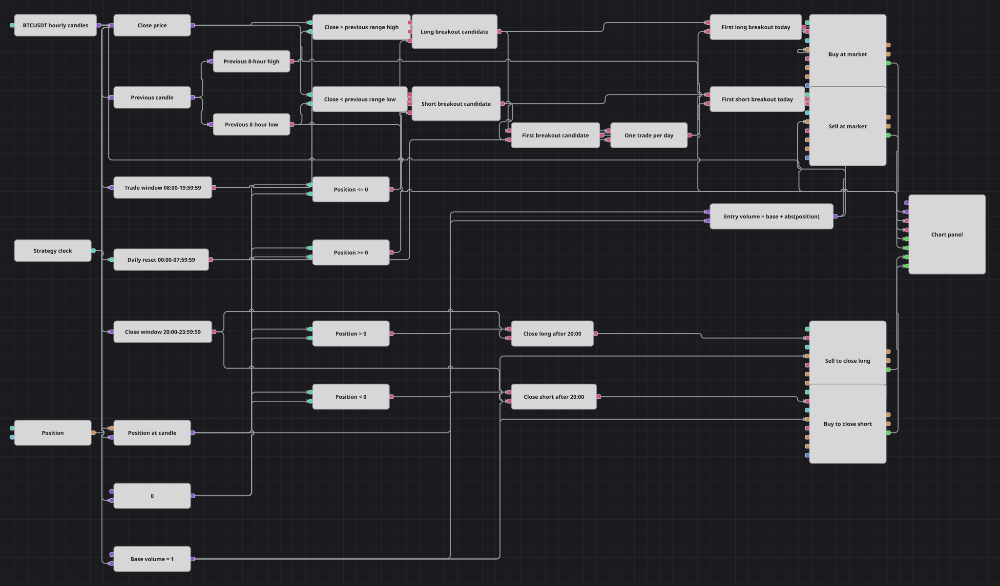

# Схема стратегии пробоя внутридневного диапазона
[English](README.md) | [中文](README_zh.md) | [Español](README_es.md) | [Deutsch](README_de.md) | [Português](README_pt.md) | [日本語](README_ja.md)

Эта схема торгует пробои скользящего восьмичасового диапазона BTCUSDT в дневной сессии UTC. Уровни и решения строятся по завершённым часовым свечам, один общий суточный флаг пропускает первого кандидата любого направления, а отдельные вечерние ветви возвращают созданную схемой позицию к нулю.

## Обзор стратегии

- Каждая завершённая часовая свеча перед индикаторами Highest 8 и Lowest 8 со включённым режимом formed-only сдвигается на один период. Поэтому на каждой новой свече уровни охватывают непосредственно предшествующие восемь завершённых часов и непрерывно сдвигаются, а не фиксируются на весь день.
- Общий поток Time активирует суточный сброс с 00:00:00 по 07:59:59 UTC. Время открытия свечи управляет отдельным торговым окном с 08:00:00 по 19:59:59 и окном закрытия с 20:00:00 по 23:59:59; такие настройки соответствуют полуоткрытым интервалам `[08:00, 20:00)` и `[20:00, 24:00)`.
- В торговом окне строгое условие `Close > High` вместе с `Position <= 0` образует кандидата на лонг, а строгое `Close < Low` вместе с `Position >= 0` — кандидата на шорт. Равенство цены любой границе диапазона входа не создаёт.
- Оба направления используют один общий Flag, поэтому за сутки UTC войти может только первый допустимый кандидат на лонг или шорт. Объём входа равен `Base Volume + abs(Position)`: из нулевой позиции открывается одна единица, а существующая позиция в одну единицу закрывается и разворачивается одной рыночной заявкой.
- В окне закрытия положительная позиция отправляет рыночную продажу базового объёма, а отрицательная — рыночную покупку базового объёма. Стоп-лосса и тейк-профита нет; график показывает свечи, скользящие уровни Highest и Lowest и все четыре потока MyTrade.

## Правила входа и выхода

- **Вход в лонг**: С 08:00:00 по 19:59:59 UTC, когда завершённая свеча выполняет `Close > Highest(8)` для предшествующих восьми часов, снимок позиции равен `<= 0`, а общий суточный Flag доступен, схема отправляет рыночную заявку NoCondition на покупку объёмом `1 + abs(Position)`.
- **Вход в шорт**: С 08:00:00 по 19:59:59 UTC, когда завершённая свеча выполняет `Close < Lowest(8)` для предшествующих восьми часов, снимок позиции равен `>= 0`, а общий суточный Flag доступен, схема отправляет рыночную заявку NoCondition на продажу объёмом `1 + abs(Position)`.
- **Выход**: С 20:00:00 по 23:59:59 UTC схема продаёт Base Volume 1 при положительной позиции и покупает Base Volume 1 при отрицательной. В штатной работе входы создают позицию строго `+1` или `-1`, поэтому фиксированный объём выхода возвращает её к нулю. Стоп-лосс, тейк-профит и другая защита не подключены.

## Параметры

| Параметр | По умолчанию | Описание |
|---|---|---|
| Candles | 01:00:00 | Часовой таймфрейм BTCUSDT; скользящий диапазон, проверки сессии, снимки позиции и решения получают только завершённые свечи. |
| Range Length | 8 | Число сдвинутых завершённых свечей для индикаторов Highest и Lowest с режимом formed-only; текущая свеча в расчёт не входит. |
| Reset Window | 00:00:00–07:59:59 UTC | Интервал UTC, в котором общий поток Time сбрасывает единый суточный Flag до начала торговой сессии. |
| Trade Window | 08:00:00–19:59:59 UTC | Включительные настроенные границы UTC для кандидатов на вход, эквивалентные полуоткрытому интервалу `[08:00, 20:00)` по времени открытия часовой свечи. |
| Close Window | 20:00:00–23:59:59 UTC | Включительные настроенные границы UTC для закрытия позиции, эквивалентные полуоткрытому интервалу `[20:00, 24:00)` по времени открытия часовой свечи. |
| Base Volume | 1 | Единичный объём при входе из нулевой позиции; он прибавляется к `abs(Position)` при развороте и без изменения поступает в обе вечерние заявки выхода. |

## Детали диаграммы

- Кубик [Свечи](https://doc.stocksharp.com/ru/topics/designer/strategies/using_visual_designer/elements/data_sources/candles.html) выдаёт завершённые часовые свечи BTCUSDT. Кубик [Предыдущее значение](https://doc.stocksharp.com/ru/topics/designer/strategies/using_visual_designer/elements/common/prev_value.html) со Shift 1 исключает свечу принятия решения из расчёта диапазона.
- Два кубика [Индикатор](https://doc.stocksharp.com/ru/topics/designer/strategies/using_visual_designer/elements/common/indicator.html) с режимом formed-only рассчитывают Highest 8 и Lowest 8 по сдвинутому потоку свечей. Их значения обновляются каждый завершённый час и задают скользящий канал за восемь предыдущих часов.
- Общий поток Time управляет кубиком сброса [Рабочее время](https://doc.stocksharp.com/ru/topics/designer/strategies/using_visual_designer/elements/time/working_time.html) для 00:00:00–07:59:59 UTC. Поток свечей напрямую управляет кубиками торгового времени и времени закрытия, поэтому решения используют OpenTime каждой свечи.
- Текущая [Позиция](https://doc.stocksharp.com/ru/topics/designer/strategies/using_visual_designer/elements/positions/current.html) фиксируется для каждой свечи решения. Кубики [Сравнение](https://doc.stocksharp.com/ru/topics/designer/strategies/using_visual_designer/elements/common/comparison.html) и [Логическое условие](https://doc.stocksharp.com/ru/topics/designer/strategies/using_visual_designer/elements/common/logical_condition.html) объединяют строгий пробой, сессию, сторону позиции и состояние общего флага.
- Арифметика объёма входа рассчитывает `Base Volume + abs(Position)`. Два кубика входа [Изменить позицию](https://doc.stocksharp.com/ru/topics/designer/strategies/using_visual_designer/elements/positions/modify.html) ставят рыночные заявки NoCondition: создают лонг или шорт в одну единицу из нуля либо полностью разворачивают противоположную единичную позицию одной заявкой.
- Окно сброса восстанавливает один общий Flag на сутки UTC, а первый принятый кандидат на лонг или шорт расходует его. В окне закрытия отдельные ветви положительной и отрицательной позиции отправляют рыночные заявки фиксированного Base Volume 1; они закрывают экспозицию `±1`, которую создаёт штатная ветвь входа схемы.
- [Панель графика](https://doc.stocksharp.com/ru/topics/designer/strategies/using_visual_designer/elements/common/chart.html) получает завершённые свечи, Highest 8, Lowest 8 и выходы MyTrade кубиков входа в лонг, входа в шорт, выхода из лонга и выхода из шорта. Кубиков стоп-лосса и тейк-профита нет.

## Использование

Импортируйте файл `.json` в Designer, прогоните схему на исторических данных в тестере, затем подстройте параметры или сами кубики под свой инструмент, прежде чем торговать вживую.
