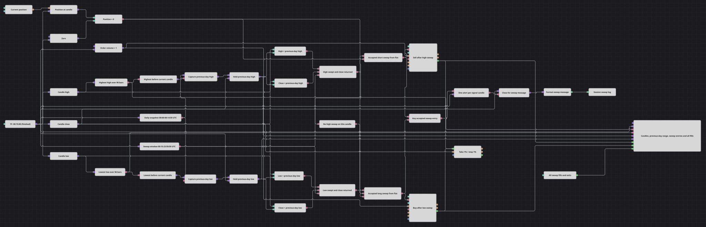

# 前日セッションスイープ通知ストラテジー図
[English](README.md) | [Русский](README_ru.md) | [中文](README_zh.md) | [Español](README_es.md) | [Deutsch](README_de.md) | [Português](README_pt.md)

このダイアグラムは、前 UTC 日のレンジに対するダマシのブレイクを取引します。深夜にその日の高値と安値を固定し、15 分足が境界を越えた後にレンジ内へ戻って確定するのを待ち、スイープと逆方向にエントリーします。受理したシグナル足ごとにログへ 1 件のメッセージを書き込みます。

## ストラテジーの概要

- 確定した 15 分足から、すべての判定に使う高値、安値、終値を取得します。
- Highest(96) と Lowest(96) が 1 日全体を対象にします。シフト 1 の Previous value ブロックにより、レンジ取得前に新しい深夜の足を除外します。
- 取得した高値と安値は 00:00 UTC からその暦日の終わりまで固定されます。エントリー判定は 00:15 UTC に始まります。
- 保持した高値を上抜けて戻るとショート設定、保持した安値を下抜けて戻るとロング設定になります。
- エントリーはポジションがゼロの場合だけ許可され、数量 1 の成行注文を使います。1 本の足で両方の条件が成立した場合は、高値のスイープを優先します。
- 約定した各エントリーには固定 1% の利確と 1% の損切りを設定し、確定足の終値に基づいて成行決済を発動します。

## エントリーとエグジットの条件

- **ロングエントリー**: 00:15 から 23:59:59 UTC の間に、足の安値が保持した前日安値より低く、終値がその水準より高く、同時の高値スイープがなく、Position がゼロであることを要求します。数量 1 を成行で買います。
- **ショートエントリー**: 同じ時間帯に、足の高値が保持した前日高値より高く、終値がその水準より低く、Position がゼロであることを要求します。数量 1 を成行で売ります。
- **通知**: 受理されたロングまたはショートの各シグナルは、足ごとの Flag を 1 回だけ通過します。String Formatter がシグナル足の終値をメッセージへ含め、Notification がストラテジーログへ送ります。
- **エグジット**: Position protection は、約定したエントリーから有利に 1% または不利に 1% 動いた時点で決済します。どちらの保護決済も成行注文です。

## パラメーター

| パラメーター | 既定値 | 説明 |
|---|---|---|
| ローソク足 | 00:15:00 | レンジ構築と判定に使う確定足の時間枠。 |
| Highest 期間 | 96 | 完全な日次レンジに含める 15 分足高値の数。 |
| Highest ソース | 未設定 | 代替のインジケーター入力フィールドは選択されていません。 |
| Lowest 期間 | 96 | 完全な日次レンジに含める 15 分足安値の数。 |
| Lowest ソース | 未設定 | 代替のインジケーター入力フィールドは選択されていません。 |
| 出来高 | 1 | 各成行エントリー注文の数量。 |
| 利確 | 1% | 約定価格から保護を発動する有利な変動。 |
| 損切り | 1% | 約定価格から保護を発動する不利な変動。 |
| トレーリングストップ | false | ストップ境界を固定します。 |
| 成行注文を使用 | true | 発動した保護決済を成行注文として送信します。 |

## ダイアグラムの詳細

- HighPrice と LowPrice のコンバーターが 96 値の 2 つのローリングインジケーターを入力し、ClosePrice がレンジ内復帰判定、通知文、保護判定に使われます。
- 各ローリング結果は、シフト 1 で確定値のみを扱う Previous value ブロックを通ります。00:00-00:14:59 UTC に取得用 Variable が直前値を受け取り、保持用 Variable が各足でその値を出力します。
- 4 つの比較が、保持高値を上抜けてその下で確定する動き、または保持安値を下抜けてその上で確定する動きを検出します。Working time は両方の組み合わせを 00:15-23:59:59 UTC に制限します。
- ポジション値は各足で取得され、ゼロと比較されます。ショートゲートは高値スイープとゼロポジション判定を組み合わせ、ロングゲートは優先順位を保つため反転した高値スイープ信号も要求します。
- 受理された 2 つのゲートが Modify position ブロックの Buy と Sell を発動し、通知用に統合されます。各足でリセットされる Flag は、同じシグナルイベント内の重複通知を防ぎつつ、その日の後続シグナルを抑制しません。
- エントリー約定が共有の Position protection ブロックを作動させます。基準価格は確定終値で更新されるため、確定前に戻った足内の到達は検出されません。
- 最初に利用できるレンジには、先行する 96 本の 15 分足が必要です。水準は深夜のスナップショット時だけ更新され、次の UTC 日まで変わりません。
- チャートには、ローソク足、ローリングおよび保持した日次境界、買いと売りの約定、保護決済を含む全ストラテジー約定を表示します。

## 使用方法

`.json` ファイルを Designer にインポートし、最初の日次レンジを形成できる十分な履歴でバックテスターを実行してください。ライブ取引の前に、時間枠、レンジ期間、保護幅、数量を銘柄に合わせて調整します。
