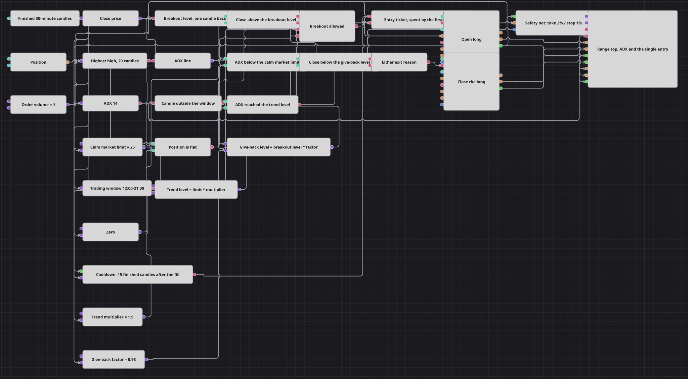

# 交易时段限制突破策略图
[English](README.md) | [Русский](README_ru.md) | [Español](README_es.md) | [Deutsch](README_de.md) | [Português](README_pt.md) | [日本語](README_ja.md)

只有当市场此前一直平静、只有在图被允许交易的时段之内、并且在交易权被交还之前仅此一次，突破才值得参与。最后这一点由标志位（Flag）模块负责执行：它让第一个合格的突破以单个脉冲的形式通过，随后保持关闭，因此一连串强势K线只会产生一次入场，而不是每根K线一笔委托。

## 策略概览

- 下游的一切都基于已完成的30分钟K线运行，因此任何决策都不会建立在仍在形成的K线上。
- 最高值（Highest）模块在20根K线上标出近期区间的顶部，前值（Previous value）模块取上一根K线时的该水平——因此这个水平在必须突破它的那根K线之前就已经确定。
- 周期为14的平均趋向指数（ADX）经转换器模块化为其自身的线，一个比较模块把入场限制在依然平静的市场：ADX线低于其限制值。
- 工作时间（Working time）模块逐根K线回答当前时刻是否落在交易窗口之内，而对同一答案取逻辑非（NOT）则标记交易时段的结束。
- 一个逻辑与（AND）把四个答案汇集成一道门：收盘价高于突破水平、ADX线低于限制值、当前时刻处于窗口之内、且持仓为空。
- 标志位模块把这道门变成一张通行票。第一个为真的答案作为单个脉冲被放行，并通过带有开仓条件的持仓修改（Position modify）模块触发市价买入；在通行票已被用掉期间，之后的每个答案都被吞掉。
- 有两件事会把通行票交还：一个延时（Delay）模块在入场成交之后计数15根已完成的K线，以及第一根落在交易窗口之外的K线。
- 离场由允许入场的同样两个读数构建——被放大的ADX限制值，以及略低于突破水平的一个水平——由逻辑或（OR）合并为一个平仓触发，其下方还有持仓保护（Position protection）模块以固定的止盈和止损运行。

## 入场与出场规则

- **做多入场**: K线收盘于前20根K线最高价之上，ADX线低于平静市场限制值，该K线属于交易窗口，且持仓为空。四者在同一根K线上同时到达，逻辑与把它们变成一个为真的答案，标志位把第一个这样的答案传给持仓修改模块，后者按委托手数以市价买入。
- **做空入场**: 没有做空入场。图的设计有意是单向的：它寻找的突破是向上的突破，而跌破回吐水平被解读为离开多头持仓的理由，而不是卖出做空的理由。
- **离场**: 有两个读数会结束这笔交易，而逻辑或意味着哪个先出现哪个就足够。第一个是市场不再平静：一个公式模块把平静市场限制值乘以趋势乘数，一个比较模块检查ADX线是否已达到这个被放大的水平。第二个是突破把自己回吐掉了：第二个公式模块把突破水平按回吐系数下调，一个比较模块检查收盘价是否已跌到它之下。二者之一都会触发一个设为平仓的持仓修改模块。在这两者之下，持仓保护模块盯着入场成交，并在盈利2%或亏损1%时结束交易。

## 参数

| 参数 | 默认值 | 说明 |
|---|---|---|
| Candles | 00:30:00 | 图中每个模块所使用的时间框架；只处理已完成的K线。 |
| Breakout Length | 20 | 最高值模块回看的K线数量，用于构建突破水平。 |
| ADX Length | 14 | 平均趋向指数的周期，其线用作平静市场过滤器。 |
| Calm Market Limit | 25 | ADX线必须保持低于的数值，突破才算是来自平静市场的突破。 |
| Session From | 12:00:00 | 交易窗口的起点；在此之前的K线不能开仓。 |
| Session Until | 21:00:00 | 交易窗口的终点；其后的第一根K线会交还入场通行票。 |
| Cooldown Candles | 15 | 入场成交之后必须经过的已完成K线数量，之后才交还入场通行票。 |
| Order Volume | 1 | 委托规模，以手为单位。 |
| Trend Multiplier | 1.5 | 施加于平静市场限制值的乘数，用于得到结束交易的ADX水平。 |
| Give-Back Factor | 0.98 | 在回吐离场中，收盘价必须跌破的突破水平的比例。 |
| Take Profit, % | 2 | 止盈距离，以入场价格的百分比表示。 |
| Stop Loss, % | 1 | 止损距离，以入场价格的百分比表示。 |

## 图表详情

- 入场门内的空仓检查有实际分量。若没有它，在交易已经开启时到来的突破会把通行票花在一笔开仓条件将会拒绝的委托上，而图随后会白白熬完整个冷却期。
- 标志位仅在被置位的那一刻发出，因此它的输出直接进入委托触发，而绝不进入逻辑与——它是脉冲而不是电平，这正是所有条件都汇集在它之前、而不是与它并列的原因。
- 测量冷却期的延时模块由入场成交武装，并由K线序列驱动，因此它所计数的15个值就是15根已完成的K线。
- 最高值模块读取每根K线的最高价，因此被突破的水平是最近20根K线的最高价，而不是最高收盘价，突破也相应地更为严格。
- 止盈和止损与两个离场比较并列，而不是取代它们：它们是为那种两个读数都未触发、只是缓慢漂移的交易准备的后备。

## 使用方法

将 `.json` 文件导入 Designer，在回测器中用历史数据运行，然后根据自己的交易品种调整参数或方块，确认无误后再用于实盘。
