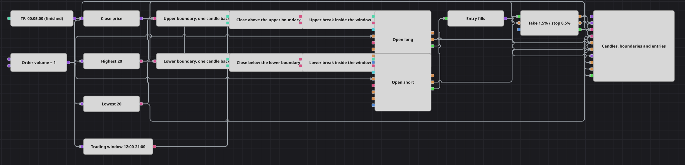

# Diagrama de la estrategia de ruptura en ventana de sesión
[English](README.md) | [Русский](README_ru.md) | [中文](README_zh.md) | [Deutsch](README_de.md) | [Português](README_pt.md) | [日本語](README_ja.md)

Una ruptura solo merece operarse mientras haya alguien contra quien operar. Este diagrama mide el rango de veinte velas, toma una posición cuando una vela terminada cierra fuera de él y se niega a actuar salvo que esa vela pertenezca a una ventana fija del día. Todo lo posterior a la entrada queda en manos de un stop y un take porcentuales.

## Resumen de la estrategia

- Una única serie de velas de cinco minutos gobierna todo el diagrama, y solo se publican velas terminadas, de modo que cada decisión se toma sobre una barra que ya no puede cambiar.
- Highest y Lowest, ambos con longitud de veinte velas y ambos solo con valores formados, llevan el borde superior e inferior del rango reciente.
- Previous value desplaza cada borde una vela hacia atrás. Ese desplazamiento es lo que convierte un rango en un nivel de ruptura: no se permite que la vela evaluada forme parte del límite que tiene que superar.
- Un conversor lee el cierre de la vela actual, y dos comparaciones lo enfrentan a los dos límites desplazados.
- Working time responde a una sola pregunta por vela —si esa vela pertenece a la ventana de negociación— y devuelve un simple verdadero o falso al mismo ritmo que las comparaciones.
- Dos condiciones lógicas unen ruptura y ventana, de modo que una rotura de nivel fuera de la ventana no produce nada en absoluto y el diagrama queda inactivo el resto del día.
- Ambas entradas son órdenes a mercado de volumen fijo y ambas llevan la condición Open position, así que solo se envía una orden desde posición plana, nunca para aumentar o invertir una ya existente.
- Position protection toma las ejecuciones de entrada y el cierre de la vela y se hace cargo de la operación a partir de ahí, cerrándola con un porcentaje fijo de beneficio o de pérdida.

## Reglas de entrada y salida

- **Entrada en largo**: Una vela terminada cierra por encima del máximo de veinte velas tomado una vela atrás, y esa vela pertenece a la ventana de negociación. Position modify compra el volumen de la orden a mercado; la condición Open position deja pasar la orden solo mientras la posición está plana.
- **Entrada en corto**: Una vela terminada cierra por debajo del mínimo de veinte velas tomado una vela atrás, bajo la misma condición de ventana. Position modify vende el volumen de la orden a mercado, de nuevo solo desde posición plana.
- **Salida**: En el diagrama no hay señal de salida. Una vez abierta la posición, Position protection se hace cargo de ella: valora la operación a partir de la ejecución de entrada, sigue el cierre de la vela y cierra con un 1.5% de beneficio o un 0.5% de pérdida, un objetivo tres veces mayor que el riesgo. La ventana gobierna solo las entradas, así que una posición abierta justo al final de la ventana sigue viva más allá del cierre de esta hasta que se alcance uno de sus dos límites. Una ruptura contraria entretanto se ignora, porque la condición Open position bloquea cualquier entrada que no parta de posición plana.

## Parámetros

| Parámetro | Por defecto | Descripción |
|---|---|---|
| Candles | 00:05:00 | Marco temporal de la serie de velas; al diagrama solo llegan velas terminadas. |
| Breakout High Length | 20 | Número de velas sobre el que se mide el límite superior, antes de aplicar el desplazamiento de una vela. |
| Breakout Low Length | 20 | Número de velas sobre el que se mide el límite inferior. Manténgalo igual que la longitud superior para que ambos bordes describan el mismo rango. |
| Session From | 12:00:00 | Inicio de la ventana de negociación como hora del día. Una vela que se abrió antes no puede disparar una entrada. |
| Session Until | 21:00:00 | Fin de la ventana de negociación. Una vela que se abrió después no puede disparar una entrada; una posición ya abierta no se ve afectada. |
| Order Volume | 1 | Cantidad fija que envían ambas entradas a mercado. |
| Take Profit, % | 1.5 | Distancia del take-profit, en porcentaje del precio de entrada. |
| Stop Loss, % | 0.5 | Distancia del stop-loss, en porcentaje del precio de entrada. |

## Detalles del diagrama

- Ambos indicadores de rango son solo formados y solo finales, de modo que ninguna lectura parcial puede mover un límite, y las primeras veinte velas no producen señal alguna.
- El desplazamiento de una vela se aplica a la salida del indicador, no al precio. Un valor de indicador llevado un paso atrás es exactamente el límite tal como estaba antes de que existiera la vela actual, que es contra lo que hay que medir una ruptura.
- Working time lee la marca de tiempo que trae el valor que recibe. Una vela lleva su hora de apertura, así que una vela cuenta como dentro de la ventana cuando se abrió dentro de ella.
- Las ejecuciones de ambas entradas se fusionan en un único flujo antes de llegar a Position protection, de modo que un solo bloque de protección cubre por igual largos y cortos.
- A Position protection se le entrega el cierre de la vela como precio, así que el stop y el take se miden contra los mismos precios de vela terminada sobre los que se tomó la decisión de entrada, y se comprueban una vez por vela.

## Uso

Importe el archivo `.json` en Designer, ejecútelo sobre datos históricos en el probador y después ajuste los parámetros o los propios bloques a su instrumento antes de operar en real.
