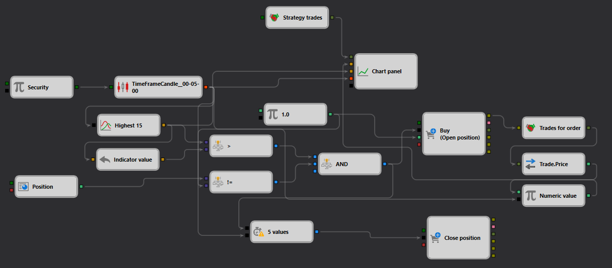

# SimpleHighBreak Strategy Description

## Strategy Overview

The "SimpleHighBreak" strategy is designed to capitalize on price breakouts over a predefined high within [StockSharp Designer](https://doc.stocksharp.com/topics/designer.html). This strategy is focused on identifying opportunities where the price breaks above the 15-period high, signaling a potential continuation of an upward trend.

## Strategy Details

### Components

- **Candle Formation**: Utilizes a 5-minute timeframe to generate [candles](https://doc.stocksharp.com/topics/designer/strategies/using_visual_designer/elements/data_sources/candles.html), monitoring the market for significant price movements.
- **High Indicator**: Calculates the [highest price](https://doc.stocksharp.com/topics/designer/strategies/using_visual_designer/elements/common/indicator.html) over the last 15 periods to establish breakout levels.
- **Breakout Detection**: The strategy triggers a buy order when the current price breaks [above](https://doc.stocksharp.com/topics/designer/strategies/using_visual_designer/elements/common/comparison.html) the recent 15-period high.

### Trade Execution

- **Order Type**: Market [Order](https://doc.stocksharp.com/topics/designer/strategies/using_visual_designer/elements/trading/register_order.html)
- **Entry**: A buy order is placed when the price exceeds the 15-period high.
- **Exit Strategy**: The position is closed based on specific conditions such as a set time frame or a reversal pattern, which are dynamically managed by the strategy.

### Risk Management

- **Position Sizing**: Adapts the size of the position based on predefined risk management rules and current market volatility.
- **Stop Loss and Take Profit**: Configurable [stop loss and take profit](https://doc.stocksharp.com/topics/designer/strategies/using_visual_designer/elements/common/protect_position.html) levels are set immediately after entry to manage risk and lock in profits.

## Implementation Details

- **Platform**: Implemented within the StockSharp platform using its extensive features for real-time data processing and automated order management.
- **Indicators**: Primarily uses the highest price indicator over a specified number of periods to determine entry points.

## Conclusion

The "SimpleHighBreak" strategy offers a straightforward yet effective approach to trading price breakouts, ideal for traders looking for opportunities in volatile markets. It combines technical indicators with detailed risk management to maximize potential returns while minimizing risks.
