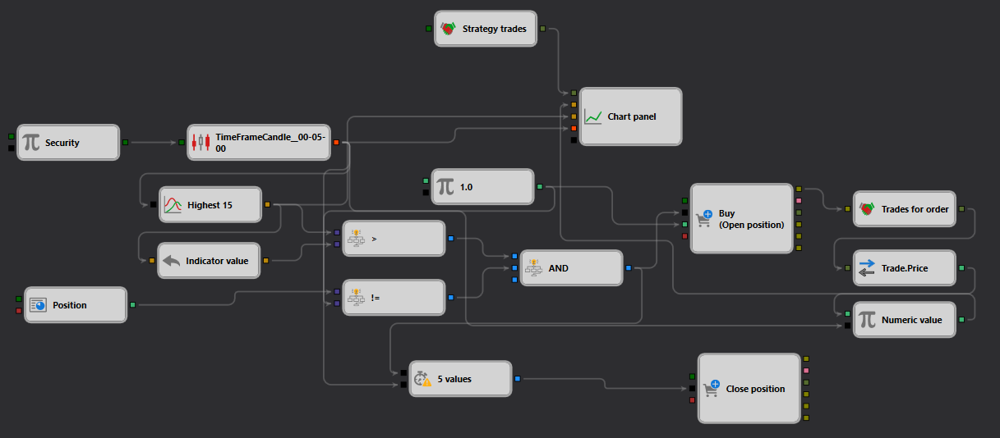

# Descrição da Estratégia SimpleHighBreak
[English](README.md) | [Русский](README_ru.md) | [中文](README_zh.md) | [Español](README_es.md) | [Deutsch](README_de.md) | [日本語](README_ja.md)

## Visão Geral da Estratégia

A estratégia "SimpleHighBreak" foi desenvolvida para capitalizar em rompimentos de preço acima de uma máxima predefinida dentro do [StockSharp Designer](https://doc.stocksharp.com/topics/designer.html). Esta estratégia é focada em identificar oportunidades onde o preço rompe acima da máxima de 15 períodos, sinalizando uma possível continuação da tendência de alta.

## Detalhes da Estratégia

### Componentes

- **Formação de Velas**: utiliza um intervalo de tempo de 5 minutos para gerar [velas](https://doc.stocksharp.com/topics/designer/strategies/using_visual_designer/elements/data_sources/candles.html), monitorando o mercado em busca de movimentos de preços significativos.
- **Indicador de Máxima**: calcula o [preço mais alto](https://doc.stocksharp.com/topics/designer/strategies/using_visual_designer/elements/common/indicator.html) durante os últimos 15 períodos para estabelecer níveis de rompimento.
- **Detecção de Rompimento**: a estratégia aciona uma ordem de compra quando o preço atual rompe [acima](https://doc.stocksharp.com/topics/designer/strategies/using_visual_designer/elements/common/comparison.html) da máxima recente de 15 períodos.

### Execução de Operações

- **Tipo de Ordem**: [Ordem](https://doc.stocksharp.com/topics/designer/strategies/using_visual_designer/elements/positions/modify.html) a mercado.
- **Entrada**: uma ordem de compra é colocada quando o preço supera a máxima de 15 períodos.
- **Estratégia de Saída**: a posição é encerrada com base em condições específicas, como um intervalo de tempo definido ou um padrão de reversão, gerenciados dinamicamente pela estratégia.

### Gerenciamento de Risco

- **Dimensionamento de Posição**: adapta o tamanho da posição com base em regras predefinidas de gerenciamento de risco e na volatilidade atual do mercado.
- **Stop Loss e Take Profit**: níveis configuráveis de [stop loss e take profit](https://doc.stocksharp.com/topics/designer/strategies/using_visual_designer/elements/common/protect_position.html) são definidos imediatamente após a entrada para gerenciar o risco e garantir lucros.

## Detalhes de Implementação

- **Plataforma**: implementada dentro da plataforma StockSharp utilizando seus recursos extensos para processamento de dados em tempo real e gerenciamento automatizado de ordens.
- **Indicadores**: usa principalmente o indicador de preço máximo durante um número específico de períodos para determinar os pontos de entrada.

## Conclusão

A estratégia "SimpleHighBreak" oferece uma abordagem simples, mas eficaz, para o trading de rompimentos de preço, ideal para traders que buscam oportunidades em mercados voláteis. Ela combina indicadores técnicos com um gerenciamento de risco detalhado para maximizar retornos potenciais enquanto minimiza riscos.
