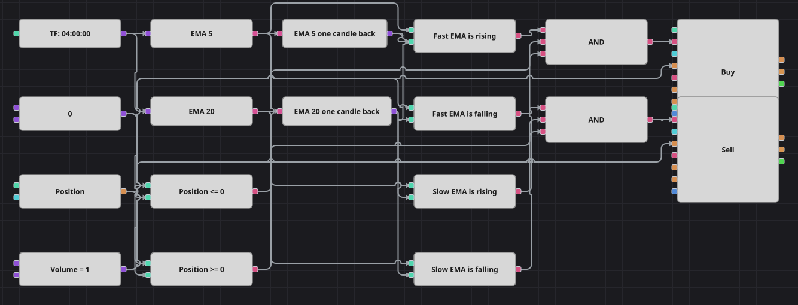

# Диаграмма стратегии Simple Multiple Time Frame Moving Average
[English](README.md) | [中文](README_zh.md) | [Español](README_es.md) | [Deutsch](README_de.md) | [Português](README_pt.md) | [日本語](README_ja.md)

Название обещает два таймфрейма, но исходная стратегия на C# подписывается на одну четырёхчасовую серию и считает по ней две линии ExponentialMovingAverage разной длины. Торгуется на самом деле совпадение их наклонов: пока и короткая, и длинная средние смотрят вверх, схема стоит в лонге, пока обе смотрят вниз — в шорте, а при расхождении позиция не трогается.

## Обзор стратегии

- Два кубика ExponentialMovingAverage, короткий и длинный, работают по одной и той же серии свечей; схема сохраняет эту единственную подписку и не выдумывает второй таймфрейм.
- Наклон каждой средней читается сравнением её текущего значения с кубиком предыдущего значения на одну свечу назад: растущая средняя — это просто средняя выше того места, где она была.
- Все заявки идут фиксированным общим объёмом, поэтому встречный сигнал лишь обнуляет позицию; чтобы войти в другую сторону, нужен второй сигнал того же направления на следующей свече — ровно как в исходном коде.
- Условие здесь состояние, а не событие: оно проверяется на каждой завершённой свече, поэтому используются сравнения и логические И, а кубик пересечения не нужен.

## Правила входа и выхода

- **Вход в лонг**: Быстрая ExponentialMovingAverage выше своего значения на предыдущей свече, медленная тоже, а позиция не в лонге. Кубик изменения позиции покупает общий объём по рынку: из нуля это открытие лонга, из шорта — его закрытие.
- **Вход в шорт**: Быстрая ExponentialMovingAverage ниже своего значения на предыдущей свече, медленная тоже, а позиция не в шорте. Кубик изменения позиции продаёт общий объём по рынку: из нуля это открытие шорта, из лонга — его закрытие.
- **Выход**: Собственного правила выхода нет: позицию закрывает противоположный сигнал, то есть момент, когда обе средние развернулись в другую сторону. В исходной стратегии нет ни стоп-лосса, ни тейк-профита, ни паузы между сделками — нет их и в схеме.

## Параметры

| Параметр | По умолчанию | Описание |
|---|---|---|
| Fast EMA length | 5 | Период быстрой ExponentialMovingAverage. |
| Slow EMA length | 20 | Период медленной ExponentialMovingAverage. |
| Volume | 1 | Объём заявки в лотах; одна и та же константа питает оба кубика изменения позиции. |
| Candles | 04:00:00 | Таймфрейм свечей всей диаграммы; в оригинале это четыре часа, и они сохранены — на поставляемом месяце истории это около двухсот свечей. |

## Детали диаграммы

- Кубик свечей питает оба кубика индикаторов, а каждый индикатор питает кубик предыдущего значения с типом индикаторного значения.
- Четыре кубика сравнения превращают две средние и их задержанные копии во флаги роста и падения.
- Кубик позиции, дважды сравнённый с нулевой константой, даёт проверку, которая не даёт входу наращивать уже открытую позицию.
- Каждое логическое И объединяет условие по быстрой средней, условие по медленной и условие по позиции и запускает кубик изменения позиции, берущий размер из общей константы объёма.

## Использование

Импортируйте файл `.json` в Designer, прогоните схему на исторических данных в тестере, затем подстройте параметры или сами кубики под свой инструмент, прежде чем торговать вживую.
