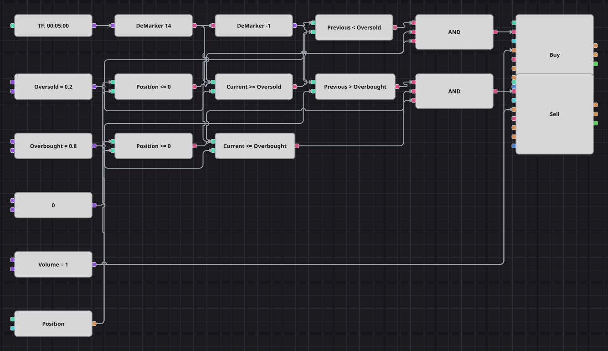

# Diagrama da estratégia DeMarker mais simples
[English](README.md) | [Русский](README_ru.md) | [中文](README_zh.md) | [Español](README_es.md) | [Deutsch](README_de.md) | [日本語](README_ja.md)

O DeMarker mede o quanto cada candle avança além do anterior, para cima contra para baixo, e devolve um valor entre 0 e 1. Este diagrama não compra o extremo, e sim a volta a partir dele: uma leitura que sobe de abaixo do nível de sobrevenda até ele compra, e uma que desce de acima do nível de sobrecompra até ele vende. A estratégia original usa candles de uma hora e espera quatro candles entre negócios; o diagrama trabalha em cinco minutos e deixa a pausa de fora, já que a verificação da posição impede uma segunda entrada no mesmo sentido.

## Visão geral da estratégia

- O DeMarker é calculado sobre candles finalizados de um único instrumento e fica sempre entre 0 e 1, com 0.5 como centro neutro.
- Um bloco de valor anterior guarda a leitura do candle passado, de modo que o diagrama reage ao retorno à zona neutra e não à permanência nela.
- A posição atual entra nas duas decisões: só se compra enquanto ela não estiver comprada e só se vende enquanto não estiver vendida.
- A pausa de quatro candles do original não foi reproduzida; ela pode ser acrescentada depois sem mexer na parte de sinais.

## Regras de entrada e saída

- **Entrada comprada**: A leitura anterior do DeMarker estava abaixo do nível de sobrevenda, a atual está nele ou acima e a posição não está comprada. A ordem compra um lote: a partir do zero abre uma compra, a partir de uma venda a encerra.
- **Entrada vendida**: A leitura anterior do DeMarker estava acima do nível de sobrecompra, a atual está nele ou abaixo e a posição não está vendida. A ordem vende um lote: a partir do zero abre uma venda, a partir de uma compra a encerra.
- **Saída**: Não há bloco de saída nem stop de proteção, como na estratégia original: o sinal contrário zera a posição, pois todas as ordens usam o mesmo volume.

## Parâmetros

| Parâmetro | Padrão | Descrição |
|---|---|---|
| DeMarker Length | 14 | Período de suavização do oscilador DeMarker. |
| Oversold | 0.2 | Nível de sobrevenda; voltar até ele por baixo é o sinal de compra. |
| Overbought | 0.8 | Nível de sobrecompra; voltar até ele por cima é o sinal de venda. |
| Volume | 1 | Volume da ordem, em lotes. |
| Candles | 00:05:00 | Tempo gráfico dos candles de todo o diagrama; o original usava uma hora. |

## Detalhes do diagrama

- O bloco de candles alimenta o bloco de indicador com o DeMarker, e o bloco de valor anterior toma a mesma saída um candle atrás.
- Quatro blocos de comparação montam os dois retornos: o valor anterior além de um nível e o atual de volta nele.
- Outros dois blocos comparam a posição com uma constante zero, e cada E lógico reúne três condições em um sinal.
- Ambos os blocos de modificação de posição enviam ordens a mercado e obtêm o volume de uma única constante compartilhada.

## Uso

Importe o arquivo `.json` no Designer, execute-o sobre dados históricos no backtester e depois ajuste os parâmetros ou os próprios blocos ao seu instrumento antes de operar ao vivo.
