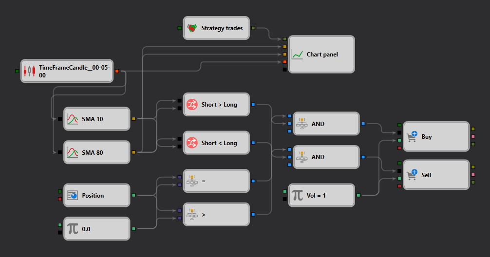

# Moving Averages Strategy Diagram

This file contains a diagrammatic representation of a trading strategy based on moving averages, designed using the Designer platform's Strategy Gallery. The strategy utilizes the concept of moving averages to generate buy and sell signals based on their crossovers, a popular method used in financial markets to gauge momentum and confirm trends.

## Strategy Overview

The strategy incorporates two moving averages:

- **Short-term Moving Average**: A faster moving average that reacts more quickly to price changes.
- **Long-term Moving Average**: A slower moving average that provides a smoother picture of price trends.

## Entry and Exit Rules

- **Buy Signal**: The strategy generates a buy signal when the short-term moving average crosses above the long-term moving average, suggesting an upward trend.
- **Sell Signal**: Conversely, a sell signal is issued when the short-term moving average crosses below the long-term moving average, indicating a potential downward trend.

## Diagram Details

The diagram visually presents the logic flow of the strategy:

- **Moving Averages Calculation**: Nodes calculate the moving averages based on user-defined parameters such as the period and type of moving average (e.g., simple, exponential).
- **Comparison Nodes**: Evaluate the crossover conditions to determine whether to enter or exit positions.
- **Trading Actions**: Nodes that execute buy or sell orders based on the evaluation results from the comparison nodes.

## Usage

Traders can import this diagram into the Designer platform to:
- Test the strategy using historical data to understand its effectiveness.
- Modify the moving average parameters or the logic to better suit specific trading needs or market conditions.
- Deploy the strategy in a live trading environment after sufficient testing.

## Educational Value

This strategy diagram serves as an educational tool for beginners to understand the basics of technical analysis and strategy design. It also provides a foundation for more complex strategy development for advanced users.

This file is part of a comprehensive collection of trading strategies provided in the Designer platform, aimed at enhancing users' trading skills and strategy development capabilities.
