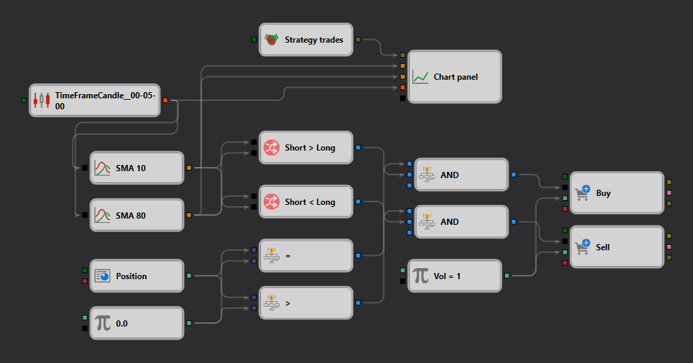

# 移動平均線戦略ダイアグラム
[English](README.md) | [Русский](README_ru.md) | [中文](README_zh.md) | [Español](README_es.md) | [Deutsch](README_de.md) | [Português](README_pt.md)

このファイルは、Designer プラットフォームの戦略ギャラリーを使用して設計された、移動平均線に基づく取引戦略のダイアグラムを含んでいます。この戦略は、移動平均線のクロスオーバーを利用して売買シグナルを生成します。これは、金融市場においてモメンタムを測定しトレンドを確認するために広く使われている手法です。

## 戦略の概要

この戦略は2本の移動平均線を組み合わせています。

- **短期移動平均線**: 価格変動により敏感に反応する、より速い[移動平均線](https://doc.stocksharp.com/topics/designer/strategies/using_visual_designer/elements/common/indicator.html)。
- **長期移動平均線**: 価格トレンドをよりなめらかに表現する、より遅い[移動平均線](https://doc.stocksharp.com/topics/designer/strategies/using_visual_designer/elements/common/indicator.html)。

## エントリーとエグジットのルール

- **買いシグナル**: 短期移動平均線が長期移動平均線を下から[クロス](https://doc.stocksharp.com/topics/designer/strategies/using_visual_designer/elements/common/crossing.html)したとき、上昇トレンドを示唆する[買い](https://doc.stocksharp.com/topics/designer/strategies/using_visual_designer/elements/positions/modify.html)シグナルが生成されます。
- **売りシグナル**: 逆に、短期移動平均線が長期移動平均線を上から[クロス](https://doc.stocksharp.com/topics/designer/strategies/using_visual_designer/elements/common/crossing.html)したとき、潜在的な下降トレンドを示す[売り](https://doc.stocksharp.com/topics/designer/strategies/using_visual_designer/elements/positions/modify.html)シグナルが発行されます。

## ダイアグラムの詳細

ダイアグラムは戦略のロジックフローを視覚的に示しています。

- **移動平均線の計算**: ノードが期間や移動平均線の種類（単純、指数加重など）など、ユーザー定義のパラメーターに基づいて移動平均線を計算します。
- **比較ノード**: クロスオーバー条件を評価し、ポジションへのエントリーまたはエグジットを判断します。
- **取引アクション**: 比較ノードの評価結果に基づいて買い・売り注文を実行するノード。

## 活用方法

トレーダーはこのダイアグラムを Designer プラットフォームにインポートして以下を行えます。
- 過去データを使って戦略をテストし、その有効性を理解する。
- 特定の取引ニーズや市場条件に合わせて、移動平均線のパラメーターやロジックを修正する。
- 十分なテストを経た後、ライブ取引環境に戦略を展開する。

## 教育的価値

この戦略ダイアグラムは、初心者がテクニカル分析と戦略設計の基礎を理解するための教育ツールとして機能します。また、上級ユーザーがより複雑な戦略を開発するための基盤も提供します。

このファイルは、Designer プラットフォームで提供される包括的な取引戦略コレクションの一部であり、ユーザーの取引スキルと戦略開発能力の向上を目的としています。
