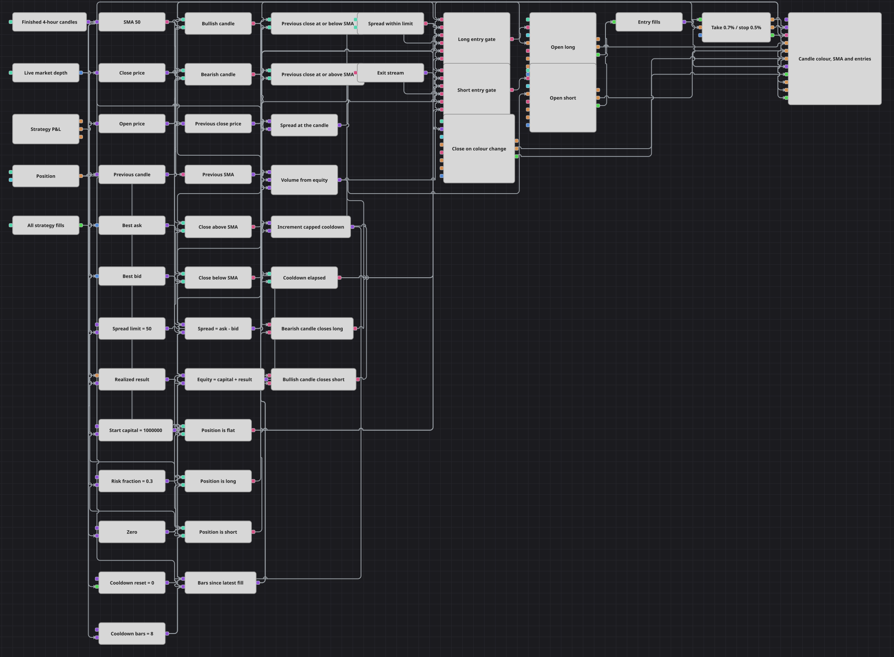

# Strategiediagramm: Einstiegsvorlage mit Spread-Filter
[English](README.md) | [Русский](README_ru.md) | [中文](README_zh.md) | [Español](README_es.md) | [Português](README_pt.md) | [日本語](README_ja.md)

Das Signal ist hier bewusst schlicht gehalten: Eine Kerze schließt über ihrer eigenen Eröffnung, während der Kurs einen langsamen gleitenden Durchschnitt nach oben kreuzt. Worum es im Diagramm eigentlich geht, ist alles, was zwischen diesem Signal und der Order steht — ein aus dem Orderbuch gelesener Spread, eine Abkühlphase, die Einstiege auf Abstand hält, und eine Ordergröße, die aus dem Kapital berechnet wird statt aus einer festen Zahl.

## Strategieübersicht

- Fertige Vier-Stunden-Kerzen speisen einen einfachen gleitenden Durchschnitt über 50 Perioden sowie zwei Konverter, die Eröffnung und Schluss aus jeder Kerze herauslösen.
- Die Kerzenfarbe ergibt sich aus zwei Vergleichen: Schluss über Eröffnung ist bullisch, Schluss unter Eröffnung ist bärisch.
- Ein Previous value-Block hält die Kerze einen Schritt zurück, ein zweiter hält den Durchschnitt; so wird eine Kreuzung als Paar gewöhnlicher Vergleiche gelesen und nicht als eigener Indikator.
- Market depth liefert den besten Bid und den besten Ask, eine Formel zieht den einen vom anderen ab. Das Ergebnis liegt in einer Variablen, die von der Kerze freigegeben wird — die Einstiegsbedingung vergleicht damit einen Spread, der zum selben Moment gehört wie alles Übrige.
- Strategy P&L speist eine Variable mit dem realisierten Ergebnis, eine Formel addiert es zum Startkapital, und eine zweite Formel macht aus diesem Kapital eine Ordergröße: Kapital mal Risikoanteil, geteilt durch den Schlusskurs, gerundet auf drei Nachkommastellen.
- Ein Zähler aus einer Variablen und der Formel min(a + 1, n) misst die Kerzen seit der letzten Ausführung und sperrt einen neuen Einstieg, bis acht davon vergangen sind.
- Beide Einstiege werden nur aus einer flachen Position heraus genommen, das Diagramm hält also immer nur eine Position und stockt sie nie auf.
- Der Ausstieg ist die entgegengesetzte Kerzenfarbe, und Position protection legt darüber noch einen Take-Profit von 0.7% und einen Stop-Loss von 0.5%.

## Ein- und Ausstiegsregeln

- **Long-Einstieg**: Eine bullische Kerze, deren vorheriger Schluss auf oder unter dem vorherigen Durchschnitt lag und deren Schluss über dem aktuellen Durchschnitt liegt, bei einem Spread innerhalb seines Limits, flacher Position und abgelaufener Abkühlphase. Position modify kauft zum Marktpreis mit dem berechneten Volumen.
- **Short-Einstieg**: Eine bärische Kerze, deren vorheriger Schluss auf oder über dem vorherigen Durchschnitt lag und deren Schluss unter dem aktuellen Durchschnitt liegt, unter denselben Bedingungen für Spread, flache Position und Abkühlphase. Position modify verkauft zum Marktpreis mit demselben berechneten Volumen.
- **Ausstieg**: Eine bärische Kerze schließt eine Long-Position, eine bullische Kerze eine Short-Position: Beide Bedingungen laufen in einer Combination zusammen, die ein einziges Position modify zum Schließen der Position auslöst — keine Richtung braucht damit einen eigenen Ausstiegsblock. Position protection beobachtet die Einstiegsausführungen unabhängig davon und kann den Trade früher bei 0.7% Gewinn oder 0.5% Verlust schließen.

## Parameter

| Parameter | Standard | Beschreibung |
|---|---|---|
| Candles | 04:00:00 | Zeitrahmen der Kerzen, auf denen das gesamte Diagramm arbeitet. |
| SMA Length | 50 | Länge des einfachen gleitenden Durchschnitts, an dem der Schlusskurs gemessen wird. |
| Spread Limit | 50 | Weitester Spread im Orderbuch, in Kurseinheiten, bei dem ein Einstieg noch zulässig ist. Bei Instrumenten mit weiter Spanne erhöhen. |
| Start Capital | 1000000 | Kontogröße, von der die Kapitalberechnung ausgeht; vor dem Handel auf die tatsächliche Größe des Kontos setzen. |
| Risk Fraction | 0.3 | Anteil des Kapitals, der in eine Position fließt, als Bruchteil: 0.3 sind dreißig Prozent. |
| Cooldown Bars | 8 | Wie viele fertige Kerzen nach einer Ausführung vergehen müssen, bevor der nächste Einstieg erlaubt ist. |
| Take Profit, % | 0.7 | Take-Profit-Abstand, in Prozent des Einstiegskurses. |
| Stop Loss, % | 0.5 | Stop-Loss-Abstand, in Prozent des Einstiegskurses. |

## Diagrammdetails

- Der Kerzenblock speist acht Abnehmer: den Durchschnitt, beide Konverter, den Block für die vorherige Kerze, die Spread-Variable, die Variable für das realisierte Ergebnis, den Abkühlzähler und das Chart-Panel.
- Das Orderbuch aktualisiert sich weit häufiger als die Kerzen, deshalb wird sein Spread nicht direkt verglichen. Eine Variable übernimmt den jeweils letzten Wert und gibt ihn beim Kerzenschluss frei — damit läuft jeder Term der Einstiegsbedingung auf derselben Uhr.
- Die Variable für das realisierte Ergebnis startet bei null und nimmt erst einen Wert an, sobald der erste Trade geschlossen ist; so ist die Volumenformel schon ab der allerersten Kerze versorgt.
- Beide Einstiegsblöcke teilen sich eine Volumenformel, Long und Short werden also nach derselben Regel dimensioniert.
- Den Abkühlzähler setzt der Block für die Ausführungen der Strategie zurück: Jede Ausführung — ein Einstieg ebenso wie ein Schutzausstieg — startet die Wartezeit über acht Kerzen erneut.

## Verwendung

Importieren Sie die `.json`-Datei in Designer, testen Sie sie im Backtester mit historischen Daten und passen Sie danach Parameter oder Bausteine an Ihr Instrument an, bevor Sie live handeln.
