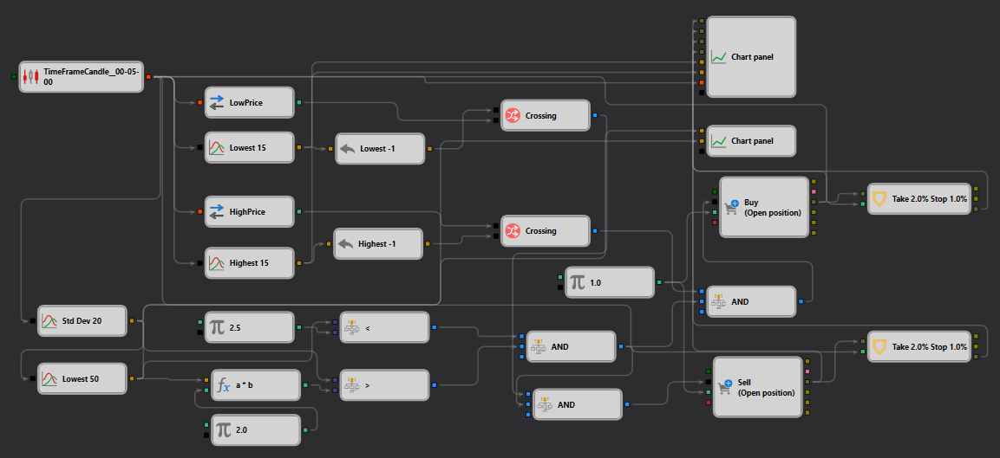

# StDevStrategy Description

## Strategy Overview

The "StDevStrategy" is engineered for [StockSharp Designer](https://doc.stocksharp.com/topics/designer.html) to leverage statistical volatility patterns using the Standard Deviation indicator. This strategy is built to identify potential trading opportunities based on deviations from the average price, signaling overbought or oversold conditions.

## Strategy Details

### Components

- **Standard Deviation Indicators**: Utilizes multiple lengths to capture short-term and long-term volatility.
  - **Std Dev 20**: Measures volatility over [20 periods](https://doc.stocksharp.com/topics/designer/strategies/using_visual_designer/elements/common/indicator.html).
  - **Lowest 15 and Highest 15**: Tracks the lowest and highest values over 15 periods to detect breakout conditions.
  - **Lowest 50**: Captures longer-term price lows to gauge extended market conditions.

### Trade Execution

- **Order Type**: Executes trades using [market orders](https://doc.stocksharp.com/topics/designer/strategies/using_visual_designer/elements/trading/register_order.html) to ensure rapid response to signal changes.
- **Entry and Exit**:
  - **Buy**: Triggered when price action suggests a rebound from oversold conditions.
  - **Sell**: Initiated when price action indicates potential downturn from overbought conditions.
- **Position Management**: Employs a dynamic position sizing strategy that adjusts based on market volatility and risk parameters.

### Risk Management

- **Stop Loss and Take Profit**: 
  - Set [stop loss](https://doc.stocksharp.com/topics/designer/strategies/using_visual_designer/elements/common/protect_position.html) at 1% below entry for minimizing risk.
  - [Take profit](https://doc.stocksharp.com/topics/designer/strategies/using_visual_designer/elements/common/protect_position.html) is set at 2%, capturing potential upswings while protecting gains.

## Implementation Details

- **Platform**: Implemented within the StockSharp platform leveraging its comprehensive tools for real-time data analysis and order management.
- **Technical Indicators**: Integrates multiple instances of Standard Deviation along with highest and lowest price tracking to enhance trading accuracy.

## Conclusion

The "StDevStrategy" is tailored for traders who prefer technical analysis and are focused on capturing price movements driven by volatility. It provides a structured approach to trading by utilizing advanced indicators to manage entry and exit points effectively.
