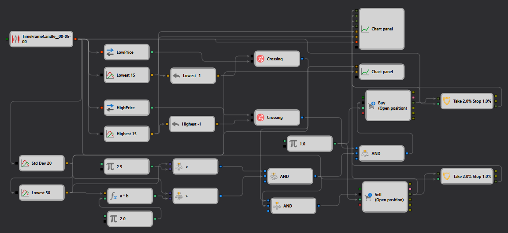

# StDevStrategy 说明
[English](README.md) | [Русский](README_ru.md) | [Español](README_es.md) | [Deutsch](README_de.md) | [Português](README_pt.md) | [日本語](README_ja.md)

## 策略概述

"StDevStrategy"专为 [StockSharp Designer](https://doc.stocksharp.com/topics/designer.html) 设计，利用 Standard Deviation 指标把握统计波动规律。该策略通过识别价格偏离均值的情况来发现潜在交易机会，从而捕捉超买或超卖信号。

## 策略详情

### 组件

- **Standard Deviation 指标**：采用多种长度参数，分别捕捉短期和长期波动。
  - **Std Dev 20**：衡量[20个周期](https://doc.stocksharp.com/topics/designer/strategies/using_visual_designer/elements/common/indicator.html)内的波动率。
  - **Lowest 15 和 Highest 15**：追踪15个周期内的最低值和最高值，以检测突破条件。
  - **Lowest 50**：捕捉长期价格低点，评估扩展性市场状况。

### 交易执行

- **订单类型**：使用[市价单](https://doc.stocksharp.com/topics/designer/strategies/using_visual_designer/elements/positions/modify.html)执行交易，确保对信号变化的快速响应。
- **入场与出场**：
  - **买入**：当价格走势表明从超卖状态反弹时触发。
  - **卖出**：当价格走势显示从超买状态可能下跌时启动。
- **仓位管理**：采用动态仓位规模策略，根据市场波动性和风险参数进行调整。

### 风险管理

- **止损和止盈**：
  - [止损](https://doc.stocksharp.com/topics/designer/strategies/using_visual_designer/elements/common/protect_position.html)设置在入场价格以下1%，以最小化风险。
  - [止盈](https://doc.stocksharp.com/topics/designer/strategies/using_visual_designer/elements/common/protect_position.html)设置在2%，在保护已有收益的同时捕捉潜在上涨空间。

## 实现细节

- **平台**：在 StockSharp 平台内实现，充分利用其实时数据分析和订单管理的综合工具。
- **技术指标**：整合多个 Standard Deviation 实例，结合最高价和最低价追踪，以提升交易准确性。

## 结论

"StDevStrategy"专为偏好技术分析、专注于捕捉波动驱动价格走势的交易者量身定制。它通过利用高级指标有效管理入场和出场点，提供了一种结构化的交易方法。
