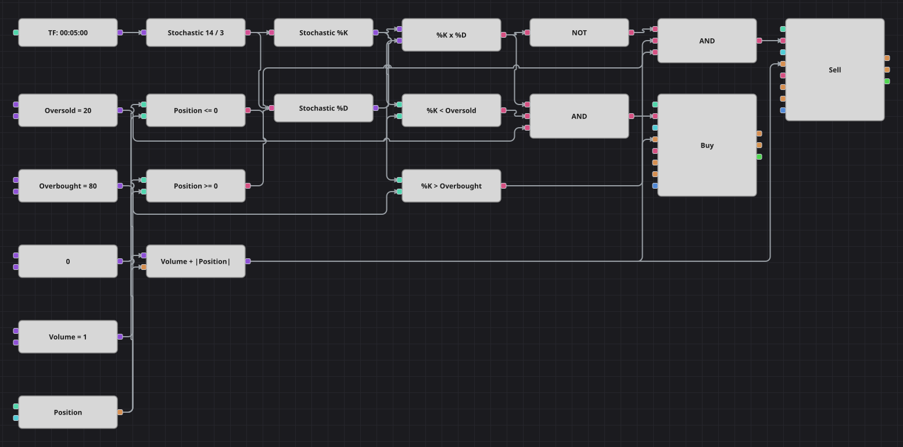

# ストキャスティクス %K/%D 極値ゾーン交差戦略のダイアグラム
[English](README.md) | [Русский](README_ru.md) | [中文](README_zh.md) | [Español](README_es.md) | [Deutsch](README_de.md) | [Português](README_pt.md)

ストキャスティクスの2本の線の交差はよく現れる反面ノイズも多いため、このダイアグラムは意味のある場所でのみ受け入れます。ゴールデンクロスは %K が売られすぎゾーンにある間に、デッドクロスは %K が買われすぎゾーンにある間に起きなければなりません。採用されたシグナルはすべてドテンとなるため、ダイアグラムは常にロングかショートのいずれかを持ち、ただ待つことはありません。

## 戦略の概要

- 1つのストキャスティクスブロックが両方の線を供給し、コンバーターブロックがその値を %K と %D に分けます。
- 交差ブロックが2本の線を比較します。その信号がゴールデンクロスを表し、同じ信号を NOT ブロックで反転したものがデッドクロスを表します。
- ゾーンのフィルターは %K を売られすぎ・買われすぎの定数と比べるだけの単純な比較で、レンジ中央での交差は無視されます。
- 注文数量は基準数量にポジションの絶対値を足した値で、1本の成行注文が反対建玉を決済し新しい建玉を作ります。
- 元の戦略はフォルダ名に RSI とありますが、コードに RSI はなく、ストップもありません。売買後に5本待つ休止はブロックで表現できないため省略しています。
- 元の戦略は15分足で動きますが、付属のサンプル履歴に合わせて5分足に縮尺しています。

## エントリーとエグジットの条件

- **ロングエントリー**: %K が %D を上抜け、そのとき %K が売られすぎ水準より下にあり、かつ買い持ちではないとき。注文は基準数量に建っている売り玉を加えて買い、ポジションをロングに反転させます。
- **ショートエントリー**: %K が %D を下抜け、そのとき %K が買われすぎ水準より上にあり、かつ売り持ちではないとき。注文は基準数量に建っている買い玉を加えて売り、ポジションをショートに反転させます。
- **エグジット**: 専用のエグジットブロックはありません。反対側のゾーンで逆方向の交差が現れるまで建玉を保有し、その注文が古い建玉の決済と新しい建玉の設定を同時に行います。

## パラメーター

| パラメーター | 既定値 | 説明 |
|---|---|---|
| %K Length | 14 | ストキャスティクス %K の計算期間。 |
| %D Length | 3 | %K の移動平均である %D の平滑化期間。 |
| Oversold | 20 | この水準より下でのゴールデンクロスを買いとして採用します。 |
| Overbought | 80 | この水準より上でのデッドクロスを売りとして採用します。 |
| Volume | 1 | 基準の注文数量（ロット）。ドテン時はこれに建玉が加算されます。 |
| Candles | 00:05:00 | ダイアグラム全体が用いるローソク足の時間軸。 |

## ダイアグラムの詳細

- ローソク足ブロックが1つのストキャスティクスを駆動し、2つのコンバーターがその値から %K と %D を取り出します。
- 交差ブロックは2本の線が入れ替わったローソク足でのみ発火します。これにより、線が離れている間ずっと売買してしまうことを防ぎます。
- 各論理積が交差・ゾーン比較・ポジション判定を結び、ポジション変更ブロックを起動します。
- 計算式ブロックが基準数量とポジションの絶対値を足し、2つの発注ブロックに供給するため、1本の成行注文でドテンが完了します。

## 使い方

`.json` ファイルを Designer に読み込み、バックテスターで過去データを使って実行し、実運用の前にパラメーターやブロック自体を自分の銘柄に合わせて調整してください。
