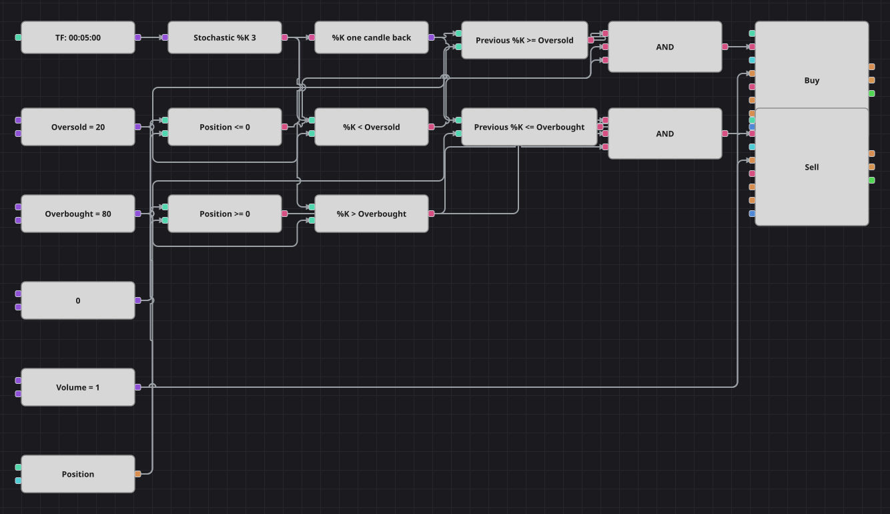

# Diagrama da estratégia de sobrecompra e sobrevenda do estocástico
[English](README.md) | [Русский](README_ru.md) | [中文](README_zh.md) | [Español](README_es.md) | [Deutsch](README_de.md) | [日本語](README_ja.md)

A linha %K do estocástico mede onde o fechamento se encontra dentro da faixa recente de máximas e mínimas, e este diagrama opera contra as pontas dessa faixa. O que importa é o instante em que %K entra numa zona, não todo o tempo que passa nela, por isso um bloco de valor anterior transforma o teste de nível em um cruzamento e cada sinal gera uma única ordem.

## Visão geral da estratégia

- A linha %K é calculada sobre candles finalizados de um único instrumento; a linha suavizada %D não participa da decisão, exatamente como na estratégia original.
- Uma janela de três candles torna %K uma linha muito rápida: ela alcança as duas zonas com frequência, e daí vem o número de negócios deste exemplo.
- Os níveis de sobrevenda e sobrecompra são constantes do diagrama e podem ser editados e otimizados; no código original estão fixos em 20 e 80.
- Todas as ordens usam o mesmo volume, de modo que um sinal contrário à posição aberta a encerra em vez de invertê-la e aumentá-la.

## Regras de entrada e saída

- **Entrada comprada**: A leitura anterior de %K estava no nível de sobrevenda ou acima dele, a atual está abaixo e a posição não está comprada. A ordem compra um lote: a partir do zero abre uma compra, a partir de uma venda a encerra.
- **Entrada vendida**: A leitura anterior de %K estava no nível de sobrecompra ou abaixo dele, a atual está acima e a posição não está vendida. A ordem vende um lote: a partir do zero abre uma venda, a partir de uma compra a encerra.
- **Saída**: Não há bloco de saída próprio: o cruzamento contrário encerra a posição, pois todas as ordens usam o mesmo volume. A estratégia original ainda faz uma pausa de um número fixo de candles após cada negócio; não existe bloco contador de barras, então o cruzamento assume esse papel e evita uma ordem a cada candle dentro da zona.

## Parâmetros

| Parâmetro | Padrão | Descrição |
|---|---|---|
| %K Length | 3 | Janela de máxima e mínima contra a qual a linha %K é medida. |
| Oversold | 20 | Nível que a linha %K precisa cruzar para baixo para uma compra. |
| Overbought | 80 | Nível que a linha %K precisa cruzar para cima para uma venda. |
| Volume | 1 | Volume da ordem, em lotes. |
| Candles | 00:05:00 | Tempo gráfico dos candles com que todo o diagrama trabalha. |

## Detalhes do diagrama

- O bloco de candles alimenta o bloco do indicador %K, cuja saída vai tanto para os blocos de comparação quanto para um bloco de valor anterior.
- Quatro blocos de comparação montam os dois cruzamentos: a leitura anterior contra um nível e a atual contra o mesmo nível.
- O bloco de posição é comparado duas vezes com uma constante zero, dando uma verificação de «não comprado» para a compra e de «não vendido» para a venda.
- Cada E lógico une as duas metades de um cruzamento à sua verificação de posição e aciona um bloco de modificação de posição; ambos obtêm o volume de uma constante compartilhada.

## Uso

Importe o arquivo `.json` no Designer, execute-o sobre dados históricos no backtester e depois ajuste os parâmetros ou os próprios blocos ao seu instrumento antes de operar ao vivo.
